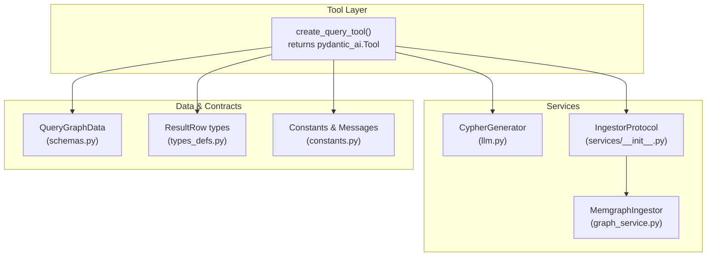
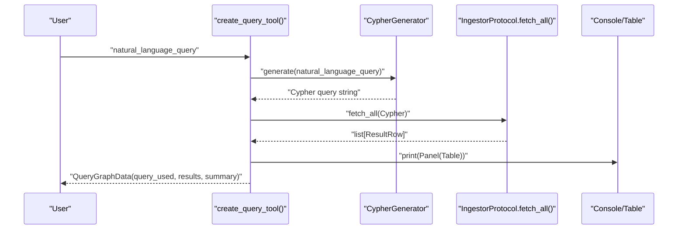
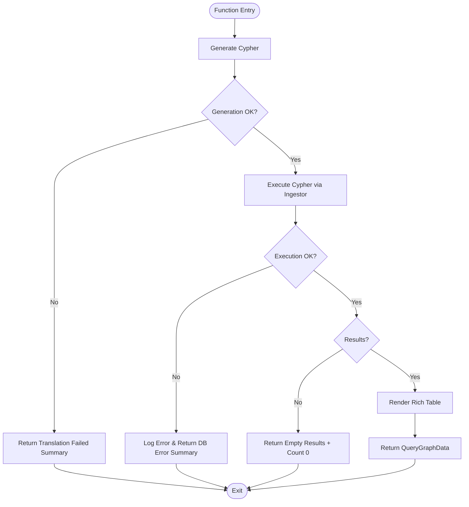
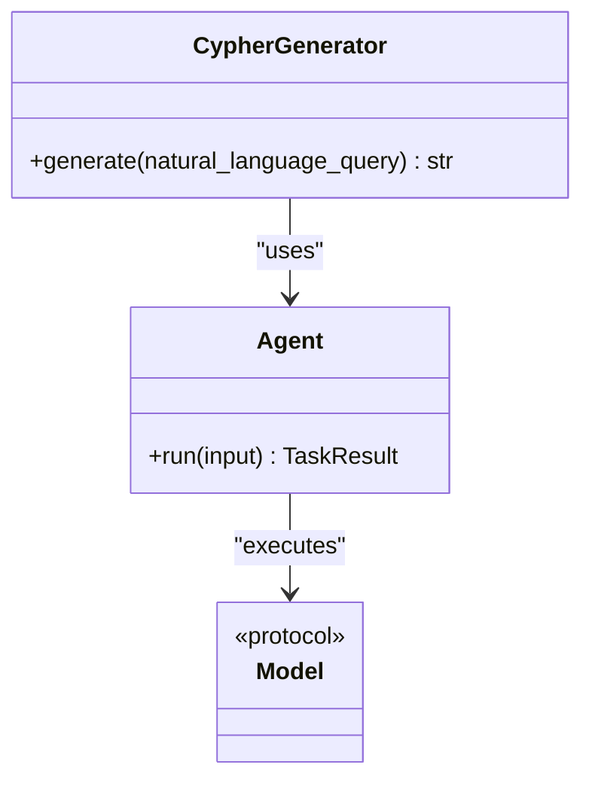
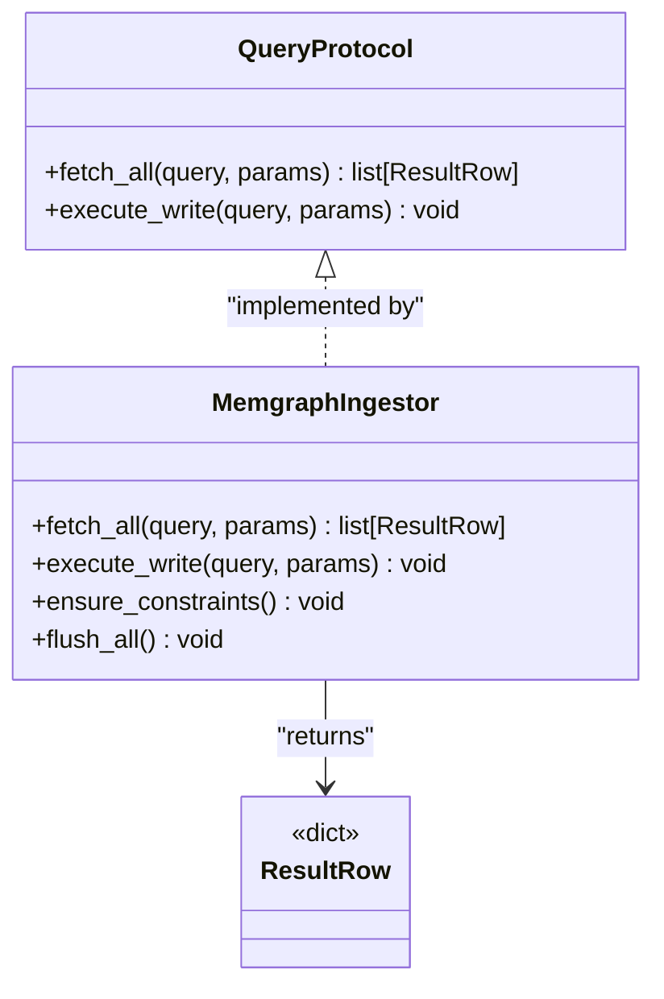
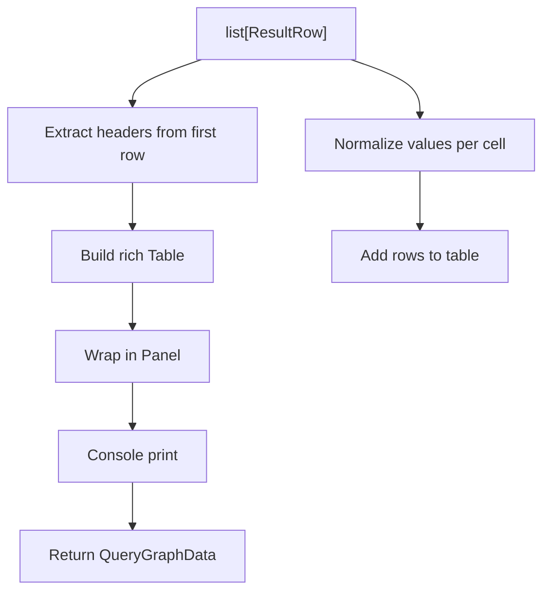
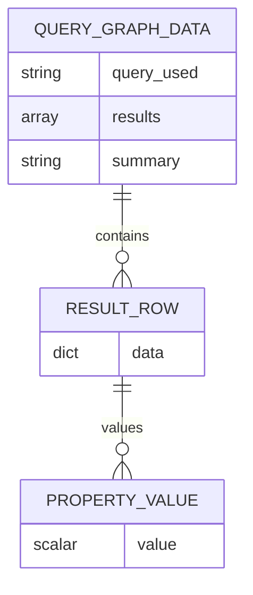
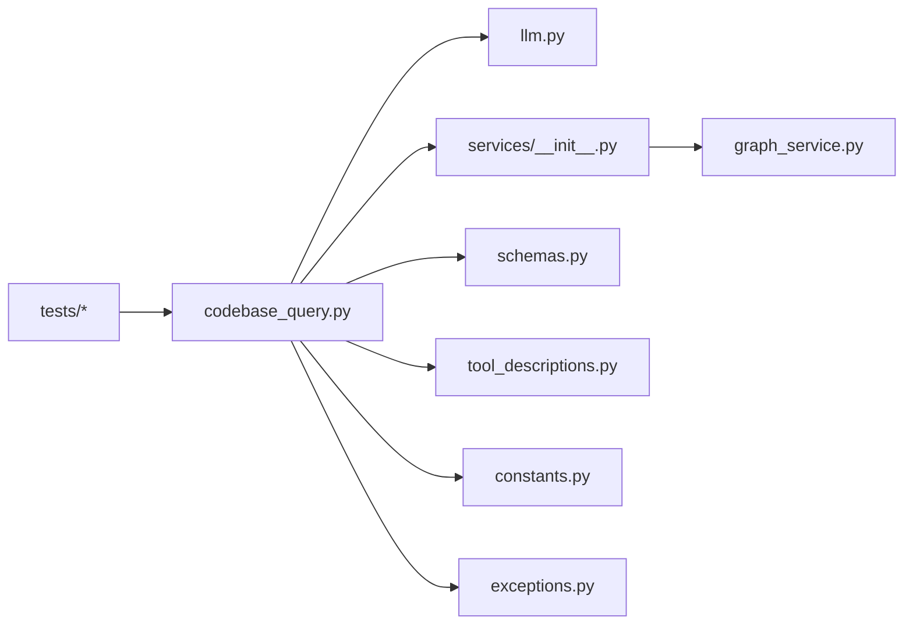

# Codebase Query Tool

<cite>
**Referenced Files in This Document**
- [codebase_query.py](file://codebase_rag/tools/codebase_query.py)
- [llm.py](file://codebase_rag/services/llm.py)
- [graph_service.py](file://codebase_rag/services/graph_service.py)
- [schemas.py](file://codebase_rag/schemas.py)
- [types_defs.py](file://codebase_rag/types_defs.py)
- [constants.py](file://codebase_rag/constants.py)
- [exceptions.py](file://codebase_rag/exceptions.py)
- [tool_descriptions.py](file://codebase_rag/tools/tool_descriptions.py)
- [services/__init__.py](file://codebase_rag/services/__init__.py)
- [test_codebase_query.py](file://codebase_rag/tests/test_codebase_query.py)
- [test_codebase_query_integration.py](file://codebase_rag/tests/integration/test_codebase_query_integration.py)
</cite>

## Table of Contents
1. [Introduction](#introduction)
2. [Project Structure](#project-structure)
3. [Core Components](#core-components)
4. [Architecture Overview](#architecture-overview)
5. [Detailed Component Analysis](#detailed-component-analysis)
6. [Dependency Analysis](#dependency-analysis)
7. [Performance Considerations](#performance-considerations)
8. [Troubleshooting Guide](#troubleshooting-guide)
9. [Conclusion](#conclusion)
10. [Appendices](#appendices)

## Introduction
The Codebase Query Tool enables natural language understanding of a codebase by translating user questions into Cypher queries and retrieving structured results from a knowledge graph. It integrates:
- A natural language-to-Cypher generator powered by a language model
- A database access layer for executing Cypher queries against the knowledge graph
- Rich console output formatting and result visualization

The tool returns a standardized QueryGraphData object containing the query used, the tabular results, and a concise summary.

## Project Structure
The tool is implemented as a pydantic-ai Tool that orchestrates two primary services:
- CypherGenerator for translating natural language into Cypher
- QueryProtocol-backed ingestor for executing queries and returning rows

**Diagram sources**
- [codebase_query.py](file://codebase_rag/tools/codebase_query.py#L24-L95)
- [llm.py](file://codebase_rag/services/llm.py#L37-L76)
- [services/__init__.py](file://codebase_rag/services/__init__.py#L21-L27)
- [graph_service.py](file://codebase_rag/services/graph_service.py#L49-L364)
- [schemas.py](file://codebase_rag/schemas.py#L8-L35)
- [types_defs.py](file://codebase_rag/types_defs.py#L21-L26)
- [constants.py](file://codebase_rag/constants.py#L673-L680)

**Section sources**
- [codebase_query.py](file://codebase_rag/tools/codebase_query.py#L1-L95)
- [llm.py](file://codebase_rag/services/llm.py#L1-L93)
- [services/__init__.py](file://codebase_rag/services/__init__.py#L1-L28)
- [graph_service.py](file://codebase_rag/services/graph_service.py#L1-L364)
- [schemas.py](file://codebase_rag/schemas.py#L1-L82)
- [types_defs.py](file://codebase_rag/types_defs.py#L1-L555)
- [constants.py](file://codebase_rag/constants.py#L1-L800)

## Core Components
- Tool creation and orchestration
  - Creates a pydantic_ai Tool named "query_graph" with a natural language description
  - Accepts an ingestor implementing QueryProtocol and a CypherGenerator
  - Provides an async function that translates NL to Cypher and executes it

- Natural language to Cypher translation
  - Uses CypherGenerator to produce syntactically valid Cypher statements
  - Applies cleaning and validation to ensure a proper MATCH/RETURN query

- Database access and result retrieval
  - Executes Cypher via ingestor.fetch_all and returns rows
  - Converts results into a normalized list of dictionaries

- Structured output and visualization
  - Builds a rich console table from results
  - Returns a QueryGraphData object with query_used, results, and summary

- Error handling
  - Catches LLM generation failures and database errors
  - Returns appropriate summaries and empty results on failure

**Section sources**
- [codebase_query.py](file://codebase_rag/tools/codebase_query.py#L24-L95)
- [llm.py](file://codebase_rag/services/llm.py#L37-L76)
- [services/__init__.py](file://codebase_rag/services/__init__.py#L21-L27)
- [schemas.py](file://codebase_rag/schemas.py#L8-L35)
- [exceptions.py](file://codebase_rag/exceptions.py#L57-L60)

## Architecture Overview
The tool follows an asynchronous execution model:
1. Receive natural_language_query
2. Generate Cypher using CypherGenerator
3. Execute Cypher via QueryProtocol.fetch_all
4. Render results in a rich table
5. Return QueryGraphData

**Diagram sources**
- [codebase_query.py](file://codebase_rag/tools/codebase_query.py#L32-L88)
- [llm.py](file://codebase_rag/services/llm.py#L58-L75)
- [services/__init__.py](file://codebase_rag/services/__init__.py#L21-L27)

## Detailed Component Analysis

### Tool Orchestration and Execution
- Purpose: Translate NL to Cypher and return structured results
- Parameters:
  - natural_language_query: string
- Returns: QueryGraphData
- Behavior:
  - Calls CypherGenerator.generate asynchronously
  - Executes Cypher via ingestor.fetch_all
  - Renders a rich table when results exist
  - Produces a summary with result count
- Error handling:
  - On LLM generation failure: returns empty results with a translation-failed summary
  - On database errors: logs and returns empty results with a database-error summary

**Diagram sources**
- [codebase_query.py](file://codebase_rag/tools/codebase_query.py#L32-L88)
- [exceptions.py](file://codebase_rag/exceptions.py#L57-L60)

**Section sources**
- [codebase_query.py](file://codebase_rag/tools/codebase_query.py#L24-L95)
- [test_codebase_query.py](file://codebase_rag/tests/test_codebase_query.py#L73-L147)
- [test_codebase_query_integration.py](file://codebase_rag/tests/integration/test_codebase_query_integration.py#L53-L123)

### Cypher Generation
- Purpose: Convert natural language into syntactically valid Cypher
- Implementation:
  - Initializes an Agent with a provider model and a Cypher-focused system prompt
  - Validates that the generated output contains a Cypher keyword and cleans it
- Error handling:
  - Wraps initialization and generation failures into LLMGenerationError

**Diagram sources**
- [llm.py](file://codebase_rag/services/llm.py#L37-L76)

**Section sources**
- [llm.py](file://codebase_rag/services/llm.py#L37-L76)
- [exceptions.py](file://codebase_rag/exceptions.py#L42-L46)

### Database Access and Query Execution
- Purpose: Execute Cypher queries and return normalized rows
- Implementation:
  - QueryProtocol defines fetch_all and execute_write
  - MemgraphIngestor implements QueryProtocol and handles batching, constraints, and exports
- Data contract:
  - ResultRow is a dictionary mapping column names to scalars or simple structures
  - Property types are constrained to strings, numbers, booleans, lists, dicts, or null

**Diagram sources**
- [services/__init__.py](file://codebase_rag/services/__init__.py#L21-L27)
- [graph_service.py](file://codebase_rag/services/graph_service.py#L49-L364)
- [types_defs.py](file://codebase_rag/types_defs.py#L21-L26)

**Section sources**
- [services/__init__.py](file://codebase_rag/services/__init__.py#L21-L27)
- [graph_service.py](file://codebase_rag/services/graph_service.py#L49-L364)
- [types_defs.py](file://codebase_rag/types_defs.py#L21-L26)

### Output Formatting and Visualization
- Purpose: Present results in a readable, rich table
- Behavior:
  - Creates a rich Table with headers derived from the first result row
  - Normalizes values: None becomes empty, booleans become checkmarks, numeric types remain numeric, others become strings
  - Prints a Panel with a configurable title and expands to fit content
- Output format:
  - QueryGraphData with query_used, results, and summary

**Diagram sources**
- [codebase_query.py](file://codebase_rag/tools/codebase_query.py#L42-L70)
- [schemas.py](file://codebase_rag/schemas.py#L8-L35)

**Section sources**
- [codebase_query.py](file://codebase_rag/tools/codebase_query.py#L42-L70)
- [constants.py](file://codebase_rag/constants.py#L673-L680)

### Data Models and Contracts
- QueryGraphData
  - Fields: query_used (string), results (list of ResultRow), summary (string)
  - Validation ensures results are sanitized to JSON-safe types
- ResultRow and PropertyValue
  - ResultRow: dict[str, ResultValue]
  - ResultValue: scalar | list[scalar] | dict[str, scalar]
  - PropertyValue: union of supported property types

**Diagram sources**
- [schemas.py](file://codebase_rag/schemas.py#L8-L35)
- [types_defs.py](file://codebase_rag/types_defs.py#L21-L26)

**Section sources**
- [schemas.py](file://codebase_rag/schemas.py#L8-L35)
- [types_defs.py](file://codebase_rag/types_defs.py#L21-L26)

## Dependency Analysis
- Tool depends on:
  - CypherGenerator for query synthesis
  - QueryProtocol for database access
  - Rich for console rendering
  - Loguru for logging
- Services depend on:
  - Provider abstraction for model selection
  - Constants for prompts and UI titles
  - Exceptions for error signaling
- Tests validate:
  - Successful flow, error handling, and result formatting

**Diagram sources**
- [codebase_query.py](file://codebase_rag/tools/codebase_query.py#L1-L21)
- [llm.py](file://codebase_rag/services/llm.py#L1-L20)
- [services/__init__.py](file://codebase_rag/services/__init__.py#L1-L4)
- [graph_service.py](file://codebase_rag/services/graph_service.py#L1-L12)
- [schemas.py](file://codebase_rag/schemas.py#L1-L5)
- [tool_descriptions.py](file://codebase_rag/tools/tool_descriptions.py#L1-L6)
- [constants.py](file://codebase_rag/constants.py#L1-L12)
- [exceptions.py](file://codebase_rag/exceptions.py#L1-L10)

**Section sources**
- [codebase_query.py](file://codebase_rag/tools/codebase_query.py#L1-L21)
- [llm.py](file://codebase_rag/services/llm.py#L1-L20)
- [services/__init__.py](file://codebase_rag/services/__init__.py#L1-L4)
- [graph_service.py](file://codebase_rag/services/graph_service.py#L1-L12)
- [schemas.py](file://codebase_rag/schemas.py#L1-L5)
- [tool_descriptions.py](file://codebase_rag/tools/tool_descriptions.py#L1-L6)
- [constants.py](file://codebase_rag/constants.py#L1-L12)
- [exceptions.py](file://codebase_rag/exceptions.py#L1-L10)

## Performance Considerations
- Asynchronous execution: The tool leverages async/await for non-blocking Cypher generation and database access.
- Batching: The underlying MemgraphIngestor supports batching for efficient writes; reads are executed per-query.
- Result normalization: Ensures minimal overhead in rendering and serialization.
- Console width: Defaults to unlimited width to maximize readability; adjust width as needed for terminal environments.

[No sources needed since this section provides general guidance]

## Troubleshooting Guide
Common issues and resolutions:
- LLM generation failures
  - Symptom: Empty results with a translation-failed summary
  - Cause: CypherGenerator could not produce a valid query
  - Resolution: Verify provider configuration and retry; check logs for detailed error messages
- Database errors
  - Symptom: Empty results with a database-error summary and logged exception
  - Cause: Connection or query execution failure
  - Resolution: Confirm database connectivity and query correctness; inspect logs for query and parameters
- Unexpected output format
  - Symptom: Non-JSON-serializable values in results
  - Cause: Unhandled property types
  - Resolution: Ensure properties are strings, numbers, booleans, lists, dicts, or null; the schema normalizes values automatically

**Section sources**
- [codebase_query.py](file://codebase_rag/tools/codebase_query.py#L76-L88)
- [exceptions.py](file://codebase_rag/exceptions.py#L42-L46)
- [test_codebase_query.py](file://codebase_rag/tests/test_codebase_query.py#L119-L146)
- [test_codebase_query_integration.py](file://codebase_rag/tests/integration/test_codebase_query_integration.py#L108-L122)

## Conclusion
The Codebase Query Tool provides a robust, asynchronous pathway from natural language to actionable insights from a knowledge graph. By cleanly separating concerns—NL-to-Cypher generation, database access, and rich output formatting—it offers a scalable foundation for agentic workflows over codebases.

[No sources needed since this section summarizes without analyzing specific files]

## Appendices

### Practical Examples
- Ask about code structure
  - "Show me all classes in the user module"
  - "List functions with the longest call chains"
- Ask about relationships
  - "Find all functions that call each other"
  - "What classes inherit from the base class?"
- Ask about patterns
  - "Show me functions with the highest complexity"
  - "Which modules export the most symbols?"

These examples illustrate how natural language queries are translated into Cypher and executed against the knowledge graph, returning structured results suitable for further analysis or visualization.

[No sources needed since this section provides general guidance]