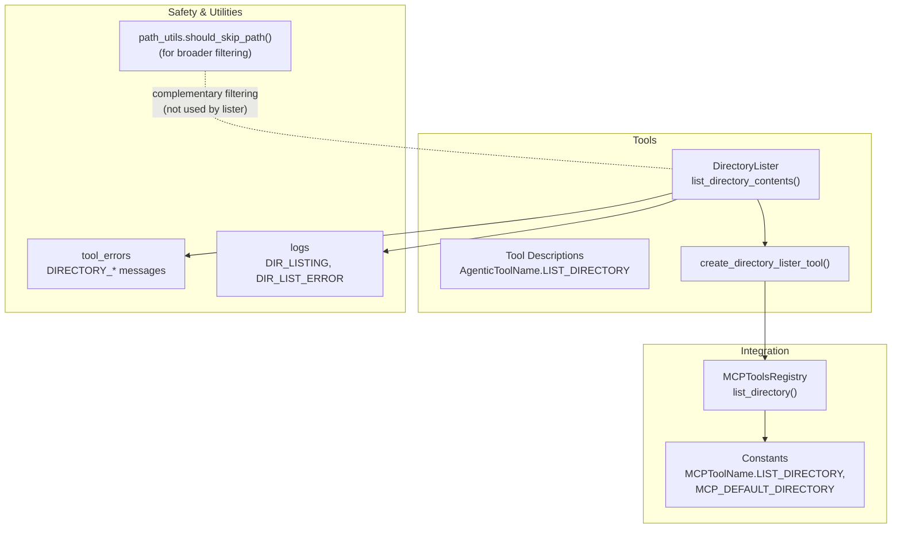
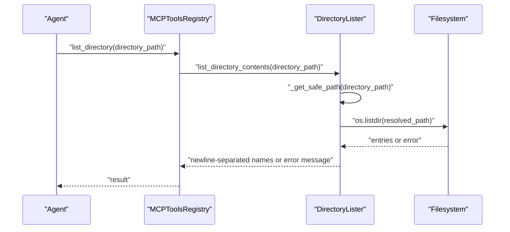
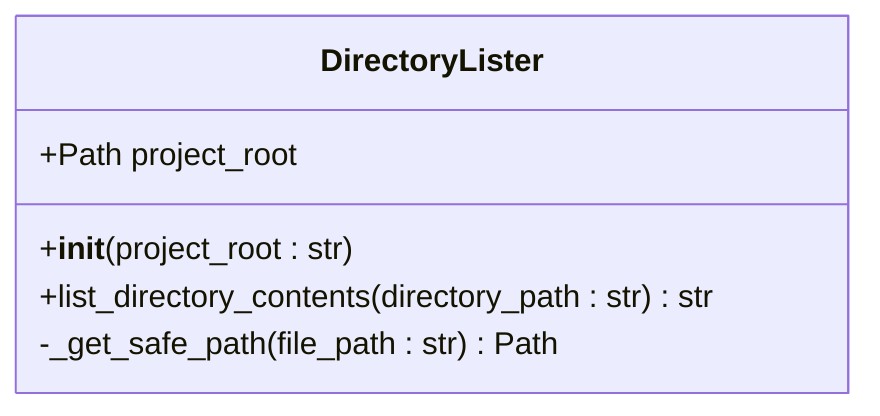
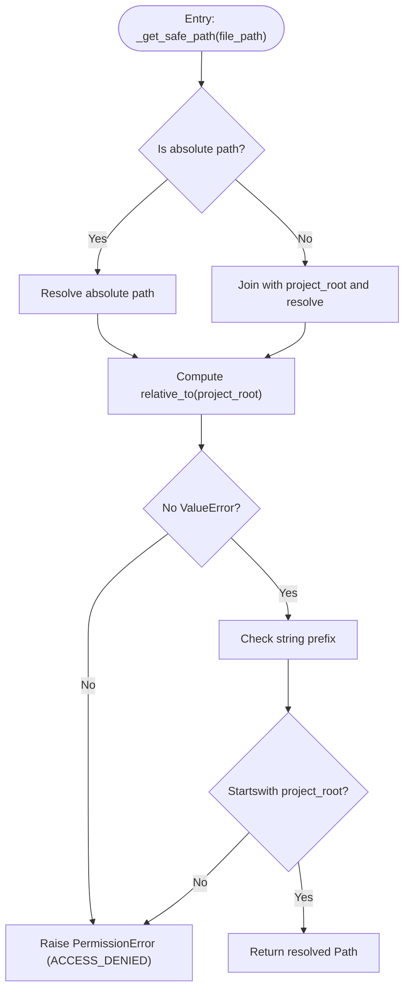
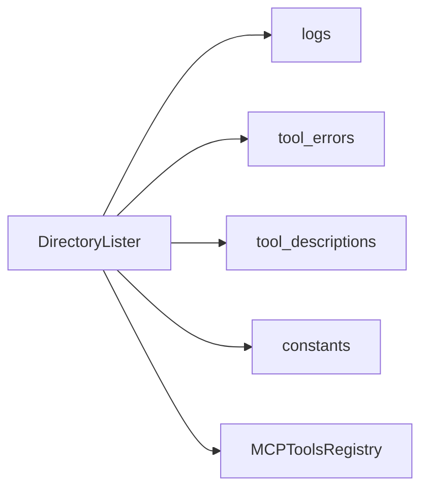

# Directory Lister Tool

<cite>
**Referenced Files in This Document**
- [directory_lister.py](file://codebase_rag/tools/directory_lister.py)
- [path_utils.py](file://codebase_rag/utils/path_utils.py)
- [tool_descriptions.py](file://codebase_rag/tools/tool_descriptions.py)
- [mcp/tools.py](file://codebase_rag/mcp/tools.py)
- [constants.py](file://codebase_rag/constants.py)
- [tool_errors.py](file://codebase_rag/tool_errors.py)
- [logs.py](file://codebase_rag/logs.py)
- [test_directory_lister.py](file://codebase_rag/tests/test_directory_lister.py)
- [test_mcp_list_directory.py](file://codebase_rag/tests/test_mcp_list_directory.py)
</cite>

## Table of Contents
1. [Introduction](#introduction)
2. [Project Structure](#project-structure)
3. [Core Components](#core-components)
4. [Architecture Overview](#architecture-overview)
5. [Detailed Component Analysis](#detailed-component-analysis)
6. [Dependency Analysis](#dependency-analysis)
7. [Performance Considerations](#performance-considerations)
8. [Troubleshooting Guide](#troubleshooting-guide)
9. [Conclusion](#conclusion)

## Introduction
The Directory Lister Tool enables AI agents to safely explore a codebase’s filesystem structure. It provides a controlled way to list directory contents, helping agents discover relevant files, navigate project layouts, and focus on meaningful targets for further actions such as reading, editing, or analysis. The tool enforces strict safety boundaries to prevent arbitrary filesystem traversal and ensures all operations remain within the designated project root.

## Project Structure
The Directory Lister is implemented as a focused tool with minimal dependencies:
- Core logic resides in a dedicated tool module
- Safety enforcement leverages path normalization and containment checks
- Integration points include both generic tool creation and MCP tool registry
- Tests validate behavior across normal usage, edge cases, and security constraints

**Diagram sources**
- [directory_lister.py](file://codebase_rag/tools/directory_lister.py#L15-L58)
- [tool_descriptions.py](file://codebase_rag/tools/tool_descriptions.py#L8-L18)
- [mcp/tools.py](file://codebase_rag/mcp/tools.py#L40-L68)
- [constants.py](file://codebase_rag/constants.py#L2347-L2403)
- [path_utils.py](file://codebase_rag/utils/path_utils.py#L6-L28)
- [tool_errors.py](file://codebase_rag/tool_errors.py#L33-L36)
- [logs.py](file://codebase_rag/logs.py#L263-L266)

**Section sources**
- [directory_lister.py](file://codebase_rag/tools/directory_lister.py#L1-L58)
- [mcp/tools.py](file://codebase_rag/mcp/tools.py#L40-L68)
- [constants.py](file://codebase_rag/constants.py#L2347-L2403)

## Core Components
- DirectoryLister: Central class that resolves a target path, validates it is a directory, lists its contents, and handles errors gracefully.
- Safe path resolution: Ensures the requested path is either absolute within the project root or relative to the project root, and rejects attempts to escape the root.
- Tool creation: Wraps the listing function into a Tool suitable for agent orchestration.
- MCP integration: Exposes the tool via MCP with a standardized schema and default parameter for directory path.

Key behaviors:
- Accepts relative or absolute paths; normalizes to a safe Path within the project root
- Validates the target is a directory; returns appropriate error messages for invalid or empty directories
- Returns newline-separated names of directory entries
- Logs operations and errors for observability

**Section sources**
- [directory_lister.py](file://codebase_rag/tools/directory_lister.py#L15-L58)
- [tool_descriptions.py](file://codebase_rag/tools/tool_descriptions.py#L33-L33)
- [mcp/tools.py](file://codebase_rag/mcp/tools.py#L232-L248)
- [constants.py](file://codebase_rag/constants.py#L2403-L2403)

## Architecture Overview
The Directory Lister integrates at two layers:
- As a standalone tool with a simple API
- Integrated into the MCP tool registry with a standardized input schema and default directory parameter

**Diagram sources**
- [mcp/tools.py](file://codebase_rag/mcp/tools.py#L422-L431)
- [directory_lister.py](file://codebase_rag/tools/directory_lister.py#L19-L34)

## Detailed Component Analysis

### DirectoryLister Class
Responsibilities:
- Initialize with a project root path and normalize it
- List directory contents safely and return a newline-separated string
- Enforce containment within the project root and reject traversal attempts
- Provide a Tool wrapper for agent orchestration

**Diagram sources**
- [directory_lister.py](file://codebase_rag/tools/directory_lister.py#L15-L58)

**Section sources**
- [directory_lister.py](file://codebase_rag/tools/directory_lister.py#L15-L58)

### Safe Path Resolution Logic
The internal method ensures:
- Absolute paths are resolved and validated against the project root
- Relative paths are joined under the project root and then resolved
- Raises a permission error if the resolved path is outside the project root
- Uses string prefix checks as an additional safeguard

**Diagram sources**
- [directory_lister.py](file://codebase_rag/tools/directory_lister.py#L35-L49)

**Section sources**
- [directory_lister.py](file://codebase_rag/tools/directory_lister.py#L35-L49)

### Tool Creation and Description
- The tool is wrapped as a Tool with a descriptive name and human-readable description
- The description indicates its purpose: listing directory contents to explore the codebase

**Section sources**
- [directory_lister.py](file://codebase_rag/tools/directory_lister.py#L52-L58)
- [tool_descriptions.py](file://codebase_rag/tools/tool_descriptions.py#L33-L33)

### MCP Integration
- Registered under the MCP tool name for directory listing
- Input schema defines a single optional parameter for the directory path with a default value pointing to the project root
- Handler delegates to the underlying tool function and wraps exceptions into user-friendly messages

**Section sources**
- [mcp/tools.py](file://codebase_rag/mcp/tools.py#L232-L248)
- [constants.py](file://codebase_rag/constants.py#L2403-L2403)

### Filtering and Pattern Matching
- The Directory Lister itself performs a flat listing without filtering by file extensions or patterns
- A separate utility exists for deciding whether a path should be skipped during broader ingestion tasks, but it is not used by the Directory Lister
- Users can combine Directory Lister results with other tools or manual filtering to achieve desired outcomes

**Section sources**
- [path_utils.py](file://codebase_rag/utils/path_utils.py#L6-L28)

## Dependency Analysis
- Internal dependencies: logging, pydantic-ai Tool, and shared error/message modules
- External integration: MCP registry and constants define tool naming and defaults
- No circular dependencies observed in the tool’s core logic

**Diagram sources**
- [directory_lister.py](file://codebase_rag/tools/directory_lister.py#L1-L12)
- [mcp/tools.py](file://codebase_rag/mcp/tools.py#L17-L23)

**Section sources**
- [directory_lister.py](file://codebase_rag/tools/directory_lister.py#L1-L12)
- [mcp/tools.py](file://codebase_rag/mcp/tools.py#L17-L23)

## Performance Considerations
- Listing is a synchronous filesystem operation; performance depends on filesystem latency and directory size
- The tool returns a newline-separated string, which is efficient for small to moderate directory sizes
- For very large directories, consider paging or filtering externally to reduce payload size

## Troubleshooting Guide
Common scenarios and their handling:
- Nonexistent directory: Returns an error indicating the path is not a valid directory
- Empty directory: Returns a message indicating the directory is empty
- Invalid target (file instead of directory): Returns an error indicating the path is not a valid directory
- Access denied or traversal attempts: Raises a permission error and logs a security-related message
- Exceptions during listing: Logged with contextual information and surfaced as a generic failure message

Operational hints:
- Use relative paths from the project root for clarity
- Combine with other tools to refine results (e.g., filter by extension using external logic)
- Monitor logs for diagnostic information when listing fails

**Section sources**
- [directory_lister.py](file://codebase_rag/tools/directory_lister.py#L23-L34)
- [tool_errors.py](file://codebase_rag/tool_errors.py#L33-L36)
- [logs.py](file://codebase_rag/logs.py#L263-L266)
- [test_directory_lister.py](file://codebase_rag/tests/test_directory_lister.py#L77-L87)

## Conclusion
The Directory Lister Tool provides a safe, reliable mechanism for AI agents to explore a codebase’s directory structure. Its strong containment guarantees and straightforward API make it ideal for initial discovery and navigation tasks. While it does not include built-in filtering, it integrates seamlessly with the broader tool ecosystem and MCP infrastructure, enabling flexible workflows tailored to specific needs.