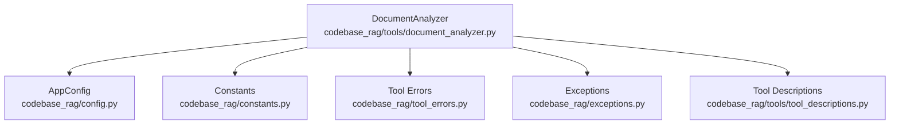
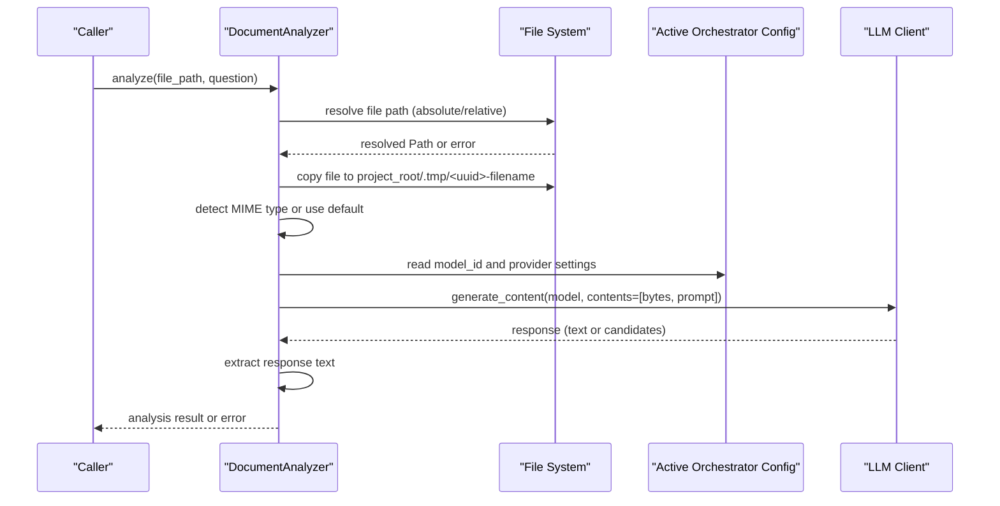
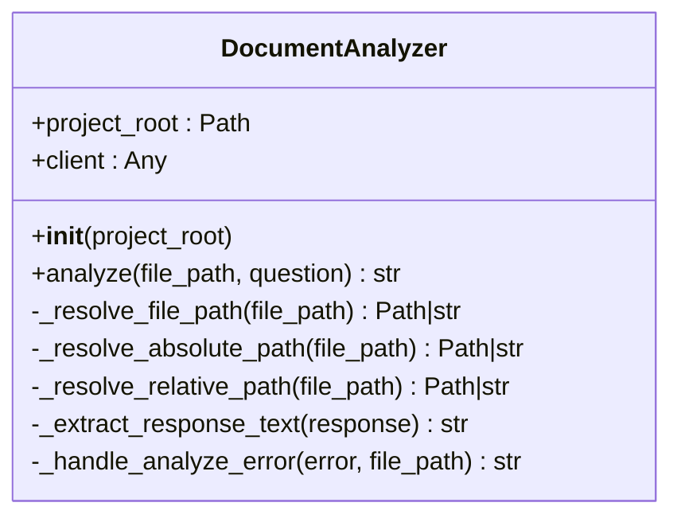
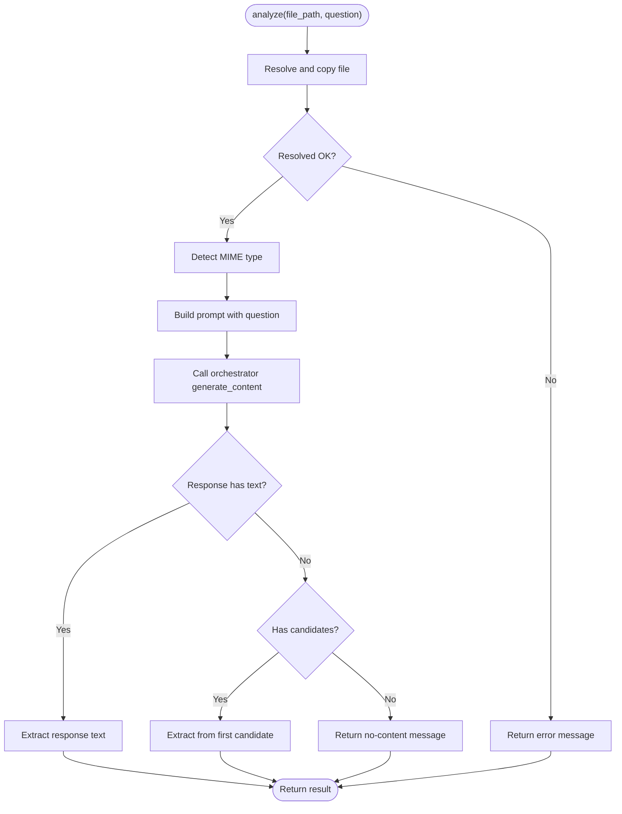
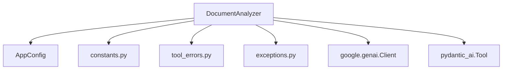

# Document Analyzer Tool

<cite>
**Referenced Files in This Document**
- [document_analyzer.py](file://codebase_rag/tools/document_analyzer.py)
- [constants.py](file://codebase_rag/constants.py)
- [exceptions.py](file://codebase_rag/exceptions.py)
- [tool_errors.py](file://codebase_rag/tool_errors.py)
- [config.py](file://codebase_rag/config.py)
- [tool_descriptions.py](file://codebase_rag/tools/tool_descriptions.py)
- [test_document_analyzer.py](file://codebase_rag/tests/test_document_analyzer.py)
- [test_document_analyzer_integration.py](file://codebase_rag/tests/integration/test_document_analyzer_integration.py)
</cite>

## Table of Contents
1. [Introduction](#introduction)
2. [Project Structure](#project-structure)
3. [Core Components](#core-components)
4. [Architecture Overview](#architecture-overview)
5. [Detailed Component Analysis](#detailed-component-analysis)
6. [Dependency Analysis](#dependency-analysis)
7. [Performance Considerations](#performance-considerations)
8. [Troubleshooting Guide](#troubleshooting-guide)
9. [Conclusion](#conclusion)

## Introduction
The Document Analyzer Tool provides a unified capability to analyze documents and images using a configured Large Language Model (LLM) orchestrator. It accepts a file path and a natural language question, resolves the file safely within the project root, determines the MIME type, and sends the file bytes along with a structured prompt to the active orchestrator model. The tool extracts the textual response from the model’s output and returns it to the caller. It integrates with the broader codebase’s tool ecosystem and supports robust error handling for unsupported providers, file access violations, API validation failures, and runtime exceptions.

## Project Structure
The Document Analyzer resides in the tools module and interacts with configuration, logging, and error-handling utilities across the codebase. The primary implementation is encapsulated in a single class with a factory function to expose it as a pydantic-ai Tool.

**Diagram sources**
- [document_analyzer.py](file://codebase_rag/tools/document_analyzer.py#L28-L167)
- [config.py](file://codebase_rag/config.py#L197-L200)
- [constants.py](file://codebase_rag/constants.py#L1130-L1136)
- [tool_errors.py](file://codebase_rag/tool_errors.py#L15-L31)
- [exceptions.py](file://codebase_rag/exceptions.py#L52-L54)
- [tool_descriptions.py](file://codebase_rag/tools/tool_descriptions.py#L8-L23)

**Section sources**
- [document_analyzer.py](file://codebase_rag/tools/document_analyzer.py#L1-L168)
- [config.py](file://codebase_rag/config.py#L197-L200)
- [constants.py](file://codebase_rag/constants.py#L1130-L1136)
- [tool_errors.py](file://codebase_rag/tool_errors.py#L15-L31)
- [exceptions.py](file://codebase_rag/exceptions.py#L52-L54)
- [tool_descriptions.py](file://codebase_rag/tools/tool_descriptions.py#L8-L23)

## Core Components
- DocumentAnalyzer: Central class that validates provider compatibility, resolves and copies files into a temporary directory, determines MIME type, constructs the prompt payload, invokes the orchestrator, and extracts the response text.
- create_document_analyzer_tool: Factory that wraps DocumentAnalyzer.analyze into a pydantic-ai Tool with a standardized name and description.
- Configuration and constants: Active orchestrator configuration, default MIME type fallback, and prompt prefix are defined centrally.
- Error handling: Dedicated error messages and exceptions for unsupported providers, file access, API validation, and runtime failures.

Key responsibilities:
- Safe file resolution and copying to avoid direct external file access.
- MIME type detection and fallback to a safe default.
- Structured prompt construction and response extraction.
- Robust error translation and logging.

**Section sources**
- [document_analyzer.py](file://codebase_rag/tools/document_analyzer.py#L28-L167)
- [constants.py](file://codebase_rag/constants.py#L1130-L1136)
- [tool_errors.py](file://codebase_rag/tool_errors.py#L15-L31)
- [exceptions.py](file://codebase_rag/exceptions.py#L52-L54)
- [tool_descriptions.py](file://codebase_rag/tools/tool_descriptions.py#L8-L23)

## Architecture Overview
The Document Analyzer integrates with the active orchestrator configuration to send a multimodal request containing the file bytes and a natural language question. The response is parsed to extract the first available text content.

**Diagram sources**
- [document_analyzer.py](file://codebase_rag/tools/document_analyzer.py#L111-L145)
- [config.py](file://codebase_rag/config.py#L197-L200)
- [constants.py](file://codebase_rag/constants.py#L1130-L1136)

## Detailed Component Analysis

### DocumentAnalyzer Class
Responsibilities:
- Initialize with project root and configure the LLM client based on the active orchestrator provider.
- Resolve file paths safely (absolute and relative), enforce project-root boundaries, and copy files into a temporary directory for processing.
- Detect MIME type and construct the prompt payload with the question.
- Invoke the orchestrator and extract the response text from either the top-level text or candidate content parts.
- Translate exceptions into user-friendly error messages.

**Diagram sources**
- [document_analyzer.py](file://codebase_rag/tools/document_analyzer.py#L28-L167)

**Section sources**
- [document_analyzer.py](file://codebase_rag/tools/document_analyzer.py#L28-L167)

### create_document_analyzer_tool Function
Purpose:
- Wrap DocumentAnalyzer.analyze into a pydantic-ai Tool with a standardized name and description.
- Log previews of results and propagate errors consistently.

Behavior:
- On success, returns the extracted text from the LLM response.
- On exceptions, logs and returns a formatted error message.

**Section sources**
- [document_analyzer.py](file://codebase_rag/tools/document_analyzer.py#L148-L167)
- [tool_descriptions.py](file://codebase_rag/tools/tool_descriptions.py#L8-L23)

### Parameter Requirements and Behavior
- Input parameters:
  - file_path: Absolute or relative path to the document/image to analyze. Relative paths are resolved against the project root and validated to prevent traversal outside the root.
  - question: Natural language query to guide the analysis.
- Output:
  - Returns the extracted text from the LLM response or a user-friendly error message.
- Analysis scope:
  - Operates on a single file per invocation.
  - Uses the active orchestrator configuration for provider, model, and credentials.
- Output format:
  - Textual response extracted from the model’s output.
- Detail level:
  - Controlled by the underlying model’s capabilities and the specificity of the question.

Operational flow highlights:
- File resolution and safety checks.
- MIME type detection with a safe default fallback.
- Prompt construction using a centralized prefix constant.
- Response extraction from either top-level text or candidate parts.

**Section sources**
- [document_analyzer.py](file://codebase_rag/tools/document_analyzer.py#L111-L145)
- [constants.py](file://codebase_rag/constants.py#L1130-L1136)
- [config.py](file://codebase_rag/config.py#L197-L200)

### Integration with Language Handlers
Observation:
- The Document Analyzer operates on arbitrary files and relies on the active orchestrator to interpret content. It does not directly integrate with language-specific parsers or handlers used elsewhere in the codebase for code analysis. Its focus is on document and image interpretation via multimodal LLM APIs.

Implication:
- For code analysis tasks, use dedicated tools and handlers designed for source code parsing and graph construction. The Document Analyzer is intended for documents and images.

**Section sources**
- [document_analyzer.py](file://codebase_rag/tools/document_analyzer.py#L111-L145)

### Examples and Use Cases
- Analyze a README for a summary: Provide a text file path and a concise question like “Summarize the purpose of this file.”
- Extract data from a JSON file: Provide a JSON path and a question like “What data is stored in this file?”
- Analyze a PDF or image: Provide a PDF or image path and a question like “Describe the content of this document.”

Validation and integration examples are covered in unit and integration tests.

**Section sources**
- [test_document_analyzer.py](file://codebase_rag/tests/test_document_analyzer.py#L83-L158)
- [test_document_analyzer_integration.py](file://codebase_rag/tests/integration/test_document_analyzer_integration.py#L71-L120)

### Error Handling
- Unsupported provider: Returns a specific error indicating the provider is not supported for document analysis.
- File not found: Returns a clear error indicating the file path was not found.
- Path traversal attempts: Blocks access and returns a security-related error.
- API validation errors: Wraps ValueError into a user-friendly message.
- Client errors: Handles LLM client errors and special cases (e.g., image processing failures).
- General exceptions: Logs and returns a generic failure message.

**Diagram sources**
- [document_analyzer.py](file://codebase_rag/tools/document_analyzer.py#L78-L145)
- [constants.py](file://codebase_rag/constants.py#L1130-L1136)
- [tool_errors.py](file://codebase_rag/tool_errors.py#L15-L31)
- [exceptions.py](file://codebase_rag/exceptions.py#L52-L54)

**Section sources**
- [document_analyzer.py](file://codebase_rag/tools/document_analyzer.py#L93-L145)
- [tool_errors.py](file://codebase_rag/tool_errors.py#L15-L31)
- [exceptions.py](file://codebase_rag/exceptions.py#L52-L54)

## Dependency Analysis
- Internal dependencies:
  - Reads active orchestrator configuration from AppConfig.
  - Uses centralized constants for prompt prefix, MIME defaults, and messaging.
  - Leverages tool error constants and exceptions for consistent error reporting.
- External dependencies:
  - LLM client (Google GenAI) for content generation.
  - pydantic-ai Tool for exposing the analyzer as a tool.

**Diagram sources**
- [document_analyzer.py](file://codebase_rag/tools/document_analyzer.py#L28-L167)
- [config.py](file://codebase_rag/config.py#L197-L200)
- [constants.py](file://codebase_rag/constants.py#L1130-L1136)
- [tool_errors.py](file://codebase_rag/tool_errors.py#L15-L31)
- [exceptions.py](file://codebase_rag/exceptions.py#L52-L54)

**Section sources**
- [document_analyzer.py](file://codebase_rag/tools/document_analyzer.py#L28-L167)
- [config.py](file://codebase_rag/config.py#L197-L200)

## Performance Considerations
- File copying: The analyzer copies the target file into a temporary directory under the project root to ensure safe processing. This avoids direct external file access and reduces risk but adds I/O overhead proportional to file size.
- MIME detection: Uses Python’s mimetypes library with a safe default fallback to ensure the LLM receives a valid MIME type.
- Prompt construction: Combines file bytes with a fixed prompt prefix, minimizing overhead while ensuring clarity for the model.
- Response extraction: Attempts to extract text directly; if unavailable, iterates through candidates to find the first text part.

Recommendations:
- Prefer smaller, focused documents for faster turnaround.
- Ensure the orchestrator model is appropriately selected for the task to balance quality and latency.
- Monitor orchestrator quotas and rate limits when invoking the analyzer repeatedly.

[No sources needed since this section provides general guidance]

## Troubleshooting Guide
Common issues and resolutions:
- Unsupported provider: The analyzer only supports configured cloud providers. If a local provider is active, the tool returns a specific error indicating document analysis is not supported.
- File not found: Verify the file path exists relative to the project root or is an absolute path within the project.
- Path traversal attempts: Ensure the path does not attempt to escape the project root; the analyzer enforces this security boundary.
- API validation errors: Confirm the orchestrator configuration is valid and the model ID is correct.
- Client errors: Inspect the LLM client error details; for images, ensure the file is not corrupted and in a supported format.
- General failures: Review logs for detailed exception information and retry with corrected parameters.

**Section sources**
- [document_analyzer.py](file://codebase_rag/tools/document_analyzer.py#L93-L145)
- [tool_errors.py](file://codebase_rag/tool_errors.py#L15-L31)
- [exceptions.py](file://codebase_rag/exceptions.py#L52-L54)

## Conclusion
The Document Analyzer Tool offers a secure, configurable way to analyze documents and images using a multimodal LLM. It enforces strict file safety, integrates with the active orchestrator configuration, and provides robust error handling. While it does not parse or analyze source code directly, it complements the broader codebase by enabling contextual understanding of non-code artifacts. For code-centric insights, pair the Document Analyzer with dedicated language handlers and graph services designed for source code analysis.