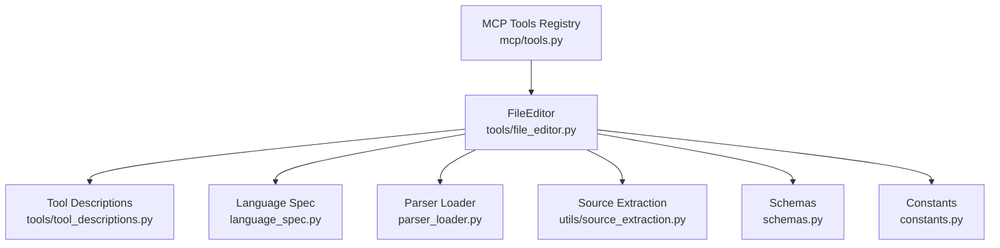
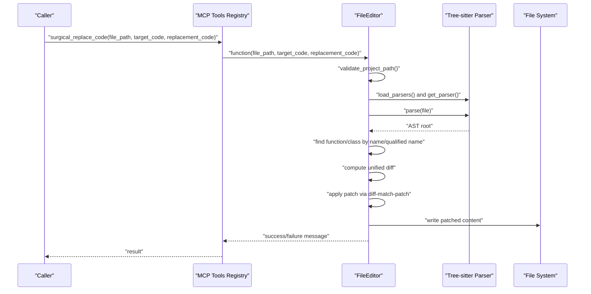
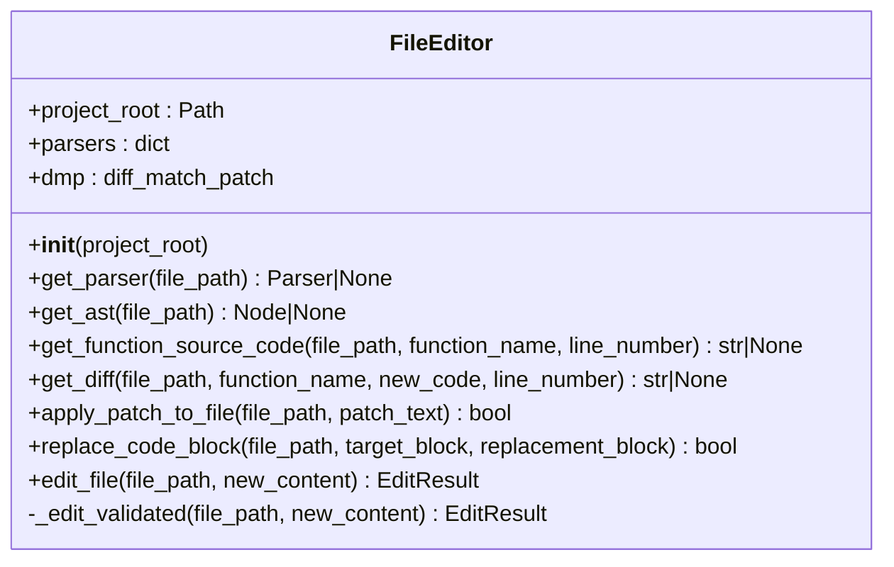
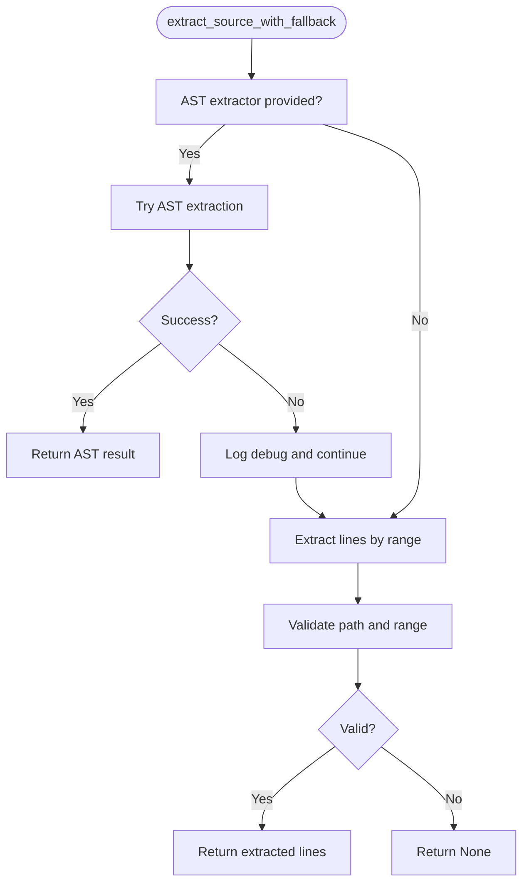
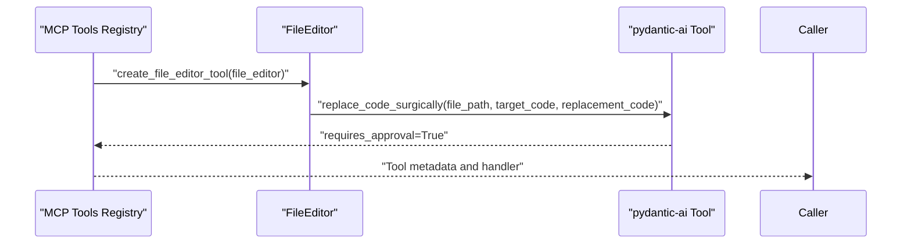
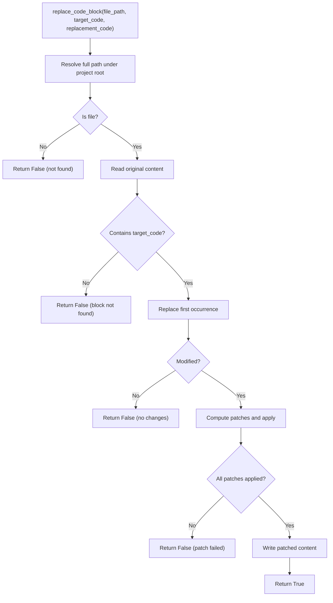
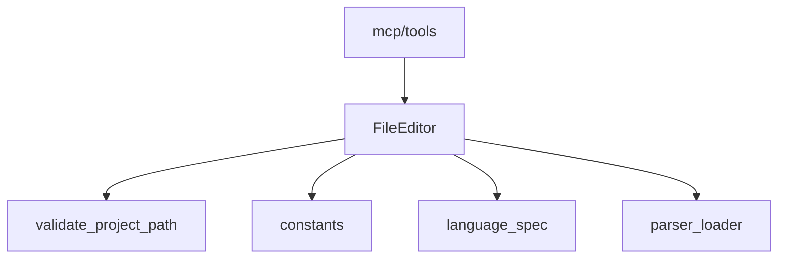

# File Editor Tool

<cite>
**Referenced Files in This Document**
- [file_editor.py](file://codebase_rag/tools/file_editor.py)
- [test_file_editor.py](file://codebase_rag/tests/test_file_editor.py)
- [source_extraction.py](file://codebase_rag/utils/source_extraction.py)
- [schemas.py](file://codebase_rag/schemas.py)
- [constants.py](file://codebase_rag/constants.py)
- [language_spec.py](file://codebase_rag/language_spec.py)
- [parser_loader.py](file://codebase_rag/parser_loader.py)
- [tool_descriptions.py](file://codebase_rag/tools/tool_descriptions.py)
- [decorators.py](file://codebase_rag/decorators.py)
- [mcp/tools.py](file://codebase_rag/mcp/tools.py)
- [README.md](file://README.md)
</cite>

## Table of Contents
1. [Introduction](#introduction)
2. [Project Structure](#project-structure)
3. [Core Components](#core-components)
4. [Architecture Overview](#architecture-overview)
5. [Detailed Component Analysis](#detailed-component-analysis)
6. [Dependency Analysis](#dependency-analysis)
7. [Performance Considerations](#performance-considerations)
8. [Troubleshooting Guide](#troubleshooting-guide)
9. [Conclusion](#conclusion)
10. [Appendices](#appendices)

## Introduction
This document describes the File Editor Tool that performs surgical code replacement with AST-based precision. It enables targeted modifications to functions, classes, and imports while preserving syntax and structure. The tool integrates with Tree-sitter parsers for language-aware AST analysis, supports multi-language grammars, and enforces strict security boundaries. It also provides diff visualization, approval workflows, and robust error handling for syntax errors, file conflicts, and validation failures.

## Project Structure
The File Editor Tool resides in the tools module and integrates with language parsing infrastructure and MCP tooling. The key files include:
- Tools: file_editor.py, tool_descriptions.py
- Language parsing: language_spec.py, parser_loader.py
- Utilities: source_extraction.py
- Schemas and constants: schemas.py, constants.py
- MCP integration: mcp/tools.py
- Tests: test_file_editor.py
- Documentation: README.md

**Diagram sources**
- [file_editor.py](file://codebase_rag/tools/file_editor.py#L22-L296)
- [tool_descriptions.py](file://codebase_rag/tools/tool_descriptions.py#L66-L71)
- [language_spec.py](file://codebase_rag/language_spec.py#L205-L409)
- [parser_loader.py](file://codebase_rag/parser_loader.py#L276-L293)
- [source_extraction.py](file://codebase_rag/utils/source_extraction.py#L12-L75)
- [schemas.py](file://codebase_rag/schemas.py#L54-L64)
- [constants.py](file://codebase_rag/constants.py#L426-L507)
- [mcp/tools.py](file://codebase_rag/mcp/tools.py#L40-L69)

**Section sources**
- [file_editor.py](file://codebase_rag/tools/file_editor.py#L22-L296)
- [tool_descriptions.py](file://codebase_rag/tools/tool_descriptions.py#L66-L71)
- [language_spec.py](file://codebase_rag/language_spec.py#L205-L409)
- [parser_loader.py](file://codebase_rag/parser_loader.py#L276-L293)
- [source_extraction.py](file://codebase_rag/utils/source_extraction.py#L12-L75)
- [schemas.py](file://codebase_rag/schemas.py#L54-L64)
- [constants.py](file://codebase_rag/constants.py#L426-L507)
- [mcp/tools.py](file://codebase_rag/mcp/tools.py#L40-L69)

## Core Components
- FileEditor: Provides AST-based function/class targeting, surgical replacement, diff generation, and patch application.
- Parser Loader and Language Spec: Supply Tree-sitter parsers and language-specific AST node types.
- Source Extraction: Offers fallback extraction and validation helpers for safe context retrieval.
- Schemas: Defines EditResult for structured results.
- Constants: Provides language metadata, AST node types, and shared constants.
- MCP Tools Registry: Exposes the surgical replace tool via MCP with approval and error handling.

Key capabilities:
- Surgical replacement using exact substring match and diff-match-patch verification.
- AST-based function/class discovery with qualified name support.
- Diff visualization for previewing changes.
- Approval-required workflow for risky edits.
- Security sandbox preventing edits outside the project root.

**Section sources**
- [file_editor.py](file://codebase_rag/tools/file_editor.py#L22-L296)
- [parser_loader.py](file://codebase_rag/parser_loader.py#L276-L293)
- [language_spec.py](file://codebase_rag/language_spec.py#L205-L409)
- [schemas.py](file://codebase_rag/schemas.py#L54-L64)
- [constants.py](file://codebase_rag/constants.py#L426-L507)
- [mcp/tools.py](file://codebase_rag/mcp/tools.py#L157-L184)

## Architecture Overview
The File Editor Tool orchestrates parsing, AST traversal, and surgical replacement. It validates paths, extracts function/class blocks via AST, computes diffs, and applies verified patches.

**Diagram sources**
- [mcp/tools.py](file://codebase_rag/mcp/tools.py#L356-L369)
- [file_editor.py](file://codebase_rag/tools/file_editor.py#L204-L253)
- [parser_loader.py](file://codebase_rag/parser_loader.py#L276-L293)

**Section sources**
- [mcp/tools.py](file://codebase_rag/mcp/tools.py#L356-L369)
- [file_editor.py](file://codebase_rag/tools/file_editor.py#L204-L253)
- [parser_loader.py](file://codebase_rag/parser_loader.py#L276-L293)

## Detailed Component Analysis

### FileEditor Class
Responsibilities:
- Initialize with project root and parser cache.
- Resolve language-specific parsers via extension.
- Parse files to AST and traverse nodes to locate functions/classes.
- Extract function/class source code precisely.
- Compute diffs and apply surgical patches.
- Provide approval-required tool creation.

Key methods and behaviors:
- Parser resolution and AST retrieval.
- Function/class discovery with qualified names and line numbers.
- Diff computation using unified diff and semantic cleanup.
- Patch application with verification.
- Safety checks for path validity and single occurrence.

**Diagram sources**
- [file_editor.py](file://codebase_rag/tools/file_editor.py#L22-L296)

**Section sources**
- [file_editor.py](file://codebase_rag/tools/file_editor.py#L22-L296)

### Parser Loader and Language Specification
- Loads Tree-sitter parsers for supported languages.
- Provides language-specific AST node types for functions, classes, imports, and calls.
- Supplies combined query patterns for efficient AST traversal.

**Diagram sources**
- [parser_loader.py](file://codebase_rag/parser_loader.py#L276-L293)
- [language_spec.py](file://codebase_rag/language_spec.py#L205-L409)
- [constants.py](file://codebase_rag/constants.py#L426-L507)

**Section sources**
- [parser_loader.py](file://codebase_rag/parser_loader.py#L276-L293)
- [language_spec.py](file://codebase_rag/language_spec.py#L205-L409)
- [constants.py](file://codebase_rag/constants.py#L426-L507)

### Source Extraction Utility
Provides safe extraction of source code segments with fallback to AST-based extraction when available. Includes validation helpers for file existence and line ranges.

**Diagram sources**
- [source_extraction.py](file://codebase_rag/utils/source_extraction.py#L46-L61)

**Section sources**
- [source_extraction.py](file://codebase_rag/utils/source_extraction.py#L12-L75)

### Tool Creation and MCP Integration
- Creates a pydantic-ai Tool for surgical replacement with requires_approval enabled.
- MCP registry exposes surgical_replace_code with input schema and handler.
- Returns human-readable success/failure messages.

**Diagram sources**
- [file_editor.py](file://codebase_rag/tools/file_editor.py#L279-L295)
- [mcp/tools.py](file://codebase_rag/mcp/tools.py#L157-L184)

**Section sources**
- [file_editor.py](file://codebase_rag/tools/file_editor.py#L279-L295)
- [mcp/tools.py](file://codebase_rag/mcp/tools.py#L157-L184)

### Parameter Requirements and Validation
- Required parameters for surgical replacement:
  - file_path: Relative path from project root.
  - target_code: Exact substring to replace.
  - replacement_code: Replacement text.
- Validation:
  - Path must resolve under project root.
  - Target block must exist in file.
  - Single occurrence enforced; multiple occurrences produce warnings.
  - Patch verification ensures applied changes match expectations.

**Diagram sources**
- [file_editor.py](file://codebase_rag/tools/file_editor.py#L204-L253)

**Section sources**
- [file_editor.py](file://codebase_rag/tools/file_editor.py#L204-L253)

### Practical Examples
- Replace function implementation:
  - Locate function by name or qualified name.
  - Extract exact function block.
  - Provide new implementation as replacement_code.
  - Preview diff and approve; tool applies surgical patch.
- Modify class definitions:
  - Use qualified name to select the desired class.
  - Replace the entire class block with updated definition.
- Update imports:
  - Identify import statements via AST.
  - Replace specific import lines with updated forms.

Note: These examples describe workflows; refer to tests for concrete scenarios.

**Section sources**
- [test_file_editor.py](file://codebase_rag/tests/test_file_editor.py#L127-L152)
- [test_file_editor.py](file://codebase_rag/tests/test_file_editor.py#L154-L200)

### Approval Workflow, Diff Visualization, and Rollback
- Approval workflow:
  - Tool requires approval due to requires_approval=True.
  - Users review unified diff preview before confirming.
- Diff visualization:
  - get_diff computes unified diff between original and new code.
  - Uses semantic cleanup and unified diff format.
- Rollback:
  - The tool does not implement automatic rollback.
  - Recommended practice: commit changes before applying edits; revert manually if needed.

**Section sources**
- [file_editor.py](file://codebase_rag/tools/file_editor.py#L157-L179)
- [file_editor.py](file://codebase_rag/tools/file_editor.py#L279-L295)
- [README.md](file://README.md#L717-L722)

## Dependency Analysis
The File Editor Tool depends on:
- Language parsing infrastructure for AST-based targeting.
- Parser loader for dynamic grammar availability.
- Constants for language metadata and AST node types.
- Decorators for path validation and approval gating.
- MCP integration for tool exposure and schema.

**Diagram sources**
- [file_editor.py](file://codebase_rag/tools/file_editor.py#L22-L296)
- [decorators.py](file://codebase_rag/decorators.py#L55-L87)
- [constants.py](file://codebase_rag/constants.py#L426-L507)
- [language_spec.py](file://codebase_rag/language_spec.py#L205-L409)
- [parser_loader.py](file://codebase_rag/parser_loader.py#L276-L293)
- [mcp/tools.py](file://codebase_rag/mcp/tools.py#L40-L69)

**Section sources**
- [file_editor.py](file://codebase_rag/tools/file_editor.py#L22-L296)
- [decorators.py](file://codebase_rag/decorators.py#L55-L87)
- [constants.py](file://codebase_rag/constants.py#L426-L507)
- [language_spec.py](file://codebase_rag/language_spec.py#L205-L409)
- [parser_loader.py](file://codebase_rag/parser_loader.py#L276-L293)
- [mcp/tools.py](file://codebase_rag/mcp/tools.py#L40-L69)

## Performance Considerations
- AST parsing overhead scales with file size; prefer targeted replacements to minimize traversal.
- Unified diff computation is linear in the size of the difference; keep replacement blocks concise.
- Parser initialization occurs once per session; subsequent operations reuse cached parsers.
- Path validation prevents unnecessary IO on invalid paths.

[No sources needed since this section provides general guidance]

## Troubleshooting Guide
Common issues and resolutions:
- File not found or outside root:
  - Ensure file_path resolves under project root.
  - Use absolute paths cautiously; rely on relative paths from project root.
- Target block not found:
  - Verify exact target_code matches the file content.
  - Confirm single occurrence; multiple matches require explicit line selection.
- Patch application fails:
  - Review unified diff preview for conflicts.
  - Ensure replacement_code maintains syntactic validity.
- Ambiguous function names:
  - Use qualified names (e.g., Class.method) or specify line_number.
- Permission or security errors:
  - Confirm tool operates within project root.
  - Avoid attempts to modify files outside the sandbox.

**Section sources**
- [file_editor.py](file://codebase_rag/tools/file_editor.py#L204-L253)
- [decorators.py](file://codebase_rag/decorators.py#L55-L87)
- [test_file_editor.py](file://codebase_rag/tests/test_file_editor.py#L178-L188)

## Conclusion
The File Editor Tool delivers surgical, AST-guided code replacement with strong safety guarantees and clear previews. By combining Tree-sitter parsing, exact substring matching, and diff-match-patch verification, it minimizes risk while enabling precise, language-aware modifications. The approval workflow and sandboxed path validation further enhance reliability for automated editing tasks.

[No sources needed since this section summarizes without analyzing specific files]

## Appendices

### API Reference
- Surgical Replace Tool:
  - Name: replace_code
  - Requires approval: Yes
  - Parameters: file_path, target_code, replacement_code
  - Behavior: Validates path, finds exact target block, computes diff, applies verified patch

**Section sources**
- [tool_descriptions.py](file://codebase_rag/tools/tool_descriptions.py#L66-L71)
- [file_editor.py](file://codebase_rag/tools/file_editor.py#L279-L295)
- [mcp/tools.py](file://codebase_rag/mcp/tools.py#L157-L184)

### Multi-Language Support
- Supported languages include Python, JavaScript/TypeScript, Rust, Go, Scala, Java, C++, C#, PHP, and Lua.
- Language metadata and AST node types are defined centrally for consistent behavior.

**Section sources**
- [constants.py](file://codebase_rag/constants.py#L426-L507)
- [language_spec.py](file://codebase_rag/language_spec.py#L205-L409)