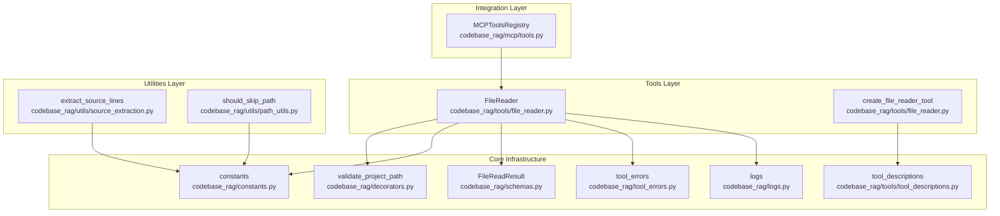
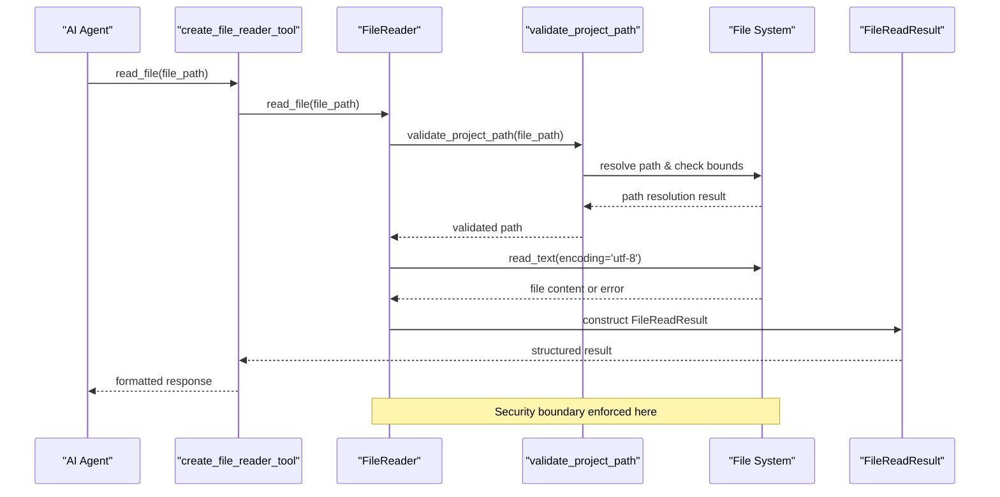
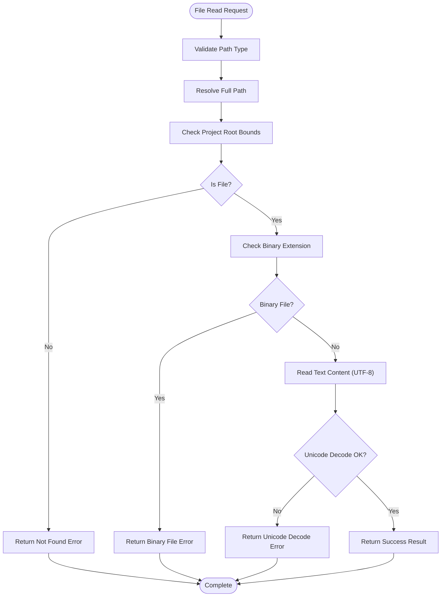
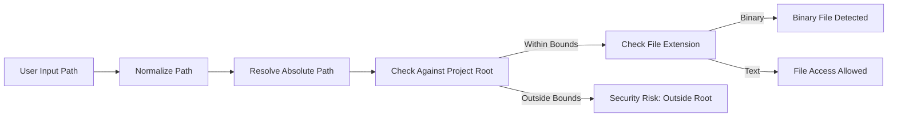
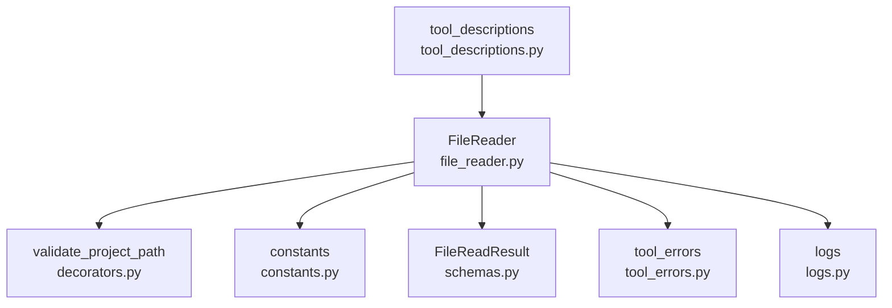

# File Reader Tool

<cite>
**Referenced Files in This Document**
- [file_reader.py](file://codebase_rag/tools/file_reader.py)
- [source_extraction.py](file://codebase_rag/utils/source_extraction.py)
- [path_utils.py](file://codebase_rag/utils/path_utils.py)
- [constants.py](file://codebase_rag/constants.py)
- [schemas.py](file://codebase_rag/schemas.py)
- [decorators.py](file://codebase_rag/decorators.py)
- [tool_errors.py](file://codebase_rag/tool_errors.py)
- [logs.py](file://codebase_rag/logs.py)
- [tool_descriptions.py](file://codebase_rag/tools/tool_descriptions.py)
- [mcp/tools.py](file://codebase_rag/mcp/tools.py)
- [test_file_reader.py](file://codebase_rag/tests/test_file_reader.py)
- [test_mcp_read_file.py](file://codebase_rag/tests/test_mcp_read_file.py)
</cite>

## Table of Contents
1. [Introduction](#introduction)
2. [Project Structure](#project-structure)
3. [Core Components](#core-components)
4. [Architecture Overview](#architecture-overview)
5. [Detailed Component Analysis](#detailed-component-analysis)
6. [Dependency Analysis](#dependency-analysis)
7. [Performance Considerations](#performance-considerations)
8. [Troubleshooting Guide](#troubleshooting-guide)
9. [Conclusion](#conclusion)

## Introduction
The File Reader Tool provides safe, controlled access to file contents within a codebase for AI agents. It serves as a security-conscious bridge between agents and source code, enabling retrieval of text-based files while preventing arbitrary filesystem access. The tool integrates with source extraction utilities, validates file paths against project boundaries, and manages encoding detection to ensure reliable text content retrieval.

## Project Structure
The File Reader Tool is implemented as a focused component within the tools subsystem, with supporting utilities in utilities and integration points in the MCP framework.

**Diagram sources**
- [file_reader.py](file://codebase_rag/tools/file_reader.py#L16-L67)
- [source_extraction.py](file://codebase_rag/utils/source_extraction.py#L12-L44)
- [path_utils.py](file://codebase_rag/utils/path_utils.py#L6-L28)
- [decorators.py](file://codebase_rag/decorators.py#L55-L87)
- [constants.py](file://codebase_rag/constants.py#L50-L62)
- [schemas.py](file://codebase_rag/schemas.py#L66-L70)
- [tool_errors.py](file://codebase_rag/tool_errors.py#L7-L13)
- [logs.py](file://codebase_rag/logs.py#L201-L203)
- [tool_descriptions.py](file://codebase_rag/tools/tool_descriptions.py#L61-L64)
- [mcp/tools.py](file://codebase_rag/mcp/tools.py#L55-L68)

**Section sources**
- [file_reader.py](file://codebase_rag/tools/file_reader.py#L1-L67)
- [mcp/tools.py](file://codebase_rag/mcp/tools.py#L40-L68)

## Core Components
The File Reader Tool consists of two primary components:

### FileReader Class
The core file reading implementation that handles path validation, binary file detection, and text content extraction with UTF-8 encoding.

### create_file_reader_tool Function
A factory function that creates a pydantic-ai Tool wrapper around the FileReader, providing standardized error handling and result formatting.

Key characteristics:
- Asynchronous operation for non-blocking file access
- Built-in path security validation
- Binary file prevention
- UTF-8 encoding enforcement
- Comprehensive error reporting

**Section sources**
- [file_reader.py](file://codebase_rag/tools/file_reader.py#L16-L67)

## Architecture Overview
The File Reader Tool follows a layered architecture with explicit security boundaries and clear separation of concerns.

**Diagram sources**
- [file_reader.py](file://codebase_rag/tools/file_reader.py#L21-L52)
- [decorators.py](file://codebase_rag/decorators.py#L55-L87)
- [schemas.py](file://codebase_rag/schemas.py#L66-L70)

## Detailed Component Analysis

### FileReader Implementation
The FileReader class implements a robust file reading mechanism with comprehensive validation and error handling.

#### Core Methods
- `__init__(project_root: str)`: Initializes with project root path and resolves it to absolute form
- `read_file(file_path: str) -> FileReadResult`: Public interface that orchestrates the reading process
- `_read_validated(file_path: Path) -> FileReadResult`: Private method with security validation

#### Security Validation Pipeline
The validation process enforces multiple security checks:

**Diagram sources**
- [file_reader.py](file://codebase_rag/tools/file_reader.py#L26-L52)
- [decorators.py](file://codebase_rag/decorators.py#L55-L87)

#### Error Handling Strategy
The tool implements a comprehensive error handling strategy:

| Error Type | Detection Mechanism | Error Message | Logging Level |
|------------|-------------------|---------------|---------------|
| File Not Found | `file_path.is_file()` check | FILE_NOT_FOUND | INFO |
| Binary File | Extension in BINARY_EXTENSIONS | BINARY_FILE | WARNING |
| Unicode Decode Error | UTF-8 decode failure | UNICODE_DECODE | WARNING |
| Security Violation | Path outside project root | ACCESS_DENIED | ERROR |
| Unexpected Error | General exception catch | UNEXPECTED | ERROR |

**Section sources**
- [file_reader.py](file://codebase_rag/tools/file_reader.py#L26-L52)
- [tool_errors.py](file://codebase_rag/tool_errors.py#L7-L13)
- [logs.py](file://codebase_rag/logs.py#L311-L319)

### Integration with Source Extraction Utilities
While the FileReader focuses on direct file reading, it complements the source extraction utilities for more sophisticated content retrieval scenarios.

#### Source Extraction Capabilities
The source extraction utilities provide additional functionality for targeted content retrieval:

- `extract_source_lines(file_path, start_line, end_line)`: Extracts specific line ranges
- `extract_source_with_fallback()`: Provides AST-based extraction with file fallback
- `validate_source_location()`: Validates source location parameters

#### Integration Benefits
- Line-based content extraction for large files
- AST-aware extraction for structured code
- Fallback mechanisms for different extraction strategies

**Section sources**
- [source_extraction.py](file://codebase_rag/utils/source_extraction.py#L12-L62)

### Path Validation and Security
The File Reader Tool implements strict path validation to prevent arbitrary filesystem access.

#### Security Features
- **Project Root Boundary Enforcement**: All file paths are resolved relative to the configured project root
- **Path Normalization**: Uses `pathlib.Path` for secure path resolution
- **Binary File Prevention**: Explicitly rejects binary file extensions
- **Directory Traversal Protection**: Prevents access to parent directories using `relative_to()`

#### Validation Flow

**Diagram sources**
- [decorators.py](file://codebase_rag/decorators.py#L73-L83)
- [constants.py](file://codebase_rag/constants.py#L50-L62)

**Section sources**
- [decorators.py](file://codebase_rag/decorators.py#L55-L87)
- [constants.py](file://codebase_rag/constants.py#L50-L62)

### Tool Creation and Integration
The `create_file_reader_tool` function provides standardized integration with the pydantic-ai framework.

#### Tool Configuration
- **Name**: "read_file" (AgenticToolName.READ_FILE)
- **Description**: Human-readable description for tool discovery
- **Function Wrapper**: Converts FileReadResult to string format
- **Error Formatting**: Wraps errors with standardized prefix

#### Integration Points
- **Agent Tools**: Integrated into the agent tool ecosystem
- **MCP Protocol**: Available through the MCP server interface
- **Testing Framework**: Comprehensive test coverage for various scenarios

**Section sources**
- [file_reader.py](file://codebase_rag/tools/file_reader.py#L55-L67)
- [tool_descriptions.py](file://codebase_rag/tools/tool_descriptions.py#L61-L64)

## Dependency Analysis
The File Reader Tool has minimal dependencies, focusing on core functionality and security.

**Diagram sources**
- [file_reader.py](file://codebase_rag/tools/file_reader.py#L1-L14)
- [decorators.py](file://codebase_rag/decorators.py#L55-L87)
- [constants.py](file://codebase_rag/constants.py#L50-L62)
- [schemas.py](file://codebase_rag/schemas.py#L66-L70)
- [tool_errors.py](file://codebase_rag/tool_errors.py#L7-L13)
- [logs.py](file://codebase_rag/logs.py#L201-L203)
- [tool_descriptions.py](file://codebase_rag/tools/tool_descriptions.py#L61-L64)

### External Dependencies
- **pydantic_ai**: Tool framework for agent integration
- **loguru**: Structured logging with severity levels
- **pathlib**: Secure path manipulation and validation

### Internal Dependencies
- **constants**: Configuration for binary extensions and encodings
- **schemas**: Data structures for result representation
- **decorators**: Security validation decorator
- **tool_errors**: Standardized error messages
- **logs**: Structured logging messages

**Section sources**
- [file_reader.py](file://codebase_rag/tools/file_reader.py#L1-L14)
- [mcp/tools.py](file://codebase_rag/mcp/tools.py#L22-L23)

## Performance Considerations
The File Reader Tool is designed for efficient file access with minimal overhead.

### Memory Efficiency
- **Single-pass Reading**: Files are read entirely into memory for text processing
- **UTF-8 Encoding**: Direct encoding specification avoids detection overhead
- **Minimal Buffering**: No custom buffering logic, leveraging Python's efficient file reading

### Scalability Factors
- **File Size Limits**: No built-in character limits or context window management
- **Memory Usage**: Proportional to file size; large files consume proportionally more memory
- **Concurrent Operations**: Asynchronous design allows multiple concurrent reads

### Optimization Recommendations
- **Large File Handling**: Consider implementing pagination or streaming for very large files
- **Caching Strategy**: Implement file content caching for frequently accessed files
- **Character Limit Management**: Add configurable character limits for agent context windows

## Troubleshooting Guide

### Common Issues and Solutions

#### File Not Found Errors
**Symptoms**: Error message indicating file not found
**Causes**: 
- Incorrect file path specification
- File moved or deleted
- Permission issues

**Solutions**:
- Verify file path relative to project root
- Check file existence before reading
- Ensure proper file permissions

#### Binary File Access
**Symptoms**: Error message about binary file type
**Causes**: 
- Attempting to read binary files (PDF, images, executables)
- Unsupported file formats

**Solutions**:
- Use analyze_document tool for binary files
- Verify file extension against supported text formats
- Convert binary files to text format if needed

#### Security Violations
**Symptoms**: Security risk warnings about accessing files outside project root
**Causes**:
- Using parent directory traversal (`../`)
- Specifying absolute paths outside project scope
- Malicious path injection attempts

**Solutions**:
- Use relative paths only
- Avoid special path characters
- Configure project root appropriately

#### Unicode Decode Errors
**Symptoms**: Unicode decode errors during file reading
**Causes**:
- Non-UTF-8 encoded files
- Corrupted text files
- Mixed encoding files

**Solutions**:
- Verify file encoding before reading
- Use appropriate encoding detection
- Convert files to UTF-8 format

### Diagnostic Commands
To troubleshoot file access issues:

1. **Verify Project Root**: Confirm the configured project root path
2. **Check File Existence**: Validate file path resolution
3. **Test Permissions**: Verify read permissions for target files
4. **Inspect Logs**: Review security and error logs for detailed information

**Section sources**
- [test_file_reader.py](file://codebase_rag/tests/test_file_reader.py#L98-L122)
- [logs.py](file://codebase_rag/logs.py#L311-L319)

## Conclusion
The File Reader Tool provides a secure, reliable mechanism for AI agents to access codebase files while maintaining strict security boundaries. Its implementation demonstrates best practices in file access control, error handling, and integration with broader codebase analysis systems. The tool's design prioritizes safety through comprehensive path validation, binary file prevention, and UTF-8 encoding enforcement, making it suitable for production environments where security is paramount.

The modular architecture enables easy integration with various agent frameworks and MCP protocols, while the comprehensive testing suite ensures reliability across different file types and edge cases. Future enhancements could include pagination support for large files, configurable character limits, and advanced encoding detection capabilities.