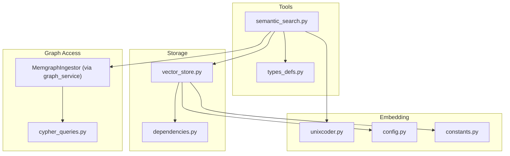
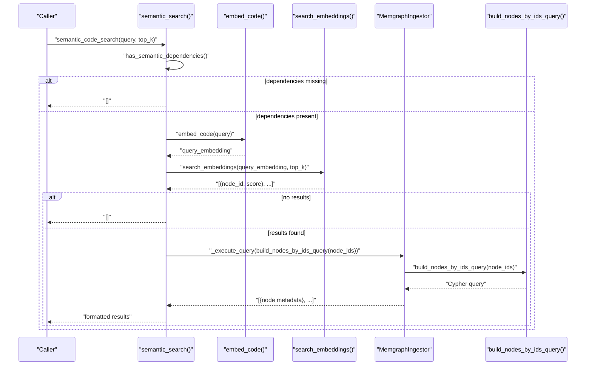
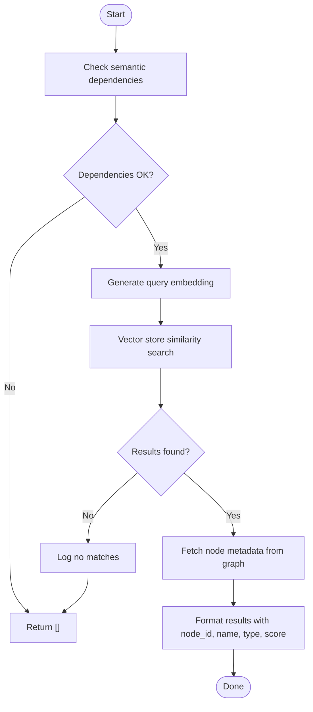
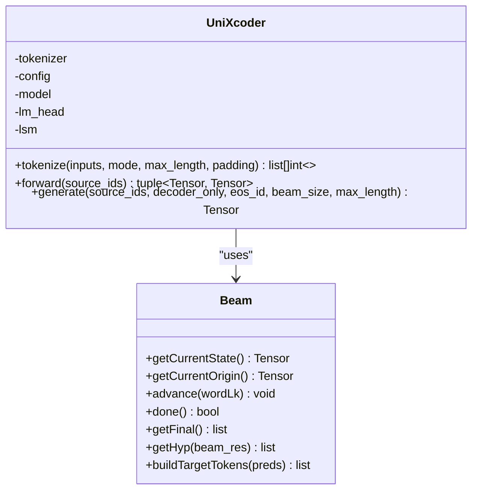
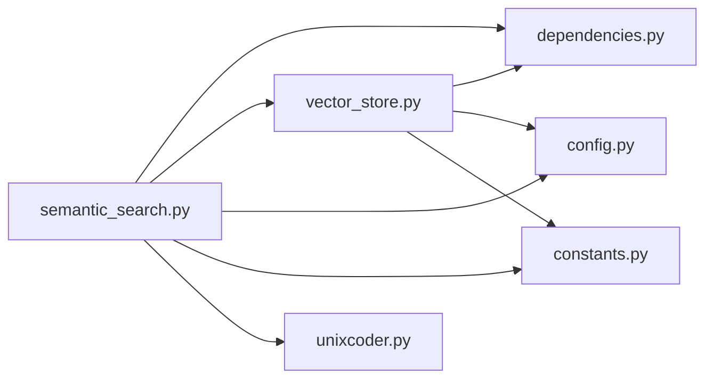

# Semantic Search Tool

<cite>
**Referenced Files in This Document**
- [semantic_search.py](file://codebase_rag/tools/semantic_search.py)
- [unixcoder.py](file://codebase_rag/unixcoder.py)
- [vector_store.py](file://codebase_rag/vector_store.py)
- [config.py](file://codebase_rag/config.py)
- [constants.py](file://codebase_rag/constants.py)
- [dependencies.py](file://codebase_rag/utils/dependencies.py)
- [cypher_queries.py](file://codebase_rag/cypher_queries.py)
- [types_defs.py](file://codebase_rag/types_defs.py)
- [test_semantic_search.py](file://codebase_rag/tests/test_semantic_search.py)
</cite>

## Table of Contents
1. [Introduction](#introduction)
2. [Project Structure](#project-structure)
3. [Core Components](#core-components)
4. [Architecture Overview](#architecture-overview)
5. [Detailed Component Analysis](#detailed-component-analysis)
6. [Dependency Analysis](#dependency-analysis)
7. [Performance Considerations](#performance-considerations)
8. [Troubleshooting Guide](#troubleshooting-guide)
9. [Conclusion](#conclusion)
10. [Appendices](#appendices)

## Introduction
This document explains the semantic search tool that enables intelligent code retrieval using embedding-based similarity search. It finds semantically similar code snippets regardless of exact keyword matches by converting natural language queries into dense vectors and searching a vector store for nearest neighbors. The tool integrates with a vector store for persistent embedding storage and uses a code representation model to produce embeddings suitable for code understanding. It also retrieves source code for matched nodes via a graph service.

Key capabilities:
- Natural language queries return semantically similar functions and methods
- Configurable result count and robust error handling
- Integration with vector store and graph service for retrieval and source extraction
- Tools exposed as agent-compatible functions for downstream orchestration

## Project Structure
The semantic search functionality spans several modules:
- Tools: semantic search orchestration and agent tool wrappers
- Embedding model: code representation via a transformer-based model
- Vector store: persistent storage and similarity search
- Configuration and constants: runtime settings and defaults
- Utilities: dependency checks and Cypher helpers
- Types: structured result definitions

**Diagram sources**
- [semantic_search.py](file://codebase_rag/tools/semantic_search.py#L18-L78)
- [unixcoder.py](file://codebase_rag/unixcoder.py#L12-L107)
- [vector_store.py](file://codebase_rag/vector_store.py#L14-L68)
- [config.py](file://codebase_rag/config.py#L144-L154)
- [constants.py](file://codebase_rag/constants.py#L929-L934)
- [dependencies.py](file://codebase_rag/utils/dependencies.py#L35-L36)
- [cypher_queries.py](file://codebase_rag/cypher_queries.py#L67-L72)
- [types_defs.py](file://codebase_rag/types_defs.py#L193-L199)

**Section sources**
- [semantic_search.py](file://codebase_rag/tools/semantic_search.py#L1-L157)
- [unixcoder.py](file://codebase_rag/unixcoder.py#L1-L279)
- [vector_store.py](file://codebase_rag/vector_store.py#L1-L81)
- [config.py](file://codebase_rag/config.py#L1-L274)
- [constants.py](file://codebase_rag/constants.py#L929-L934)
- [dependencies.py](file://codebase_rag/utils/dependencies.py#L1-L45)
- [cypher_queries.py](file://codebase_rag/cypher_queries.py#L1-L120)
- [types_defs.py](file://codebase_rag/types_defs.py#L193-L199)

## Core Components
- Semantic search orchestration: converts a query to an embedding, searches the vector store, resolves node metadata from the graph, and formats results
- Code representation model: a transformer-based model that produces sentence embeddings for code
- Vector store: persists embeddings and performs similarity search using cosine distance
- Graph access: retrieves source location metadata for matched nodes
- Agent tools: expose semantic search and source retrieval as callable tools

Key parameters and behaviors:
- Query: natural language description of desired code
- Result count: top_k parameter controls how many nearest neighbors to return
- Threshold: similarity search is performed with a vector query; the vector store returns scored hits
- Dependencies: requires vector store client and model libraries

**Section sources**
- [semantic_search.py](file://codebase_rag/tools/semantic_search.py#L18-L78)
- [unixcoder.py](file://codebase_rag/unixcoder.py#L12-L107)
- [vector_store.py](file://codebase_rag/vector_store.py#L50-L68)
- [config.py](file://codebase_rag/config.py#L144-L154)
- [types_defs.py](file://codebase_rag/types_defs.py#L193-L199)

## Architecture Overview
The semantic search pipeline:
1. Validate semantic dependencies
2. Convert query to embedding using the code representation model
3. Query vector store for nearest neighbors
4. Fetch node metadata from the graph using matched IDs
5. Format results with identifiers, names, types, and scores
6. Optionally retrieve source code for a specific node

**Diagram sources**
- [semantic_search.py](file://codebase_rag/tools/semantic_search.py#L18-L78)
- [vector_store.py](file://codebase_rag/vector_store.py#L50-L68)
- [cypher_queries.py](file://codebase_rag/cypher_queries.py#L86-L94)

## Detailed Component Analysis

### Semantic Search Orchestration
Responsibilities:
- Validate semantic dependencies before proceeding
- Convert query to embedding
- Perform similarity search in vector store
- Resolve node metadata from the graph
- Format results and handle errors gracefully

Processing logic:
- Dependency check short-circuits the process if required packages are missing
- Embedding generation delegates to the code representation model
- Vector store search returns node IDs and similarity scores
- Graph queries fetch qualified names, labels, and names for each node
- Results are rounded to three decimal places for readability

**Diagram sources**
- [semantic_search.py](file://codebase_rag/tools/semantic_search.py#L18-L78)

**Section sources**
- [semantic_search.py](file://codebase_rag/tools/semantic_search.py#L18-L78)

### Code Representation Model (UniXcoder)
The model:
- Uses a RoBERTa-based architecture configured as a decoder
- Produces token and sentence embeddings from code representations
- Supports tokenization modes for encoder-only, decoder-only, and encoder-decoder contexts
- Provides a generation interface for code completion tasks

**Diagram sources**
- [unixcoder.py](file://codebase_rag/unixcoder.py#L12-L107)
- [unixcoder.py](file://codebase_rag/unixcoder.py#L192-L279)

**Section sources**
- [unixcoder.py](file://codebase_rag/unixcoder.py#L12-L107)
- [unixcoder.py](file://codebase_rag/unixcoder.py#L192-L279)

### Vector Store Integration
Capabilities:
- Creates a Qdrant collection if it does not exist
- Upserts embeddings with node IDs and metadata
- Performs similarity search with cosine distance
- Returns scored results as node_id and score pairs

Configuration:
- Collection name and vector dimension are configurable
- Top-k defaults are controlled by settings

**Section sources**
- [vector_store.py](file://codebase_rag/vector_store.py#L14-L68)
- [config.py](file://codebase_rag/config.py#L144-L154)
- [constants.py](file://codebase_rag/constants.py#L929-L934)

### Graph Metadata Retrieval
The system retrieves node metadata (qualified name, labels, and name) for matched node IDs using a Cypher query builder. It constructs a query that filters nodes by IDs and orders results by qualified name.

**Section sources**
- [semantic_search.py](file://codebase_rag/tools/semantic_search.py#L39-L68)
- [cypher_queries.py](file://codebase_rag/cypher_queries.py#L86-L94)

### Agent Tools
Two tools are exposed:
- Semantic search tool: returns a formatted list of matches with scores
- Get function source tool: retrieves source code for a given node ID

Both tools integrate logging and error handling, returning user-friendly messages when results are unavailable.

**Section sources**
- [semantic_search.py](file://codebase_rag/tools/semantic_search.py#L121-L157)

## Dependency Analysis
The semantic search tool depends on:
- Vector store client availability
- Torch and Transformers for model operations
- Configuration for vector dimension, collection name, and top-k defaults
- Constants defining module names for dependency checks

**Diagram sources**
- [semantic_search.py](file://codebase_rag/tools/semantic_search.py#L18-L78)
- [dependencies.py](file://codebase_rag/utils/dependencies.py#L35-L36)
- [vector_store.py](file://codebase_rag/vector_store.py#L14-L68)
- [config.py](file://codebase_rag/config.py#L144-L154)
- [constants.py](file://codebase_rag/constants.py#L929-L934)

**Section sources**
- [dependencies.py](file://codebase_rag/utils/dependencies.py#L35-L36)
- [constants.py](file://codebase_rag/constants.py#L929-L934)

## Performance Considerations
- Embedding dimension: configured via settings and used consistently across store and search
- Top-k selection: controls the number of nearest neighbors retrieved; larger values increase latency and memory usage
- Vector store distance metric: cosine distance is efficient for normalized embeddings
- Batch sizes: graph queries use configurable batch sizes to reduce memory pressure
- Model inference: tokenization and forward passes depend on input length and device resources

Recommendations:
- Tune top-k based on downstream consumption and latency budgets
- Monitor vector store health and collection size
- Consider caching frequently accessed embeddings if reuse patterns emerge
- Ensure adequate GPU/CPU resources for model inference

**Section sources**
- [config.py](file://codebase_rag/config.py#L144-L154)
- [vector_store.py](file://codebase_rag/vector_store.py#L50-L68)

## Troubleshooting Guide
Common issues and resolutions:
- Missing semantic dependencies: the tool returns empty results and logs a warning when required packages are absent
- Embedding generation failures: exceptions during embedding lead to empty results and error logs
- Vector store search failures: exceptions are caught and logged; returns empty results
- No matches found: logs an informational message and returns empty results
- Source retrieval failures: invalid locations or database errors return None and warnings

Validation and testing:
- Unit tests verify dependency gating, parameter passing, exception handling, and result formatting
- Mocks simulate embedding, vector store, and graph access to isolate behavior

**Section sources**
- [semantic_search.py](file://codebase_rag/tools/semantic_search.py#L18-L78)
- [test_semantic_search.py](file://codebase_rag/tests/test_semantic_search.py#L52-L166)
- [test_semantic_search.py](file://codebase_rag/tests/test_semantic_search.py#L198-L298)

## Conclusion
The semantic search tool provides a robust, modular pipeline for finding semantically similar code using embedding-based similarity search. It integrates cleanly with a vector store and graph service, exposes agent-friendly tools, and handles errors gracefully. By tuning parameters like top-k and ensuring dependencies are satisfied, teams can achieve fast, accurate code discovery across large codebases.

## Appendices

### Parameter Reference
- Query: natural language description of desired functionality
- top_k: number of nearest neighbors to return (default governed by settings)
- Node metadata: node_id, qualified_name, name, type, score

**Section sources**
- [semantic_search.py](file://codebase_rag/tools/semantic_search.py#L18-L78)
- [types_defs.py](file://codebase_rag/types_defs.py#L193-L199)

### Example Use Cases
- Alternative implementations: phrase a query around a concept; the tool surfaces semantically similar functions and methods
- Related functionality: search for patterns like "authentication flow" to discover related modules and functions
- Best practices: search for "error handling" to locate consistent patterns across the codebase

Validation references:
- Tests demonstrate parameter propagation, result formatting, and error handling

**Section sources**
- [test_semantic_search.py](file://codebase_rag/tests/test_semantic_search.py#L65-L132)
- [test_semantic_search.py](file://codebase_rag/tests/test_semantic_search.py#L334-L378)