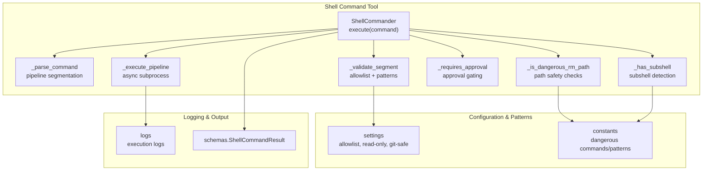
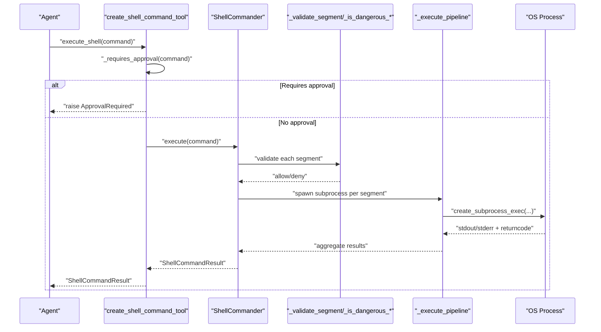
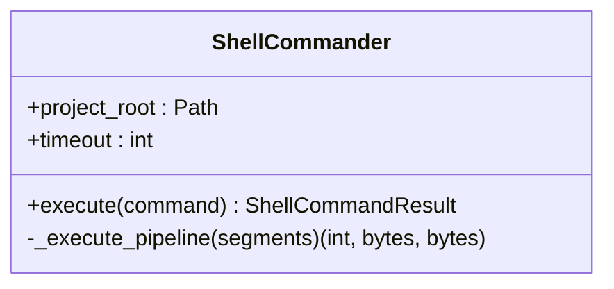
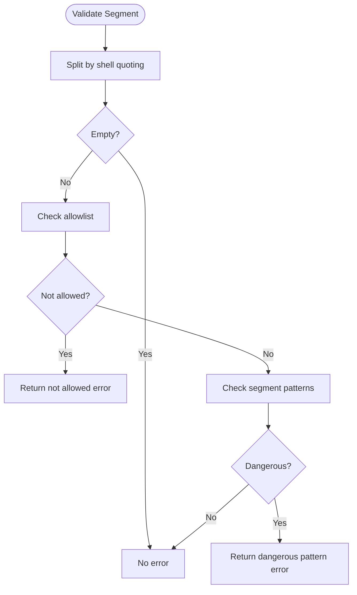
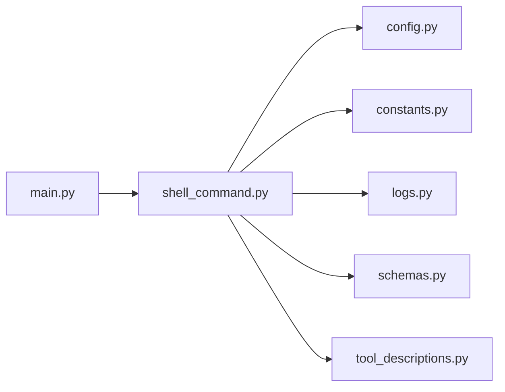

# Shell Command Tool

<cite>
**Referenced Files in This Document**
- [shell_command.py](file://codebase_rag/tools/shell_command.py)
- [test_shell_command.py](file://codebase_rag/tests/test_shell_command.py)
- [test_shell_command_integration.py](file://codebase_rag/tests/integration/test_shell_command_integration.py)
- [constants.py](file://codebase_rag/constants.py)
- [config.py](file://codebase_rag/config.py)
- [logs.py](file://codebase_rag/logs.py)
- [schemas.py](file://codebase_rag/schemas.py)
- [tool_descriptions.py](file://codebase_rag/tools/tool_descriptions.py)
- [main.py](file://codebase_rag/main.py)
</cite>

## Table of Contents
1. [Introduction](#introduction)
2. [Project Structure](#project-structure)
3. [Core Components](#core-components)
4. [Architecture Overview](#architecture-overview)
5. [Detailed Component Analysis](#detailed-component-analysis)
6. [Dependency Analysis](#dependency-analysis)
7. [Performance Considerations](#performance-considerations)
8. [Troubleshooting Guide](#troubleshooting-guide)
9. [Conclusion](#conclusion)
10. [Appendices](#appendices)

## Introduction
This document describes the shell command tool that safely executes system commands within controlled environments. It focuses on the security restrictions, command validation, execution monitoring, and error handling mechanisms. It also explains parameter requirements (command strings, timeout limits, output capture), safety mechanisms preventing dangerous operations, and the tool’s logging and audit trail features.

## Project Structure
The shell command tool is implemented as a cohesive module with strong separation of concerns:
- Validation and parsing logic for commands and pipelines
- Execution engine with timeouts and output capture
- Safety enforcement against dangerous commands and patterns
- Logging and audit trail integration
- Tool registration for agent orchestration

**Diagram sources**
- [shell_command.py](file://codebase_rag/tools/shell_command.py#L63-L121)
- [shell_command.py](file://codebase_rag/tools/shell_command.py#L194-L216)
- [shell_command.py](file://codebase_rag/tools/shell_command.py#L354-L366)
- [shell_command.py](file://codebase_rag/tools/shell_command.py#L310-L409)
- [config.py](file://codebase_rag/config.py#L80-L142)
- [constants.py](file://codebase_rag/constants.py#L980-L1098)
- [logs.py](file://codebase_rag/logs.py#L216-L224)
- [schemas.py](file://codebase_rag/schemas.py#L48-L51)

**Section sources**
- [shell_command.py](file://codebase_rag/tools/shell_command.py#L1-L436)
- [config.py](file://codebase_rag/config.py#L80-L142)
- [constants.py](file://codebase_rag/constants.py#L970-L1098)
- [logs.py](file://codebase_rag/logs.py#L216-L224)
- [schemas.py](file://codebase_rag/schemas.py#L48-L51)

## Core Components
- ShellCommander: Orchestrates command parsing, validation, safety checks, and execution with timeouts.
- Validation helpers: Allowlist enforcement, dangerous command detection, pattern matching, and subshell detection.
- Pipeline execution: Async subprocess creation, streaming stdout/stderr, and cumulative return code handling.
- Tool registration: Exposes a pydantic-ai Tool with approval gating for write operations.
- Logging and audit: Comprehensive logs for execution, return codes, stdout/stderr, and errors.

Key behaviors:
- Commands are parsed into pipeline groups and segments.
- Each segment is validated against an allowlist and pattern rules.
- Subshell operators are strictly disallowed.
- Redirect operators trigger approval gating.
- rm -rf with risky flags or paths is blocked.
- Timeout enforces execution limits.
- Outputs are captured and returned in a structured result.

**Section sources**
- [shell_command.py](file://codebase_rag/tools/shell_command.py#L262-L420)
- [shell_command.py](file://codebase_rag/tools/shell_command.py#L194-L216)
- [shell_command.py](file://codebase_rag/tools/shell_command.py#L310-L409)
- [tool_descriptions.py](file://codebase_rag/tools/tool_descriptions.py#L41-L44)

## Architecture Overview
The tool integrates with the agent framework and respects configuration-driven allowlists and safety policies.

**Diagram sources**
- [shell_command.py](file://codebase_rag/tools/shell_command.py#L422-L435)
- [shell_command.py](file://codebase_rag/tools/shell_command.py#L310-L409)
- [shell_command.py](file://codebase_rag/tools/shell_command.py#L194-L216)

## Detailed Component Analysis

### ShellCommander: Execution Engine
Responsibilities:
- Parse command into pipeline groups and segments.
- Validate each segment against allowlist and pattern rules.
- Enforce subshell and redirect operator restrictions.
- Execute segments with timeouts and capture outputs.
- Aggregate results and return a structured ShellCommandResult.

**Diagram sources**
- [shell_command.py](file://codebase_rag/tools/shell_command.py#L262-L420)

**Section sources**
- [shell_command.py](file://codebase_rag/tools/shell_command.py#L262-L420)

### Command Parsing and Validation
- _parse_command: Tokenizes operators and quotes, building groups and segments.
- _validate_segment: Splits by shell quoting, checks allowlist membership, and applies pattern checks.
- _is_dangerous_rm: Detects rm with -rf/-fr flags.
- _is_dangerous_rm_path: Validates rm targets against system directories and project boundaries.
- _check_pipeline_patterns and _check_segment_patterns: Match known dangerous patterns.
- _has_subshell: Detects $() and backticks outside quotes.
- _requires_approval: Determines whether a command requires user approval (write operations, redirects, unsafe patterns).

**Diagram sources**
- [shell_command.py](file://codebase_rag/tools/shell_command.py#L194-L216)
- [shell_command.py](file://codebase_rag/tools/shell_command.py#L162-L173)
- [shell_command.py](file://codebase_rag/tools/shell_command.py#L124-L133)
- [shell_command.py](file://codebase_rag/tools/shell_command.py#L135-L159)

**Section sources**
- [shell_command.py](file://codebase_rag/tools/shell_command.py#L63-L121)
- [shell_command.py](file://codebase_rag/tools/shell_command.py#L124-L192)
- [shell_command.py](file://codebase_rag/tools/shell_command.py#L222-L259)

### Safety Mechanisms
- Allowlist enforcement: Only commands in SHELL_COMMAND_ALLOWLIST are permitted.
- Dangerous command blocklist: Absolute blocking of destructive commands.
- Pattern-based blocking: Cross-segment and per-segment patterns prevent remote script execution, device writes, and other high-risk activities.
- Path safety for rm: Prevents rm targeting root, system directories, or paths outside the project root.
- Subshell detection: Blocks $() and backticks outside quotes.
- Redirect operator gating: Triggers approval requirement for >, >>, <, <<.

**Section sources**
- [config.py](file://codebase_rag/config.py#L80-L142)
- [constants.py](file://codebase_rag/constants.py#L980-L1098)
- [shell_command.py](file://codebase_rag/tools/shell_command.py#L124-L192)
- [shell_command.py](file://codebase_rag/tools/shell_command.py#L222-L259)

### Execution Monitoring and Timeouts
- Per-segment timeout budgeting: Remaining timeout is recalculated for each pipeline stage.
- TimeoutError raised and handled to return an error result.
- Async subprocess execution with stdout/stderr capture and return code aggregation.

**Section sources**
- [shell_command.py](file://codebase_rag/tools/shell_command.py#L268-L309)
- [shell_command.py](file://codebase_rag/tools/shell_command.py#L409-L419)

### Logging and Audit Trail
- Execution logs: Command, return code, stdout, stderr, and error messages are logged.
- Timing logs: Decorated execution timing is recorded.
- Initialization logs: ShellCommander initialization with project root.

**Section sources**
- [logs.py](file://codebase_rag/logs.py#L216-L224)
- [logs.py](file://codebase_rag/logs.py#L228)
- [logs.py](file://codebase_rag/logs.py#L295)

### Tool Registration and Approval Gating
- Tool name and description are registered for agent orchestration.
- ApprovalRequired is raised when a command requires user confirmation (write operations, redirects, unsafe patterns).

**Section sources**
- [tool_descriptions.py](file://codebase_rag/tools/tool_descriptions.py#L41-L44)
- [shell_command.py](file://codebase_rag/tools/shell_command.py#L422-L435)

## Dependency Analysis
The shell command tool depends on configuration-driven allowlists and constants for safety enforcement, and integrates with logging and schemas for output.

**Diagram sources**
- [shell_command.py](file://codebase_rag/tools/shell_command.py#L12-L18)
- [config.py](file://codebase_rag/config.py#L80-L142)
- [constants.py](file://codebase_rag/constants.py#L980-L1098)
- [logs.py](file://codebase_rag/logs.py#L216-L224)
- [schemas.py](file://codebase_rag/schemas.py#L48-L51)
- [tool_descriptions.py](file://codebase_rag/tools/tool_descriptions.py#L41-L44)
- [main.py](file://codebase_rag/main.py#L971-L982)

**Section sources**
- [shell_command.py](file://codebase_rag/tools/shell_command.py#L12-L18)
- [config.py](file://codebase_rag/config.py#L80-L142)
- [constants.py](file://codebase_rag/constants.py#L980-L1098)
- [logs.py](file://codebase_rag/logs.py#L216-L224)
- [schemas.py](file://codebase_rag/schemas.py#L48-L51)
- [tool_descriptions.py](file://codebase_rag/tools/tool_descriptions.py#L41-L44)
- [main.py](file://codebase_rag/main.py#L971-L982)

## Performance Considerations
- Asynchronous subprocess execution prevents blocking the event loop.
- Timeout budgeting ensures long pipelines do not starve later stages.
- Output capture uses bytes streams and decodes to UTF-8 with replacement for robustness.
- Pattern matching uses compiled regex for pipeline and segment patterns.

[No sources needed since this section provides general guidance]

## Troubleshooting Guide
Common issues and resolutions:
- Command not in allowlist: Use an allowed command from the allowlist. The tool suggests alternatives when applicable.
- Dangerous command rejected: Review the reason (e.g., rm with -rf, system directory targeting).
- Subshell detected: Remove $() or backticks outside quotes; they are not allowed.
- Redirect operators require approval: Use read-only commands or approve write operations.
- Timeout exceeded: Reduce command complexity or increase timeout via configuration.
- Invalid syntax: Fix quoting and escaping; the tool validates each segment.

**Section sources**
- [tool_errors.py](file://codebase_rag/tool_errors.py#L39-L46)
- [shell_command.py](file://codebase_rag/tools/shell_command.py#L310-L419)

## Conclusion
The shell command tool provides a secure, configurable, and auditable way to execute system commands. Its layered validation (allowlist, patterns, path safety, subshell detection), strict approval gating for write operations, and robust timeout handling ensure safe operation within controlled environments. Logging and structured results enable clear auditing and troubleshooting.

[No sources needed since this section summarizes without analyzing specific files]

## Appendices

### Parameter Requirements
- Command string: A shell command or pipeline string. Supports operators (|, &&, ||, ;) and quoting.
- Timeout limit: Configured via settings.SHELL_COMMAND_TIMEOUT (seconds). Defaults to 30.
- Output capture: Captures stdout and stderr as strings; return_code is an integer.

**Section sources**
- [config.py](file://codebase_rag/config.py#L80-L81)
- [schemas.py](file://codebase_rag/schemas.py#L48-L51)

### Examples
- Build commands: Use allowed commands like find, grep, and pipeline them appropriately.
- Execute tests: Use pytest or other allowed testing commands.
- System diagnostics: Use read-only commands like ls, pwd, find, and head.

These examples are validated by integration tests that demonstrate allowed commands and pipelines.

**Section sources**
- [test_shell_command_integration.py](file://codebase_rag/tests/integration/test_shell_command_integration.py#L37-L110)
- [test_shell_command_integration.py](file://codebase_rag/tests/integration/test_shell_command_integration.py#L178-L248)

### Security Violations and Blocking
- Absolute blocking of destructive commands (e.g., dd, mkfs, shutdown, systemctl).
- Pattern-based blocking for remote script execution, device writes, and high-risk constructs.
- Path safety for rm prevents targeting system directories or paths outside the project root.
- Subshell operators are strictly disallowed.

**Section sources**
- [constants.py](file://codebase_rag/constants.py#L980-L1098)
- [shell_command.py](file://codebase_rag/tools/shell_command.py#L124-L192)
- [shell_command.py](file://codebase_rag/tools/shell_command.py#L135-L159)

### Logging and Audit Trail
- Execution logs record the command, return code, stdout, and stderr.
- Timing logs show execution duration.
- Initialization logs indicate the project root used by ShellCommander.

**Section sources**
- [logs.py](file://codebase_rag/logs.py#L216-L224)
- [logs.py](file://codebase_rag/logs.py#L228)
- [logs.py](file://codebase_rag/logs.py#L295)