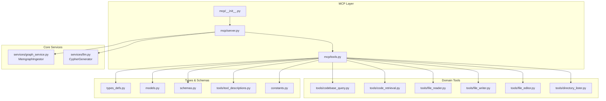
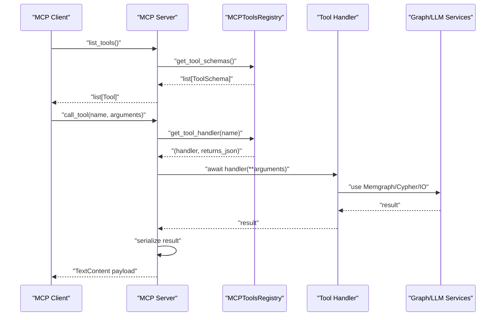
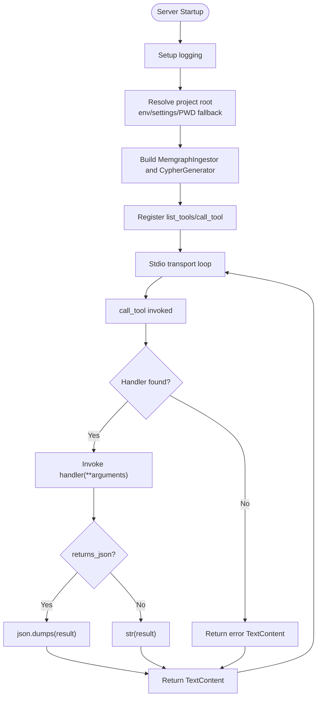
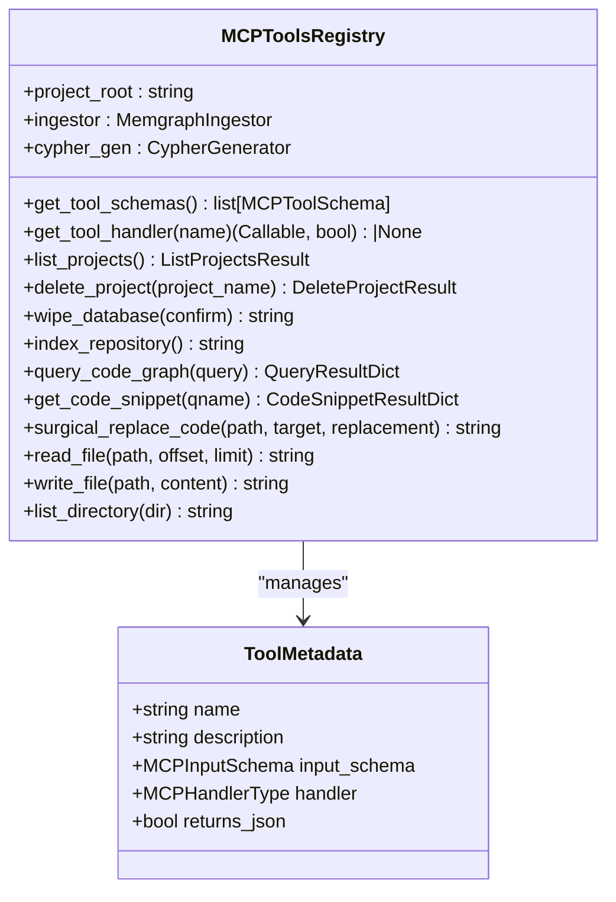
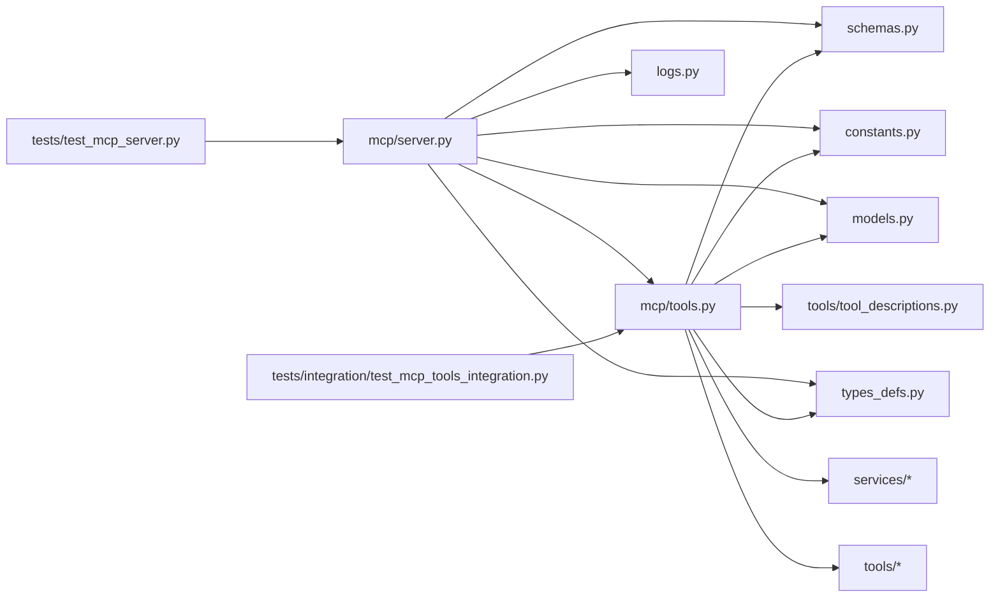

# MCP Tool Integration

<cite>
**Referenced Files in This Document**
- [mcp/__init__.py](file://codebase_rag/mcp/__init__.py)
- [mcp/server.py](file://codebase_rag/mcp/server.py)
- [mcp/tools.py](file://codebase_rag/mcp/tools.py)
- [types_defs.py](file://codebase_rag/types_defs.py)
- [models.py](file://codebase_rag/models.py)
- [constants.py](file://codebase_rag/constants.py)
- [schemas.py](file://codebase_rag/schemas.py)
- [tools/tool_descriptions.py](file://codebase_rag/tools/tool_descriptions.py)
- [tests/integration/test_mcp_tools_integration.py](file://codebase_rag/tests/integration/test_mcp_tools_integration.py)
- [tests/test_mcp_server.py](file://codebase_rag/tests/test_mcp_server.py)
</cite>

## Table of Contents
1. [Introduction](#introduction)
2. [Project Structure](#project-structure)
3. [Core Components](#core-components)
4. [Architecture Overview](#architecture-overview)
5. [Detailed Component Analysis](#detailed-component-analysis)
6. [Dependency Analysis](#dependency-analysis)
7. [Performance Considerations](#performance-considerations)
8. [Troubleshooting Guide](#troubleshooting-guide)
9. [Conclusion](#conclusion)
10. [Appendices](#appendices)

## Introduction
This document explains how Graph-Code exposes its capabilities as Model Context Protocol (MCP) tools to external AI agents and Claude Code. It covers the MCP server implementation, tool schemas and request/response formats, tool registration, schema generation, authentication and authorization considerations, serialization/deserialization of parameters/results, practical integration examples, and troubleshooting/performance tips.

## Project Structure
The MCP integration lives under the mcp package and integrates with Graph-Code’s services and tools:
- MCP server entrypoint and runtime
- Tools registry and tool metadata
- Types and schemas for MCP tool arguments and results
- Tool descriptions and constants
- Tests validating server behavior and tool integration

**Diagram sources**
- [mcp/server.py](file://codebase_rag/mcp/server.py#L1-L166)
- [mcp/tools.py](file://codebase_rag/mcp/tools.py#L1-L458)
- [mcp/__init__.py](file://codebase_rag/mcp/__init__.py#L1-L2)
- [types_defs.py](file://codebase_rag/types_defs.py#L343-L422)
- [models.py](file://codebase_rag/models.py#L89-L95)
- [schemas.py](file://codebase_rag/schemas.py#L8-L82)
- [tools/tool_descriptions.py](file://codebase_rag/tools/tool_descriptions.py#L74-L160)
- [constants.py](file://codebase_rag/constants.py#L2361-L2414)

**Section sources**
- [mcp/__init__.py](file://codebase_rag/mcp/__init__.py#L1-L2)
- [mcp/server.py](file://codebase_rag/mcp/server.py#L1-L166)
- [mcp/tools.py](file://codebase_rag/mcp/tools.py#L1-L458)
- [types_defs.py](file://codebase_rag/types_defs.py#L343-L422)
- [models.py](file://codebase_rag/models.py#L89-L95)
- [schemas.py](file://codebase_rag/schemas.py#L8-L82)
- [tools/tool_descriptions.py](file://codebase_rag/tools/tool_descriptions.py#L74-L160)
- [constants.py](file://codebase_rag/constants.py#L2361-L2414)

## Core Components
- MCP Server: Initializes logging, resolves project root, constructs services, registers MCP tool endpoints, and runs via stdio transport.
- Tools Registry: Central registry of MCP tools with metadata (name, description, input schema, handler, returns_json flag).
- Tool Handlers: Asynchronous functions implementing tool logic backed by Graph-Code services (e.g., Memgraph ingestion, Cypher generation, file operations).
- Types and Schemas: Typed definitions for MCP tool arguments, input schemas, tool metadata, and result dictionaries.
- Tool Descriptions: Human-readable descriptions and parameter documentation for MCP tools.
- Constants: Environment variables, logging, and error message constants used by the MCP server.

Key responsibilities:
- Expose list_tools and call_tool endpoints conforming to MCP protocol.
- Validate tool names and route to registered handlers.
- Serialize results as MCP TextContent payloads.
- Provide robust error handling and logging.

**Section sources**
- [mcp/server.py](file://codebase_rag/mcp/server.py#L58-L135)
- [mcp/tools.py](file://codebase_rag/mcp/tools.py#L40-L249)
- [types_defs.py](file://codebase_rag/types_defs.py#L343-L422)
- [models.py](file://codebase_rag/models.py#L89-L95)
- [tools/tool_descriptions.py](file://codebase_rag/tools/tool_descriptions.py#L74-L160)
- [constants.py](file://codebase_rag/constants.py#L2361-L2414)

## Architecture Overview
The MCP server acts as a thin adapter around Graph-Code’s domain tools. It translates MCP requests into calls to the tools registry, which delegates to underlying services.

**Diagram sources**
- [mcp/server.py](file://codebase_rag/mcp/server.py#L96-L134)
- [mcp/tools.py](file://codebase_rag/mcp/tools.py#L433-L446)

**Section sources**
- [mcp/server.py](file://codebase_rag/mcp/server.py#L96-L134)
- [mcp/tools.py](file://codebase_rag/mcp/tools.py#L433-L446)

## Detailed Component Analysis

### MCP Server
Responsibilities:
- Logging setup and MCP content type configuration.
- Project root resolution supporting environment variables and settings fallback.
- Service construction (Memgraph ingestor, Cypher generator).
- Tool registration via list_tools and call_tool decorators.
- Stdio transport lifecycle and graceful shutdown.

Behavior highlights:
- Unknown tool returns an error TextContent.
- Exceptions are caught, logged, and returned as error TextContent.
- Results are serialized either as JSON (when returns_json is true) or as plain text.

**Diagram sources**
- [mcp/server.py](file://codebase_rag/mcp/server.py#L21-L135)

**Section sources**
- [mcp/server.py](file://codebase_rag/mcp/server.py#L21-L135)
- [constants.py](file://codebase_rag/constants.py#L2401-L2405)

### Tools Registry and Tool Metadata
The registry centralizes:
- Tool metadata: name, description, input schema, handler, returns_json.
- Tool handlers: asynchronous functions performing operations against services.
- Schema generation: list of MCPToolSchema for list_tools.

Registered tools include:
- List/Delete Projects
- Wipe Database
- Index Repository
- Query Code Graph
- Get Code Snippet
- Surgical Replace Code
- Read/Write File
- List Directory

**Diagram sources**
- [mcp/tools.py](file://codebase_rag/mcp/tools.py#L40-L249)
- [models.py](file://codebase_rag/models.py#L89-L95)

**Section sources**
- [mcp/tools.py](file://codebase_rag/mcp/tools.py#L40-L249)
- [models.py](file://codebase_rag/models.py#L89-L95)

### Request/Response and Message Handling
- Request: MCP list_tools returns a list of Tool entries with name, description, and inputSchema.
- Call: MCP call_tool receives name and arguments (MCPToolArguments), which are passed to the handler.
- Response: Results are returned as MCP TextContent with type text. If returns_json is true, results are serialized with indentation; otherwise, str(result) is used.

Serialization specifics:
- JSON serialization uses a fixed indent constant.
- Error responses wrap messages in a standardized error wrapper.

**Section sources**
- [mcp/server.py](file://codebase_rag/mcp/server.py#L96-L134)
- [types_defs.py](file://codebase_rag/types_defs.py#L343-L344)
- [constants.py](file://codebase_rag/constants.py#L2401-L2405)

### Tool Registration and Schema Generation
- Tool schemas are generated from ToolMetadata stored in the registry.
- Each ToolMetadata defines:
  - Name and description
  - Input schema (properties, required fields)
  - Handler function
  - Whether the result should be serialized as JSON

This enables clients to introspect available tools and their parameters before invoking.

**Section sources**
- [mcp/tools.py](file://codebase_rag/mcp/tools.py#L433-L446)
- [types_defs.py](file://codebase_rag/types_defs.py#L355-L365)
- [tools/tool_descriptions.py](file://codebase_rag/tools/tool_descriptions.py#L74-L160)

### Authentication and Authorization
- No explicit authentication or authorization mechanism is implemented in the MCP server.
- Access control is implicitly governed by filesystem permissions of the project root and environment variable configuration.
- Recommendations:
  - Run the MCP server in a restricted environment.
  - Use environment variables to control TARGET_REPO_PATH and related paths.
  - Consider wrapping the server with a process that enforces additional policies.

**Section sources**
- [mcp/server.py](file://codebase_rag/mcp/server.py#L30-L55)
- [constants.py](file://codebase_rag/constants.py#L2361-L2364)

### Serialization and Deserialization
- Parameters: MCPToolArguments is a dictionary mapping string keys to string or integer values. Handlers receive keyword arguments derived from this dictionary.
- Results:
  - JSON serialization: Used when returns_json is true; applies a fixed indent.
  - String serialization: Used when returns_json is false.
- Error handling: Exceptions are caught and returned as error TextContent with a standardized wrapper.

**Section sources**
- [types_defs.py](file://codebase_rag/types_defs.py#L343-L344)
- [mcp/server.py](file://codebase_rag/mcp/server.py#L123-L128)
- [constants.py](file://codebase_rag/constants.py#L2401-L2405)

### Practical Integration Examples

#### Integrating with Claude Code
- Configure the project root via environment variables or settings so the server can resolve TARGET_REPO_PATH, CLAUDE_PROJECT_ROOT, or PWD.
- Launch the MCP server; Claude Code can discover tools via list_tools and invoke them via call_tool.
- Use tools like:
  - query_code_graph for natural language queries
  - get_code_snippet to retrieve source code by qualified name
  - read_file/write_file/list_directory for file operations
  - index_repository to rebuild the knowledge graph

Validation references:
- Server root resolution tests demonstrate precedence and fallback behavior.
- Integration tests exercise query, read_file, get_code_snippet, and list_directory.

**Section sources**
- [tests/test_mcp_server.py](file://codebase_rag/tests/test_mcp_server.py#L14-L172)
- [tests/integration/test_mcp_tools_integration.py](file://codebase_rag/tests/integration/test_mcp_tools_integration.py#L59-L107)

#### Integrating with Other MCP-Compatible Platforms
- Use list_tools to enumerate tools and their input schemas.
- Invoke call_tool with arguments matching the input schema.
- Expect TextContent responses; parse JSON when returns_json is true.

**Section sources**
- [mcp/server.py](file://codebase_rag/mcp/server.py#L96-L106)
- [mcp/tools.py](file://codebase_rag/mcp/tools.py#L433-L446)

## Dependency Analysis
High-level dependencies:
- mcp/server depends on mcp/tools, services, and constants/logs.
- mcp/tools depends on domain tools, services, types_defs, models, schemas, and tool descriptions.
- tests depend on mcp/server and mcp/tools to validate behavior.

**Diagram sources**
- [mcp/server.py](file://codebase_rag/mcp/server.py#L1-L166)
- [mcp/tools.py](file://codebase_rag/mcp/tools.py#L1-L458)
- [constants.py](file://codebase_rag/constants.py#L2361-L2414)
- [types_defs.py](file://codebase_rag/types_defs.py#L343-L422)
- [models.py](file://codebase_rag/models.py#L89-L95)
- [schemas.py](file://codebase_rag/schemas.py#L8-L82)
- [tools/tool_descriptions.py](file://codebase_rag/tools/tool_descriptions.py#L74-L160)
- [tests/test_mcp_server.py](file://codebase_rag/tests/test_mcp_server.py#L1-L173)
- [tests/integration/test_mcp_tools_integration.py](file://codebase_rag/tests/integration/test_mcp_tools_integration.py#L1-L137)

**Section sources**
- [mcp/server.py](file://codebase_rag/mcp/server.py#L1-L166)
- [mcp/tools.py](file://codebase_rag/mcp/tools.py#L1-L458)
- [tests/test_mcp_server.py](file://codebase_rag/tests/test_mcp_server.py#L1-L173)
- [tests/integration/test_mcp_tools_integration.py](file://codebase_rag/tests/integration/test_mcp_tools_integration.py#L1-L137)

## Performance Considerations
- Index repository operations can be expensive; schedule during off-peak hours.
- Query results serialization uses a fixed indent; large JSON payloads increase overhead—prefer streaming or pagination where applicable.
- File read operations support offset/limit for pagination; use them to avoid loading entire files.
- Logging verbosity can impact performance; adjust MCP log level as needed.

[No sources needed since this section provides general guidance]

## Troubleshooting Guide
Common issues and resolutions:
- Unknown tool invocation: Ensure the tool name matches exactly; verify list_tools output.
- Project root misconfiguration: Set TARGET_REPO_PATH or configure settings; verify environment variable precedence.
- Path does not exist or is not a directory: Correct the path or ensure it exists and is a directory.
- Tool execution errors: Inspect server logs for exceptions; note that errors are returned as error TextContent.

Validation references:
- Root resolution tests cover environment variable precedence, defaults, and error conditions.
- Integration tests validate behavior of query, read_file, get_code_snippet, and list_directory.

**Section sources**
- [tests/test_mcp_server.py](file://codebase_rag/tests/test_mcp_server.py#L14-L172)
- [tests/integration/test_mcp_tools_integration.py](file://codebase_rag/tests/integration/test_mcp_tools_integration.py#L59-L107)
- [mcp/server.py](file://codebase_rag/mcp/server.py#L30-L55)

## Conclusion
Graph-Code’s MCP integration provides a clean, extensible way to expose codebase querying, code retrieval, file operations, and indexing capabilities to external AI agents and Claude Code. The server adheres to the MCP protocol, offers robust error handling, and leverages typed schemas for predictable tool discovery and invocation. For production use, consider adding authentication/authorization and optimizing heavy operations like indexing and large file reads.

[No sources needed since this section summarizes without analyzing specific files]

## Appendices

### MCP Tool Catalog
- list_projects: Lists indexed projects.
- delete_project: Deletes a specific project.
- wipe_database: Wipes the entire database (confirmation required).
- index_repository: Reindexes the current repository.
- query_code_graph: Natural language query over the code graph.
- get_code_snippet: Retrieves source code by qualified name.
- surgical_replace_code: Replaces code blocks with surgical precision.
- read_file: Reads file content with optional pagination.
- write_file: Writes content to a file.
- list_directory: Lists directory contents.

**Section sources**
- [mcp/tools.py](file://codebase_rag/mcp/tools.py#L70-L249)
- [tools/tool_descriptions.py](file://codebase_rag/tools/tool_descriptions.py#L74-L160)