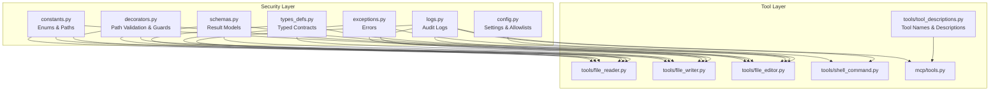
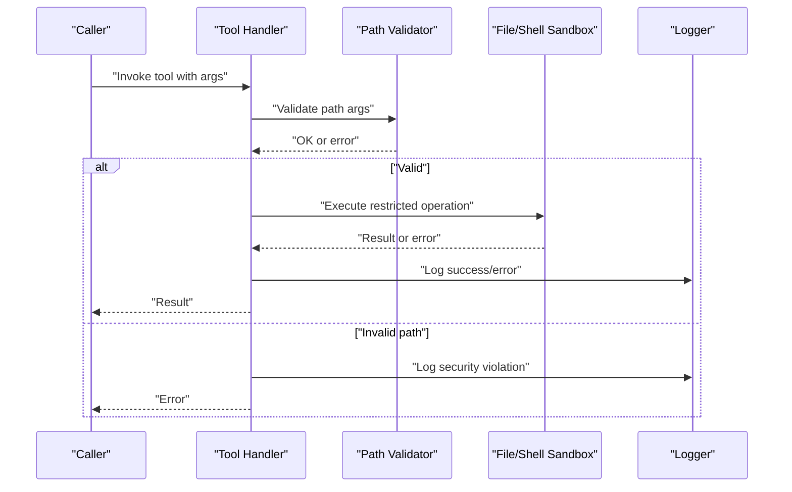
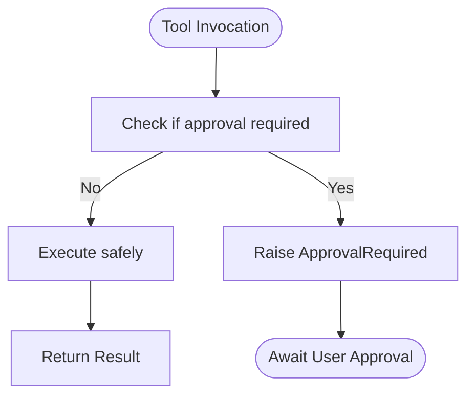
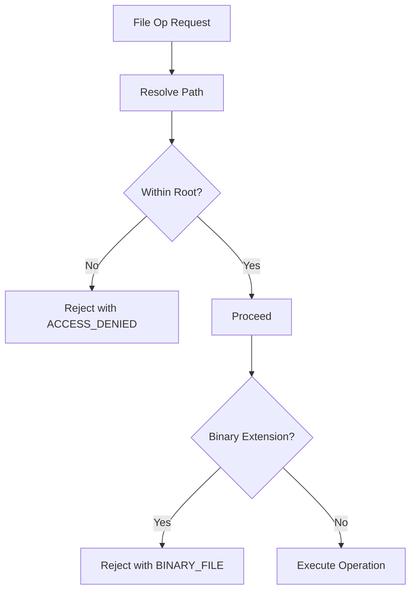
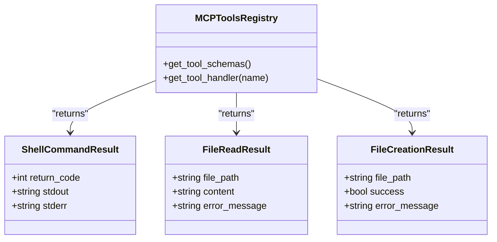
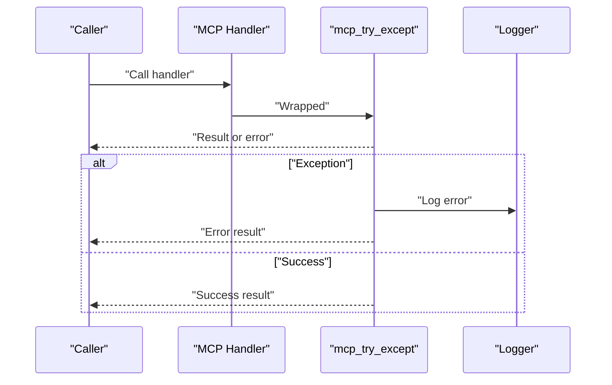
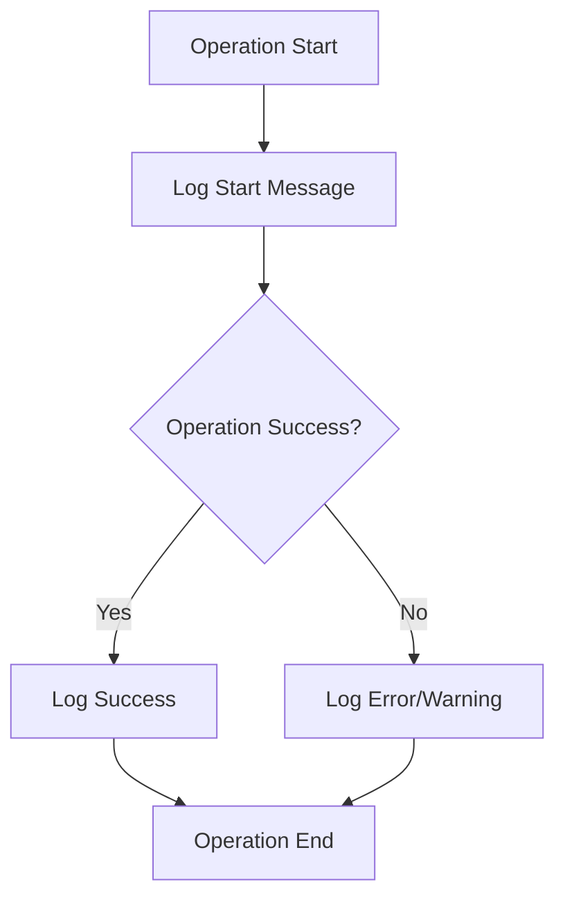
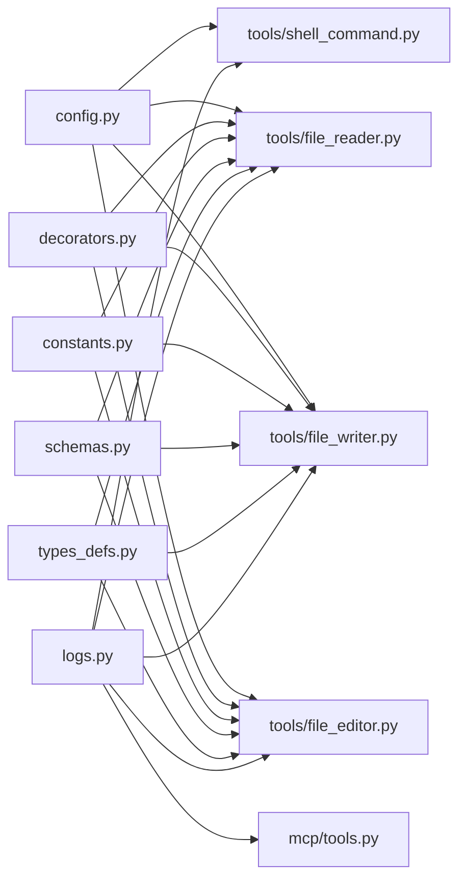

# Security and Safety Mechanisms

<cite>
**Referenced Files in This Document**
- [constants.py](file://codebase_rag/constants.py)
- [config.py](file://codebase_rag/config.py)
- [decorators.py](file://codebase_rag/decorators.py)
- [exceptions.py](file://codebase_rag/exceptions.py)
- [logs.py](file://codebase_rag/logs.py)
- [schemas.py](file://codebase_rag/schemas.py)
- [types_defs.py](file://codebase_rag/types_defs.py)
- [mcp/tools.py](file://codebase_rag/mcp/tools.py)
- [tools/tool_descriptions.py](file://codebase_rag/tools/tool_descriptions.py)
- [tools/shell_command.py](file://codebase_rag/tools/shell_command.py)
- [tools/file_reader.py](file://codebase_rag/tools/file_reader.py)
- [tools/file_writer.py](file://codebase_rag/tools/file_writer.py)
- [tools/file_editor.py](file://codebase_rag/tools/file_editor.py)
</cite>

## Table of Contents
1. [Introduction](#introduction)
2. [Project Structure](#project-structure)
3. [Core Components](#core-components)
4. [Architecture Overview](#architecture-overview)
5. [Detailed Component Analysis](#detailed-component-analysis)
6. [Dependency Analysis](#dependency-analysis)
7. [Performance Considerations](#performance-considerations)
8. [Troubleshooting Guide](#troubleshooting-guide)
9. [Conclusion](#conclusion)
10. [Appendices](#appendices)

## Introduction
This document explains the security and safety mechanisms that protect the Graph-Code tool system. It covers the approval workflow for tool execution, sandboxing and path restrictions, the permission system for validating tool requests, error handling and exception management, validation rules for tool parameters, logging and audit trails, best practices, and identified vulnerabilities with mitigation strategies.

## Project Structure
Security-related capabilities are distributed across several modules:
- Constants and configuration define allowed operations, timeouts, and allowlists.
- Decorators enforce path validation and guard recursion.
- Tools implement sandboxed file operations and shell command approvals.
- Logging records all tool actions and security events.
- Schemas and typed definitions formalize inputs and outputs.

**Diagram sources**
- [config.py](file://codebase_rag/config.py#L80-L142)
- [constants.py](file://codebase_rag/constants.py#L50-L120)
- [decorators.py](file://codebase_rag/decorators.py#L55-L87)
- [schemas.py](file://codebase_rag/schemas.py#L48-L82)
- [types_defs.py](file://codebase_rag/types_defs.py#L128-L131)
- [logs.py](file://codebase_rag/logs.py#L200-L320)
- [tools/tool_descriptions.py](file://codebase_rag/tools/tool_descriptions.py#L8-L19)
- [tools/file_reader.py](file://codebase_rag/tools/file_reader.py#L16-L67)
- [tools/file_writer.py](file://codebase_rag/tools/file_writer.py#L16-L52)
- [tools/file_editor.py](file://codebase_rag/tools/file_editor.py#L22-L296)
- [tools/shell_command.py](file://codebase_rag/tools/shell_command.py#L262-L436)
- [mcp/tools.py](file://codebase_rag/mcp/tools.py#L40-L458)

**Section sources**
- [constants.py](file://codebase_rag/constants.py#L50-L120)
- [config.py](file://codebase_rag/config.py#L80-L142)
- [decorators.py](file://codebase_rag/decorators.py#L55-L87)
- [tools/tool_descriptions.py](file://codebase_rag/tools/tool_descriptions.py#L8-L19)

## Core Components
- Path validation decorator ensures all file operations occur within the project root.
- Shell command tool enforces allowlists, detects dangerous patterns/operators, and requires approval for non-read-only commands.
- File reader/writer/editor restrict file access to text files and enforce project-root boundaries.
- MCP tools registry centralizes tool schemas and handlers with strict input validation.
- Logging and error messages provide audit trails and diagnostics.

**Section sources**
- [decorators.py](file://codebase_rag/decorators.py#L55-L87)
- [tools/shell_command.py](file://codebase_rag/tools/shell_command.py#L262-L436)
- [tools/file_reader.py](file://codebase_rag/tools/file_reader.py#L16-L67)
- [tools/file_writer.py](file://codebase_rag/tools/file_writer.py#L16-L52)
- [tools/file_editor.py](file://codebase_rag/tools/file_editor.py#L22-L296)
- [mcp/tools.py](file://codebase_rag/mcp/tools.py#L40-L250)
- [logs.py](file://codebase_rag/logs.py#L200-L320)

## Architecture Overview
The system separates concerns into configuration, validation, tool execution, and auditing. Approval gating is enforced at the tool boundary for potentially destructive operations.

**Diagram sources**
- [decorators.py](file://codebase_rag/decorators.py#L55-L87)
- [tools/file_reader.py](file://codebase_rag/tools/file_reader.py#L25-L52)
- [tools/file_writer.py](file://codebase_rag/tools/file_writer.py#L25-L40)
- [tools/file_editor.py](file://codebase_rag/tools/file_editor.py#L259-L277)
- [logs.py](file://codebase_rag/logs.py#L200-L320)

## Detailed Component Analysis

### Approval Workflow and Permission System
- Shell commands require approval unless they are read-only or safe git subcommands. The system parses pipelines, checks operators, and validates against allowlists.
- File creation and surgical edits require explicit approval.
- MCP tools expose input schemas and handlers; errors are wrapped consistently.

**Diagram sources**
- [tools/shell_command.py](file://codebase_rag/tools/shell_command.py#L422-L436)
- [tools/file_writer.py](file://codebase_rag/tools/file_writer.py#L42-L52)
- [tools/file_editor.py](file://codebase_rag/tools/file_editor.py#L279-L296)
- [mcp/tools.py](file://codebase_rag/mcp/tools.py#L70-L249)

**Section sources**
- [tools/shell_command.py](file://codebase_rag/tools/shell_command.py#L222-L260)
- [tools/shell_command.py](file://codebase_rag/tools/shell_command.py#L340-L367)
- [tools/file_writer.py](file://codebase_rag/tools/file_writer.py#L42-L52)
- [tools/file_editor.py](file://codebase_rag/tools/file_editor.py#L279-L296)
- [mcp/tools.py](file://codebase_rag/mcp/tools.py#L70-L249)

### Sandboxing and Path Restrictions
- All file operations are decorated to validate paths and ensure they remain within the project root.
- Binary file detection prevents accidental binary reads.
- Dangerous shell patterns and operators are blocked; rm with recursive flags is disallowed; subshells are rejected.

**Diagram sources**
- [decorators.py](file://codebase_rag/decorators.py#L55-L87)
- [tools/file_reader.py](file://codebase_rag/tools/file_reader.py#L25-L52)
- [tools/shell_command.py](file://codebase_rag/tools/shell_command.py#L124-L160)

**Section sources**
- [decorators.py](file://codebase_rag/decorators.py#L55-L87)
- [tools/file_reader.py](file://codebase_rag/tools/file_reader.py#L25-L52)
- [tools/file_writer.py](file://codebase_rag/tools/file_writer.py#L25-L40)
- [tools/file_editor.py](file://codebase_rag/tools/file_editor.py#L204-L254)
- [constants.py](file://codebase_rag/constants.py#L50-L62)

### Parameter Validation and Input Schemas
- MCP tools define strict input schemas with required fields and descriptions.
- Shell command validator rejects invalid syntax and non-allowlisted commands.
- Results are strongly typed to prevent ambiguous states.

**Diagram sources**
- [mcp/tools.py](file://codebase_rag/mcp/tools.py#L433-L446)
- [schemas.py](file://codebase_rag/schemas.py#L48-L82)

**Section sources**
- [mcp/tools.py](file://codebase_rag/mcp/tools.py#L70-L249)
- [tools/shell_command.py](file://codebase_rag/tools/shell_command.py#L194-L216)
- [schemas.py](file://codebase_rag/schemas.py#L48-L82)

### Error Handling and Exception Management
- Dedicated error constants and exceptions unify messaging.
- Decorators wrap MCP handlers to convert exceptions into structured error results.
- Shell command execution handles timeouts and process termination.

**Diagram sources**
- [decorators.py](file://codebase_rag/decorators.py#L145-L161)
- [mcp/tools.py](file://codebase_rag/mcp/tools.py#L251-L280)
- [tools/shell_command.py](file://codebase_rag/tools/shell_command.py#L409-L419)

**Section sources**
- [exceptions.py](file://codebase_rag/exceptions.py#L52-L59)
- [decorators.py](file://codebase_rag/decorators.py#L145-L161)
- [tools/shell_command.py](file://codebase_rag/tools/shell_command.py#L409-L419)

### Logging and Audit Trail
- Comprehensive logs record tool invocations, security events, and errors.
- Examples include file operations, shell execution, and MCP tool usage.

**Diagram sources**
- [logs.py](file://codebase_rag/logs.py#L200-L320)
- [tools/file_reader.py](file://codebase_rag/tools/file_reader.py#L21-L52)
- [tools/file_writer.py](file://codebase_rag/tools/file_writer.py#L21-L40)
- [tools/file_editor.py](file://codebase_rag/tools/file_editor.py#L204-L254)
- [tools/shell_command.py](file://codebase_rag/tools/shell_command.py#L311-L419)
- [mcp/tools.py](file://codebase_rag/mcp/tools.py#L251-L431)

**Section sources**
- [logs.py](file://codebase_rag/logs.py#L200-L320)

### Security Best Practices for Tool Development and Deployment
- Enforce path validation on all file operations.
- Use allowlists for shell commands and reject subshells and redirect operators.
- Require approval for destructive operations (create/edit/surgical replace).
- Log all sensitive operations and maintain audit trails.
- Validate inputs rigorously using schemas and typed contracts.
- Limit timeouts for external processes.
- Keep configuration in environment variables and avoid hardcoded secrets.

[No sources needed since this section provides general guidance]

## Dependency Analysis
Security depends on tight coupling between configuration, validation, and tool execution.

**Diagram sources**
- [config.py](file://codebase_rag/config.py#L80-L142)
- [constants.py](file://codebase_rag/constants.py#L50-L120)
- [decorators.py](file://codebase_rag/decorators.py#L55-L87)
- [schemas.py](file://codebase_rag/schemas.py#L48-L82)
- [types_defs.py](file://codebase_rag/types_defs.py#L128-L131)
- [tools/shell_command.py](file://codebase_rag/tools/shell_command.py#L262-L436)
- [tools/file_reader.py](file://codebase_rag/tools/file_reader.py#L16-L67)
- [tools/file_writer.py](file://codebase_rag/tools/file_writer.py#L16-L52)
- [tools/file_editor.py](file://codebase_rag/tools/file_editor.py#L22-L296)
- [mcp/tools.py](file://codebase_rag/mcp/tools.py#L40-L458)
- [logs.py](file://codebase_rag/logs.py#L200-L320)

**Section sources**
- [config.py](file://codebase_rag/config.py#L80-L142)
- [decorators.py](file://codebase_rag/decorators.py#L55-L87)
- [tools/shell_command.py](file://codebase_rag/tools/shell_command.py#L262-L436)
- [tools/file_reader.py](file://codebase_rag/tools/file_reader.py#L16-L67)
- [tools/file_writer.py](file://codebase_rag/tools/file_writer.py#L16-L52)
- [tools/file_editor.py](file://codebase_rag/tools/file_editor.py#L22-L296)
- [mcp/tools.py](file://codebase_rag/mcp/tools.py#L40-L458)
- [logs.py](file://codebase_rag/logs.py#L200-L320)

## Performance Considerations
- Path validation adds minimal overhead via resolved paths and relative-to checks.
- Shell command parsing and pattern matching are linear in command length; keep commands concise.
- Logging is asynchronous-friendly; ensure log sinks are configured appropriately for throughput.

[No sources needed since this section provides general guidance]

## Troubleshooting Guide
Common issues and resolutions:
- Access Denied Outside Root: Ensure file paths are relative to the project root.
- Binary File Read: Use document analysis tools for binary/media files.
- Command Not Allowed: Verify command is in the allowlist; check suggestions for alternatives.
- Dangerous Pattern Detected: Remove pipes, redirects, or subshells; use safer alternatives.
- Timeout During Shell Execution: Reduce command complexity or increase timeout.

**Section sources**
- [exceptions.py](file://codebase_rag/exceptions.py#L52-L59)
- [tools/file_reader.py](file://codebase_rag/tools/file_reader.py#L25-L52)
- [tools/shell_command.py](file://codebase_rag/tools/shell_command.py#L194-L216)
- [tools/shell_command.py](file://codebase_rag/tools/shell_command.py#L323-L339)
- [config.py](file://codebase_rag/config.py#L81-L81)

## Conclusion
The Graph-Code tool system enforces strong security through path validation, approval gating for risky operations, allowlists and pattern detection for shell commands, and comprehensive logging. Adhering to the documented best practices and understanding the validation and error-handling mechanisms helps maintain a safe and auditable environment for automated tool usage.

[No sources needed since this section summarizes without analyzing specific files]

## Appendices

### Security Controls Checklist
- [ ] All file operations validated against project root
- [ ] Shell commands restricted to allowlist and safe patterns
- [ ] Approval required for create/edit/surgical replace
- [ ] Comprehensive logging enabled for audit
- [ ] Timeouts configured for external processes
- [ ] Environment-driven configuration for secrets

[No sources needed since this section provides general guidance]