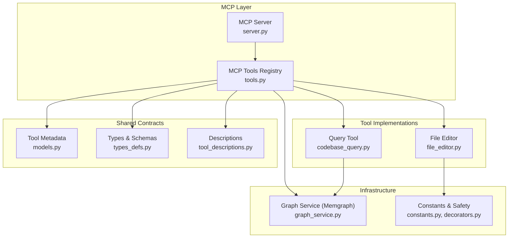
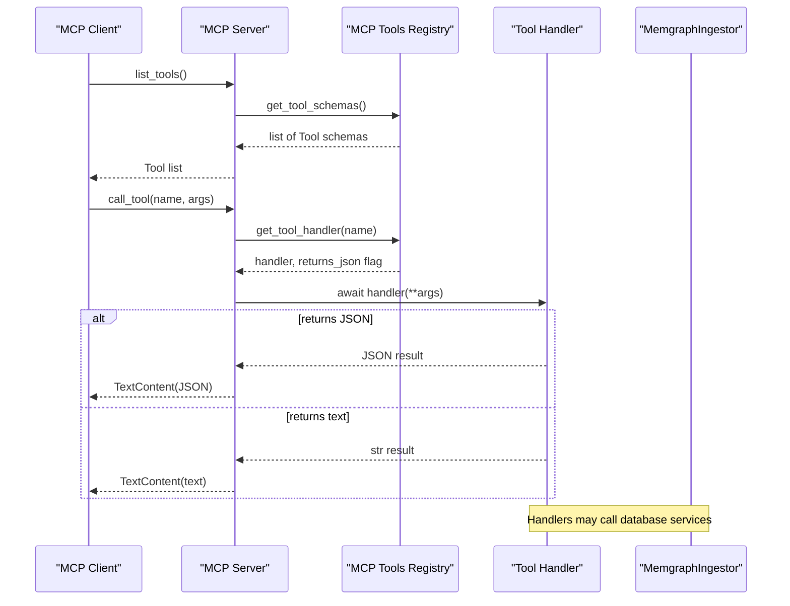
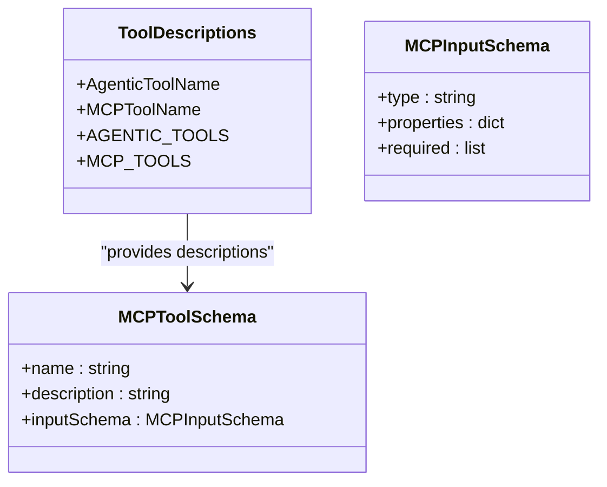
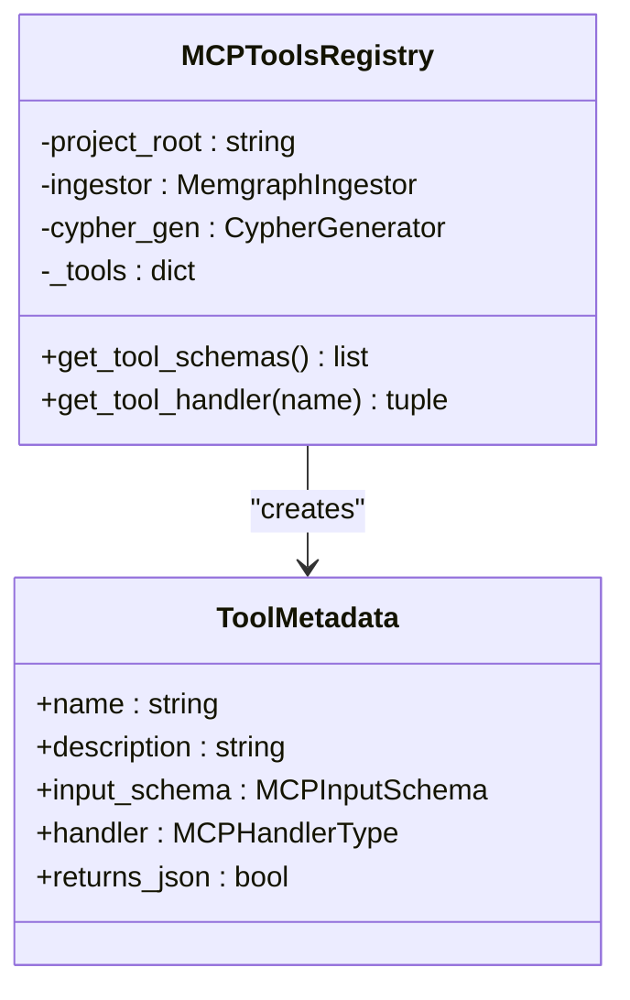
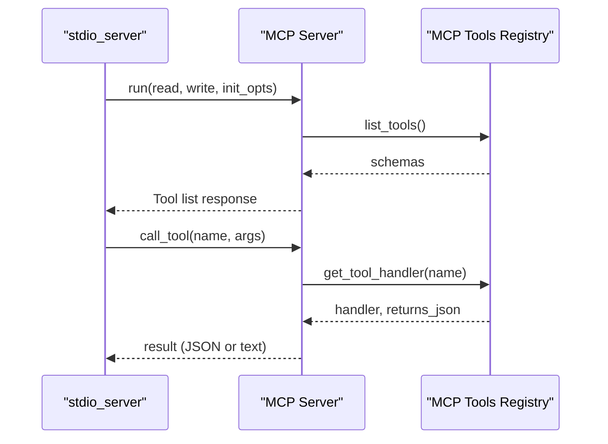
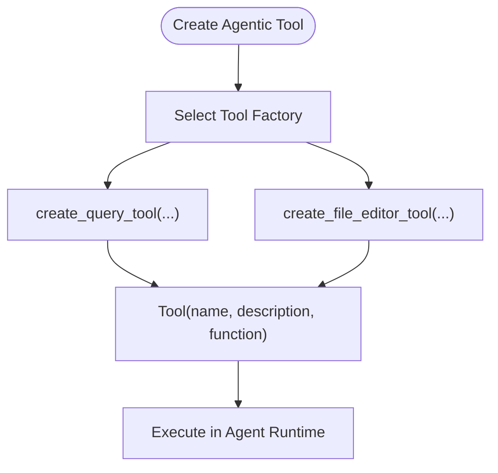
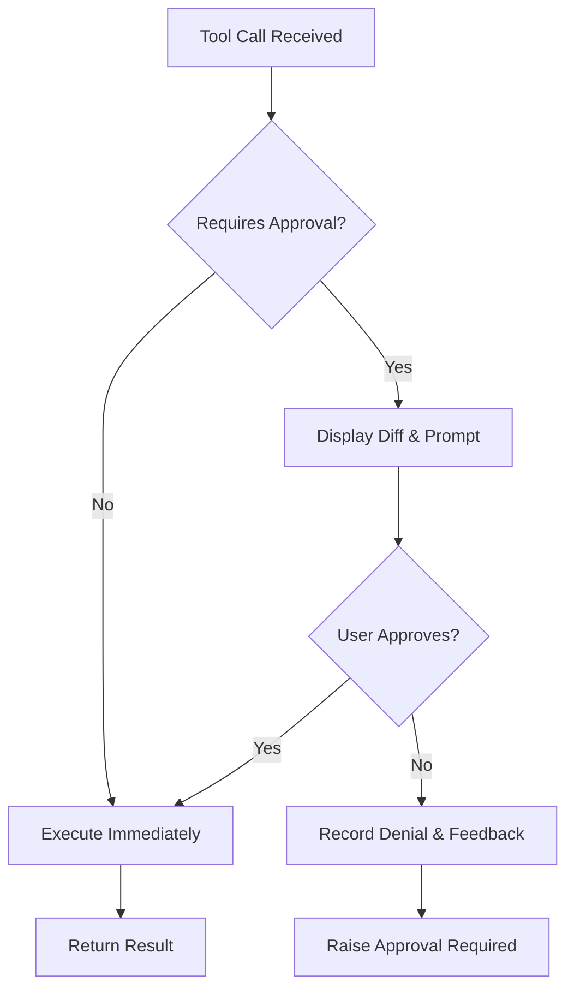
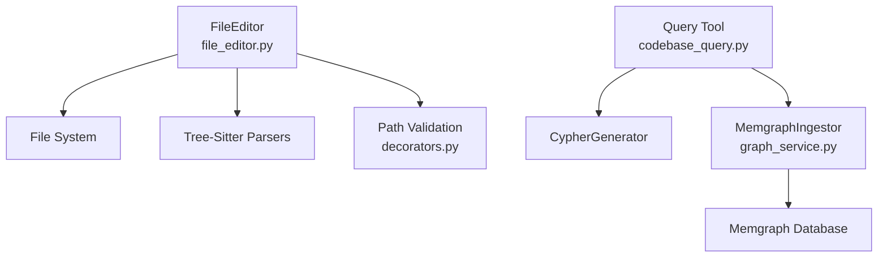
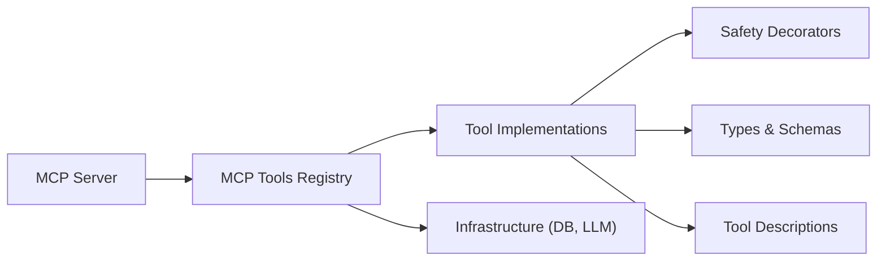

# Tool Architecture and Registry

<cite>
**Referenced Files in This Document**
- [tool_descriptions.py](file://codebase_rag/tools/tool_descriptions.py)
- [tools.py](file://codebase_rag/mcp/tools.py)
- [server.py](file://codebase_rag/mcp/server.py)
- [models.py](file://codebase_rag/models.py)
- [types_defs.py](file://codebase_rag/types_defs.py)
- [constants.py](file://codebase_rag/constants.py)
- [decorators.py](file://codebase_rag/decorators.py)
- [graph_service.py](file://codebase_rag/services/graph_service.py)
- [codebase_query.py](file://codebase_rag/tools/codebase_query.py)
- [file_editor.py](file://codebase_rag/tools/file_editor.py)
- [readme_sections.py](file://codebase_rag/readme_sections.py)
</cite>

## Table of Contents
1. [Introduction](#introduction)
2. [Project Structure](#project-structure)
3. [Core Components](#core-components)
4. [Architecture Overview](#architecture-overview)
5. [Detailed Component Analysis](#detailed-component-analysis)
6. [Dependency Analysis](#dependency-analysis)
7. [Performance Considerations](#performance-considerations)
8. [Troubleshooting Guide](#troubleshooting-guide)
9. [Conclusion](#conclusion)
10. [Appendices](#appendices)

## Introduction
This document explains the Graph-Code tool architecture and registry system. It covers how AI-powered operations are modeled, registered, discovered, and executed via two pathways:
- The MCP (Model Context Protocol) registry for external tool invocation
- The agentic tool registry for internal orchestration and approval-driven execution

It also documents tool description schemas, the approval workflow and safety mechanisms, metadata systems, and how tools interact with the file system and database layers.

## Project Structure
The tool system spans several modules:
- Tool descriptions and schemas: define tool names, descriptions, and input schemas
- MCP registry and server: expose tools over MCP, handle discovery and execution
- Tool implementations: concrete tools for querying, reading/writing files, editing code, etc.
- Models and types: shared data structures for tool metadata and schemas
- Services: database integration (Memgraph) and LLM support
- Decorators and constants: safety guards and shared constants
- Documentation helpers: generate Markdown tables for tool listings

**Diagram sources**
- [server.py](file://codebase_rag/mcp/server.py#L58-L135)
- [tools.py](file://codebase_rag/mcp/tools.py#L40-L446)
- [codebase_query.py](file://codebase_rag/tools/codebase_query.py#L24-L95)
- [file_editor.py](file://codebase_rag/tools/file_editor.py#L22-L296)
- [models.py](file://codebase_rag/models.py#L89-L95)
- [types_defs.py](file://codebase_rag/types_defs.py#L346-L421)
- [tool_descriptions.py](file://codebase_rag/tools/tool_descriptions.py#L1-L160)
- [graph_service.py](file://codebase_rag/services/graph_service.py#L49-L364)
- [constants.py](file://codebase_rag/constants.py#L1-L800)
- [decorators.py](file://codebase_rag/decorators.py#L55-L87)

**Section sources**
- [server.py](file://codebase_rag/mcp/server.py#L58-L135)
- [tools.py](file://codebase_rag/mcp/tools.py#L40-L446)
- [models.py](file://codebase_rag/models.py#L89-L95)
- [types_defs.py](file://codebase_rag/types_defs.py#L346-L421)
- [tool_descriptions.py](file://codebase_rag/tools/tool_descriptions.py#L1-L160)
- [graph_service.py](file://codebase_rag/services/graph_service.py#L49-L364)
- [constants.py](file://codebase_rag/constants.py#L1-L800)
- [decorators.py](file://codebase_rag/decorators.py#L55-L87)

## Core Components
- Tool descriptions and schemas
  - Enumerations and dictionaries define tool names and descriptions for both MCP and agentic tools
  - Input schemas describe parameters and validation rules for MCP tools
- MCP Tools Registry
  - Central registry mapping tool names to handlers, input schemas, and metadata
  - Factory function creates the registry with injected services (database, LLM)
- MCP Server
  - Exposes list_tools and call_tool endpoints
  - Resolves handlers and executes tools with proper JSON serialization
- Tool implementations
  - Query tool integrates with LLM and database
  - File editor enforces path safety and performs surgical replacements
- Models and types
  - ToolMetadata encapsulates handler, schema, and return type
  - Typed schemas for MCP input and tool results
- Infrastructure
  - Memgraph ingestor for database operations
  - Safety decorators and constants for path validation and approval gating

**Section sources**
- [tool_descriptions.py](file://codebase_rag/tools/tool_descriptions.py#L8-L160)
- [tools.py](file://codebase_rag/mcp/tools.py#L40-L446)
- [server.py](file://codebase_rag/mcp/server.py#L96-L134)
- [models.py](file://codebase_rag/models.py#L89-L95)
- [types_defs.py](file://codebase_rag/types_defs.py#L346-L421)
- [codebase_query.py](file://codebase_rag/tools/codebase_query.py#L24-L95)
- [file_editor.py](file://codebase_rag/tools/file_editor.py#L22-L296)
- [graph_service.py](file://codebase_rag/services/graph_service.py#L49-L364)
- [constants.py](file://codebase_rag/constants.py#L1-L800)
- [decorators.py](file://codebase_rag/decorators.py#L55-L87)

## Architecture Overview
The system separates concerns between discovery and execution:
- Discovery: MCP server lists tools and their schemas
- Execution: MCP server resolves handlers from the registry and invokes them
- Internal orchestration: Agentic tools are created via factories and can require user approval

**Diagram sources**
- [server.py](file://codebase_rag/mcp/server.py#L96-L134)
- [tools.py](file://codebase_rag/mcp/tools.py#L433-L446)
- [graph_service.py](file://codebase_rag/services/graph_service.py#L49-L364)

## Detailed Component Analysis

### Tool Descriptions and Schemas
- Tool names and descriptions
  - AgenticToolName enumerates tool identifiers used by agentic workflows
  - MCPToolName enumerates MCP tool identifiers
  - AGENTIC_TOOLS and MCP_TOOLS dictionaries map names to human-readable descriptions
- Input schemas for MCP tools
  - MCPInputSchema defines parameter types, descriptions, and required fields
  - MCPToolSchema bundles name, description, and inputSchema for discovery
- Parameter descriptions
  - Constants define parameter descriptions for MCP tools (e.g., project name, file path)

**Diagram sources**
- [tool_descriptions.py](file://codebase_rag/tools/tool_descriptions.py#L8-L160)
- [types_defs.py](file://codebase_rag/types_defs.py#L355-L365)

**Section sources**
- [tool_descriptions.py](file://codebase_rag/tools/tool_descriptions.py#L8-L160)
- [types_defs.py](file://codebase_rag/types_defs.py#L346-L421)

### MCP Tools Registry Pattern
- Registry construction
  - Injects project root, Memgraph ingestor, and Cypher generator
  - Initializes tool instances and creates ToolMetadata entries
  - Populates a dictionary keyed by tool name
- Tool metadata
  - ToolMetadata stores name, description, input schema, handler, and return type
- Handler resolution
  - get_tool_handler returns handler and a flag indicating JSON return type
- Tool creation factories
  - create_mcp_tools_registry is the factory for constructing the registry

**Diagram sources**
- [tools.py](file://codebase_rag/mcp/tools.py#L40-L446)
- [models.py](file://codebase_rag/models.py#L89-L95)

**Section sources**
- [tools.py](file://codebase_rag/mcp/tools.py#L40-L446)
- [models.py](file://codebase_rag/models.py#L89-L95)

### MCP Server and Discovery
- Server initialization
  - Creates logging, resolves project root, initializes Memgraph ingestor and Cypher generator
  - Builds MCP tools registry via factory
- Tool discovery
  - list_tools returns Tool objects with name, description, and inputSchema
- Tool execution
  - call_tool resolves handler, invokes with arguments, serializes results appropriately

**Diagram sources**
- [server.py](file://codebase_rag/mcp/server.py#L58-L135)
- [tools.py](file://codebase_rag/mcp/tools.py#L433-L446)

**Section sources**
- [server.py](file://codebase_rag/mcp/server.py#L58-L135)

### Agentic Tool Registry and Factory Pattern
- Agentic tool creation
  - Tools are created via factory functions (e.g., create_query_tool, create_file_editor_tool)
  - These return pydantic-ai Tool instances with name, description, and function
- Example: Query tool
  - Integrates with Cypher generation and database ingestion
  - Returns structured QueryGraphData
- Example: File editor tool
  - Requires approval for write operations
  - Uses FileEditor for surgical replacements

**Diagram sources**
- [codebase_query.py](file://codebase_rag/tools/codebase_query.py#L24-L95)
- [file_editor.py](file://codebase_rag/tools/file_editor.py#L279-L296)

**Section sources**
- [codebase_query.py](file://codebase_rag/tools/codebase_query.py#L24-L95)
- [file_editor.py](file://codebase_rag/tools/file_editor.py#L279-L296)

### Approval Workflow and Safety Mechanisms
- Approval gating
  - Tools marked with requires_approval=True trigger an approval step in agentic workflows
  - Shell command tool checks whether a command requires approval based on allowlist and danger heuristics
- Path safety
  - validate_project_path decorator ensures file operations stay within project root
- Dangerous command detection
  - Commands with redirection or unsafe subcommands require approval
- User prompts and feedback
  - Deferred approvals present diffs and prompts for confirmation or denial

**Diagram sources**
- [file_editor.py](file://codebase_rag/tools/file_editor.py#L279-L296)
- [decorators.py](file://codebase_rag/decorators.py#L55-L87)

**Section sources**
- [file_editor.py](file://codebase_rag/tools/file_editor.py#L279-L296)
- [decorators.py](file://codebase_rag/decorators.py#L55-L87)

### Tool Metadata System
- ToolMetadata
  - Encapsulates handler, input schema, and return type for MCP tools
- Tool descriptions
  - AGENTIC_TOOLS and MCP_TOOLS dictionaries provide human-readable descriptions
- Documentation generation
  - Helper functions produce Markdown tables for tool listings

**Section sources**
- [models.py](file://codebase_rag/models.py#L89-L95)
- [tool_descriptions.py](file://codebase_rag/tools/tool_descriptions.py#L148-L160)
- [readme_sections.py](file://codebase_rag/readme_sections.py#L160-L166)

### Tool Interface Contracts and Execution Contracts
- MCP handler contract
  - MCPHandlerType defines async callable returning a union of result types
  - get_tool_handler returns handler and a boolean indicating JSON serialization
- Tool function contracts
  - Agentic tools return typed results (e.g., QueryGraphData, EditResult)
- Input validation
  - MCPInputSchema enforces parameter types and required fields

**Section sources**
- [types_defs.py](file://codebase_rag/types_defs.py#L421-L421)
- [tools.py](file://codebase_rag/mcp/tools.py#L443-L446)
- [types_defs.py](file://codebase_rag/types_defs.py#L355-L359)

### Interaction with File System and Database Layers
- File system
  - FileEditor validates paths, reads ASTs, and applies surgical edits
  - validate_project_path ensures operations remain within project root
- Database
  - MemgraphIngestor manages connections, batches, and Cypher operations
  - Tools like query_code_graph delegate to ingestor and Cypher generator

**Diagram sources**
- [file_editor.py](file://codebase_rag/tools/file_editor.py#L22-L296)
- [decorators.py](file://codebase_rag/decorators.py#L55-L87)
- [codebase_query.py](file://codebase_rag/tools/codebase_query.py#L24-L95)
- [graph_service.py](file://codebase_rag/services/graph_service.py#L49-L364)

**Section sources**
- [file_editor.py](file://codebase_rag/tools/file_editor.py#L22-L296)
- [decorators.py](file://codebase_rag/decorators.py#L55-L87)
- [codebase_query.py](file://codebase_rag/tools/codebase_query.py#L24-L95)
- [graph_service.py](file://codebase_rag/services/graph_service.py#L49-L364)

## Dependency Analysis
- Coupling
  - MCP server depends on registry for handler resolution
  - Registry depends on tool implementations and infrastructure services
  - Tool implementations depend on decorators and language-specific parsers
- Cohesion
  - Tool descriptions and schemas are cohesive and reusable across registries
  - Models centralize shared metadata structures
- External dependencies
  - MCP server library for protocol handling
  - Memgraph client for database operations
  - Tree-sitter parsers for AST parsing

**Diagram sources**
- [server.py](file://codebase_rag/mcp/server.py#L58-L135)
- [tools.py](file://codebase_rag/mcp/tools.py#L40-L446)
- [types_defs.py](file://codebase_rag/types_defs.py#L346-L421)
- [tool_descriptions.py](file://codebase_rag/tools/tool_descriptions.py#L1-L160)
- [decorators.py](file://codebase_rag/decorators.py#L55-L87)

**Section sources**
- [server.py](file://codebase_rag/mcp/server.py#L58-L135)
- [tools.py](file://codebase_rag/mcp/tools.py#L40-L446)
- [types_defs.py](file://codebase_rag/types_defs.py#L346-L421)
- [tool_descriptions.py](file://codebase_rag/tools/tool_descriptions.py#L1-L160)
- [decorators.py](file://codebase_rag/decorators.py#L55-L87)

## Performance Considerations
- Batched database writes
  - MemgraphIngestor buffers and flushes nodes and relationships in batches to reduce round-trips
- Async execution
  - MCP handlers are awaited; ensure tool implementations avoid blocking operations
- Schema validation
  - MCP input schemas prevent malformed requests and reduce error handling overhead
- Path validation
  - Early rejection of out-of-root paths avoids unnecessary filesystem work

[No sources needed since this section provides general guidance]

## Troubleshooting Guide
- Unknown tool errors
  - MCP server logs and returns an error when a tool name is not found
- Tool execution errors
  - MCP server catches exceptions and returns wrapped error messages
- Database connectivity
  - MemgraphIngestor logs connection and query errors; verify host/port/batch size
- File operations
  - validate_project_path returns explicit errors when paths are invalid or outside root
- Dangerous commands
  - Shell command tool blocks unsafe commands and suggests alternatives

**Section sources**
- [server.py](file://codebase_rag/mcp/server.py#L112-L134)
- [graph_service.py](file://codebase_rag/services/graph_service.py#L104-L123)
- [decorators.py](file://codebase_rag/decorators.py#L55-L87)

## Conclusion
The Graph-Code tool architecture cleanly separates discovery and execution via the MCP registry and server, while enabling safe, approval-driven operations for sensitive actions. Tool descriptions and schemas provide a contract-first design, and the factory pattern simplifies tool instantiation. The integration with Memgraph and file system abstractions ensures robust, scalable operations.

[No sources needed since this section summarizes without analyzing specific files]

## Appendices

### Tool Registration Patterns
- MCP registry registration
  - Define ToolMetadata entries with handler, input schema, and return type
  - Populate registry dictionary keyed by tool name
- Agentic tool registration
  - Use factory functions to create pydantic-ai Tool instances
  - Attach descriptions and mark approval requirements where needed

**Section sources**
- [tools.py](file://codebase_rag/mcp/tools.py#L70-L249)
- [codebase_query.py](file://codebase_rag/tools/codebase_query.py#L24-L95)
- [file_editor.py](file://codebase_rag/tools/file_editor.py#L279-L296)

### Tool Description Schema Reference
- MCPInputSchema
  - type: object
  - properties: dict of parameter descriptors
  - required: list of required parameter names
- MCPToolSchema
  - name, description, inputSchema

**Section sources**
- [types_defs.py](file://codebase_rag/types_defs.py#L355-L365)