# Tool System

<cite>
**Referenced Files in This Document**
- [mcp/tools.py](file://codebase_rag/mcp/tools.py)
- [mcp/server.py](file://codebase_rag/mcp/server.py)
- [tools/tool_descriptions.py](file://codebase_rag/tools/tool_descriptions.py)
- [tools/codebase_query.py](file://codebase_rag/tools/codebase_query.py)
- [tools/code_retrieval.py](file://codebase_rag/tools/code_retrieval.py)
- [tools/file_reader.py](file://codebase_rag/tools/file_reader.py)
- [tools/file_editor.py](file://codebase_rag/tools/file_editor.py)
- [tools/directory_lister.py](file://codebase_rag/tools/directory_lister.py)
- [tools/semantic_search.py](file://codebase_rag/tools/semantic_search.py)
- [types_defs.py](file://codebase_rag/types_defs.py)
- [models.py](file://codebase_rag/models.py)
- [decorators.py](file://codebase_rag/decorators.py)
- [schemas.py](file://codebase_rag/schemas.py)
- [tool_errors.py](file://codebase_rag/tool_errors.py)
- [logs.py](file://codebase_rag/logs.py)
- [constants.py](file://codebase_rag/constants.py)
</cite>

## Table of Contents
1. [Introduction](#introduction)
2. [Project Structure](#project-structure)
3. [Core Components](#core-components)
4. [Architecture Overview](#architecture-overview)
5. [Detailed Component Analysis](#detailed-component-analysis)
6. [Dependency Analysis](#dependency-analysis)
7. [Performance Considerations](#performance-considerations)
8. [Troubleshooting Guide](#troubleshooting-guide)
9. [Conclusion](#conclusion)
10. [Appendices](#appendices)

## Introduction
This document explains the Graph-Code tool system and AI-powered operations. It covers the tool architecture, registry, and safety mechanisms that enable controlled access to file operations, code analysis, and editing. It also documents the MCP tool integration for Claude Code compatibility, the available AI-powered tools, schemas, parameter validation, error handling, and practical usage patterns.

## Project Structure
The tool system is organized around:
- A registry that exposes tools via an MCP-compatible interface
- Individual tool implementations for reading, writing, editing, directory listing, semantic search, and graph querying
- Shared schemas, decorators, and logging utilities for validation, safety, and observability

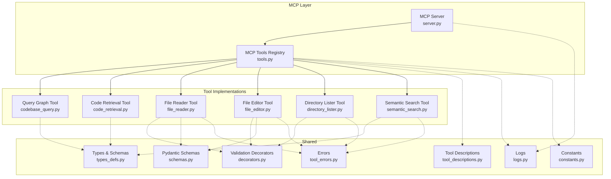

**Diagram sources**
- [mcp/server.py](file://codebase_rag/mcp/server.py#L58-L135)
- [mcp/tools.py](file://codebase_rag/mcp/tools.py#L40-L446)
- [tools/codebase_query.py](file://codebase_rag/tools/codebase_query.py#L24-L94)
- [tools/code_retrieval.py](file://codebase_rag/tools/code_retrieval.py#L17-L94)
- [tools/file_reader.py](file://codebase_rag/tools/file_reader.py#L16-L66)
- [tools/file_editor.py](file://codebase_rag/tools/file_editor.py#L22-L295)
- [tools/directory_lister.py](file://codebase_rag/tools/directory_lister.py#L15-L57)
- [tools/semantic_search.py](file://codebase_rag/tools/semantic_search.py#L18-L156)
- [tools/tool_descriptions.py](file://codebase_rag/tools/tool_descriptions.py#L8-L160)
- [types_defs.py](file://codebase_rag/types_defs.py#L343-L421)
- [decorators.py](file://codebase_rag/decorators.py#L55-L87)
- [schemas.py](file://codebase_rag/schemas.py#L8-L82)
- [tool_errors.py](file://codebase_rag/tool_errors.py#L1-L72)
- [logs.py](file://codebase_rag/logs.py#L569-L612)
- [constants.py](file://codebase_rag/constants.py#L188-L190)

**Section sources**
- [mcp/server.py](file://codebase_rag/mcp/server.py#L58-L135)
- [mcp/tools.py](file://codebase_rag/mcp/tools.py#L40-L446)

## Core Components
- MCP Tools Registry: Central registry that constructs tools, defines their schemas, and routes calls to handlers.
- Tool Implementations: Each tool encapsulates a specific capability (query graph, read file, replace code, list directory, semantic search, get code snippet).
- Validation and Safety: Path validation decorators and error wrappers enforce safe operations.
- Schemas and Types: Strong typing for tool inputs/outputs and shared result models.
- Logging and Constants: Consistent logging and constants for UI, messages, and safety checks.

Key responsibilities:
- Registry: Builds tool instances, registers handlers, and exposes schemas to clients.
- Tools: Implement business logic with validation and error handling.
- Safety: Enforce project-root boundaries and sanitize inputs.
- Observability: Comprehensive logs for all tool operations.

**Section sources**
- [mcp/tools.py](file://codebase_rag/mcp/tools.py#L40-L446)
- [tools/file_reader.py](file://codebase_rag/tools/file_reader.py#L16-L66)
- [tools/file_editor.py](file://codebase_rag/tools/file_editor.py#L22-L295)
- [tools/directory_lister.py](file://codebase_rag/tools/directory_lister.py#L15-L57)
- [tools/semantic_search.py](file://codebase_rag/tools/semantic_search.py#L18-L156)
- [tools/codebase_query.py](file://codebase_rag/tools/codebase_query.py#L24-L94)
- [tools/code_retrieval.py](file://codebase_rag/tools/code_retrieval.py#L17-L94)
- [decorators.py](file://codebase_rag/decorators.py#L55-L87)
- [schemas.py](file://codebase_rag/schemas.py#L8-L82)
- [tool_errors.py](file://codebase_rag/tool_errors.py#L1-L72)
- [logs.py](file://codebase_rag/logs.py#L200-L320)
- [constants.py](file://codebase_rag/constants.py#L188-L190)

## Architecture Overview
The MCP server initializes services, creates the registry, and exposes a list of tools and a call-tool endpoint. The registry maps tool names to handlers and schemas. Handlers execute tool logic and return either JSON or text responses.

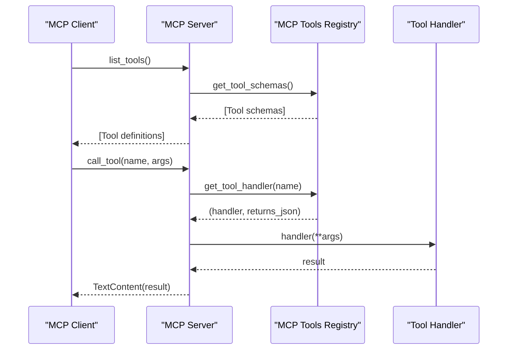

**Diagram sources**
- [mcp/server.py](file://codebase_rag/mcp/server.py#L96-L134)
- [mcp/tools.py](file://codebase_rag/mcp/tools.py#L433-L446)

**Section sources**
- [mcp/server.py](file://codebase_rag/mcp/server.py#L58-L135)
- [mcp/tools.py](file://codebase_rag/mcp/tools.py#L40-L446)

## Detailed Component Analysis

### MCP Tools Registry
The registry composes tool instances and defines their schemas. It exposes:
- Tool schemas for discovery
- Handlers mapped by tool name
- Safety-aware tool execution paths

Highlights:
- Uses typed schemas for input validation
- Returns JSON for structured results, text otherwise
- Centralizes logging and error wrapping

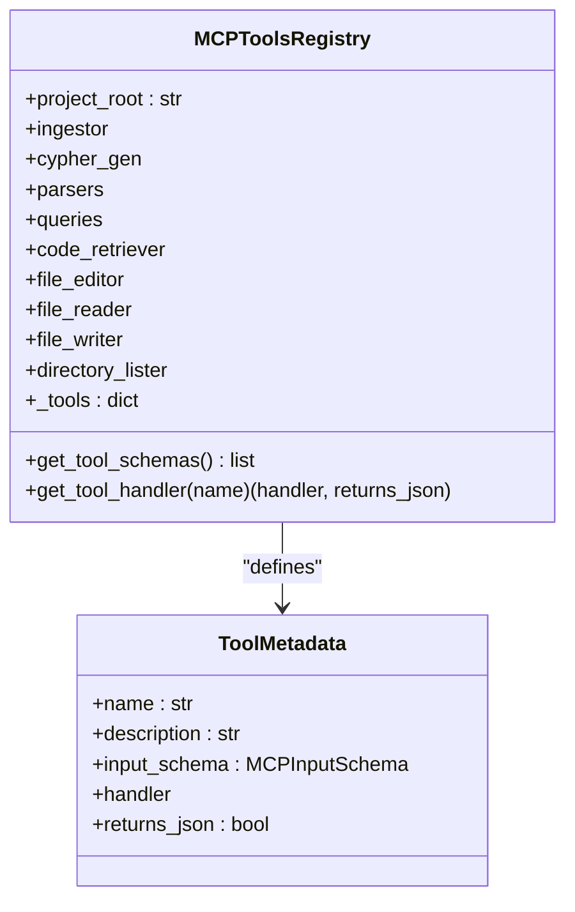

**Diagram sources**
- [mcp/tools.py](file://codebase_rag/mcp/tools.py#L40-L446)
- [models.py](file://codebase_rag/models.py#L88-L95)
- [types_defs.py](file://codebase_rag/types_defs.py#L355-L365)

**Section sources**
- [mcp/tools.py](file://codebase_rag/mcp/tools.py#L40-L446)
- [models.py](file://codebase_rag/models.py#L88-L95)
- [types_defs.py](file://codebase_rag/types_defs.py#L355-L365)

### File Reader Tool
Purpose: Safely read text files from the project root with validation and error handling.

Key behaviors:
- Validates file path against project root
- Rejects binary files and handles encoding errors
- Returns structured results with content or error messages

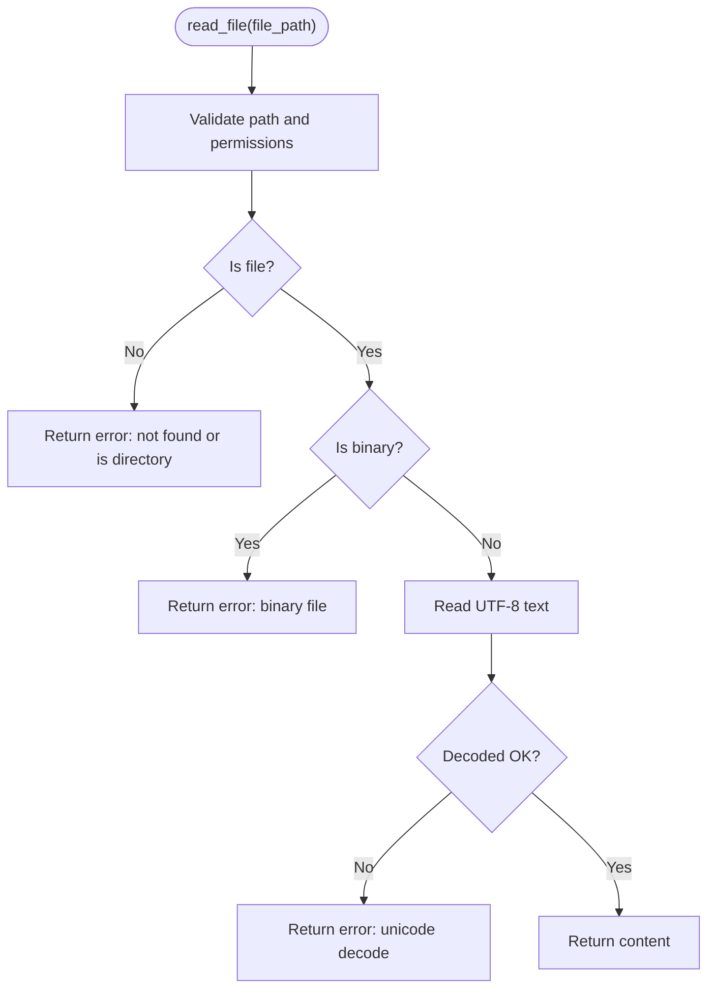

**Diagram sources**
- [tools/file_reader.py](file://codebase_rag/tools/file_reader.py#L21-L52)
- [decorators.py](file://codebase_rag/decorators.py#L55-L87)
- [schemas.py](file://codebase_rag/schemas.py#L66-L70)
- [tool_errors.py](file://codebase_rag/tool_errors.py#L7-L13)
- [constants.py](file://codebase_rag/constants.py#L50-L62)

**Section sources**
- [tools/file_reader.py](file://codebase_rag/tools/file_reader.py#L16-L66)
- [decorators.py](file://codebase_rag/decorators.py#L55-L87)
- [schemas.py](file://codebase_rag/schemas.py#L66-L70)
- [tool_errors.py](file://codebase_rag/tool_errors.py#L7-L13)
- [constants.py](file://codebase_rag/constants.py#L50-L62)

### File Editor Tool
Purpose: Surgically replace code blocks within a file using exact matching and diff-based patching.

Key behaviors:
- Validates path and enforces project root
- Finds target block and replaces first occurrence
- Applies diff-match-patch to ensure clean application
- Logs warnings for ambiguous or repeated matches

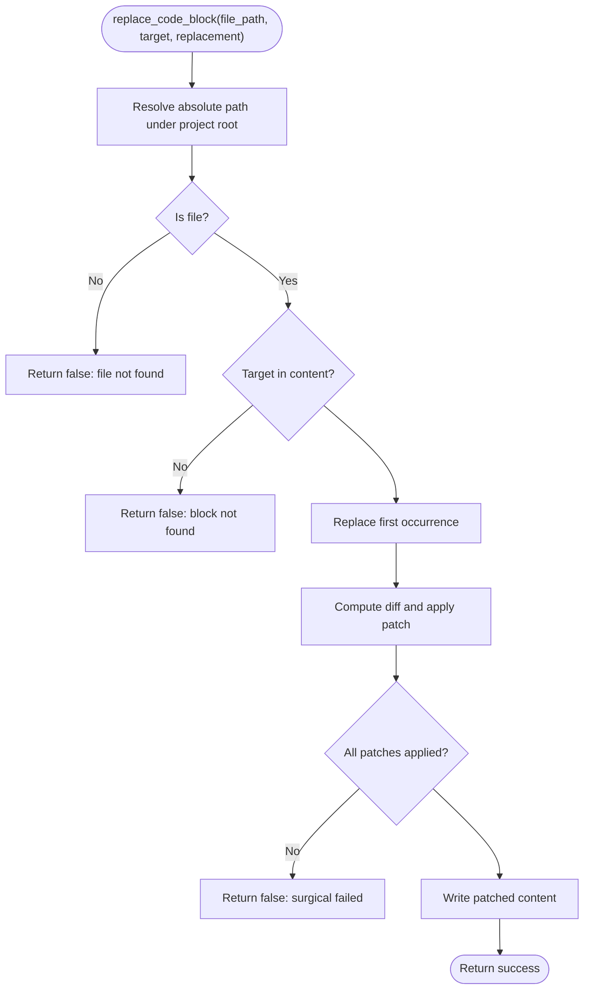

**Diagram sources**
- [tools/file_editor.py](file://codebase_rag/tools/file_editor.py#L204-L253)
- [decorators.py](file://codebase_rag/decorators.py#L55-L87)
- [schemas.py](file://codebase_rag/schemas.py#L54-L63)
- [tool_errors.py](file://codebase_rag/tool_errors.py#L6-L13)
- [logs.py](file://codebase_rag/logs.py#L233-L261)

**Section sources**
- [tools/file_editor.py](file://codebase_rag/tools/file_editor.py#L22-L295)
- [decorators.py](file://codebase_rag/decorators.py#L55-L87)
- [schemas.py](file://codebase_rag/schemas.py#L54-L63)
- [tool_errors.py](file://codebase_rag/tool_errors.py#L6-L13)
- [logs.py](file://codebase_rag/logs.py#L233-L261)

### Directory Lister Tool
Purpose: List directory contents safely under the project root.

Key behaviors:
- Resolves target path and ensures it stays within project root
- Handles invalid directories and empty results
- Raises permission errors for out-of-root access

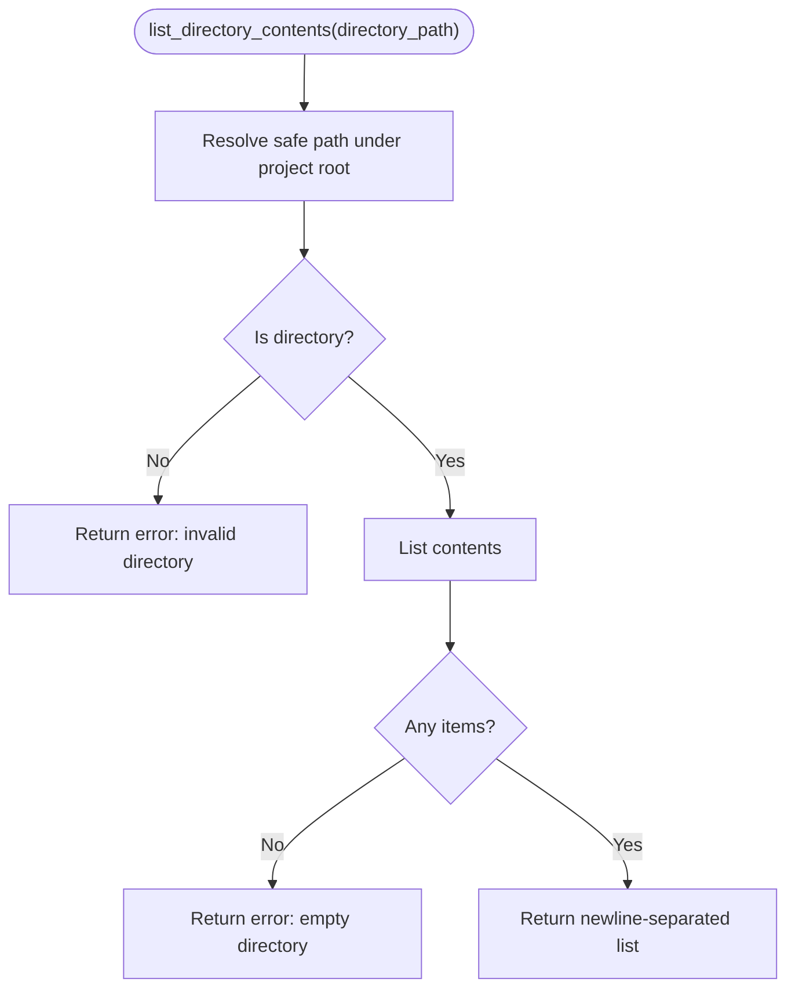

**Diagram sources**
- [tools/directory_lister.py](file://codebase_rag/tools/directory_lister.py#L19-L33)
- [tools/directory_lister.py](file://codebase_rag/tools/directory_lister.py#L35-L49)
- [tool_errors.py](file://codebase_rag/tool_errors.py#L33-L36)
- [logs.py](file://codebase_rag/logs.py#L263-L265)

**Section sources**
- [tools/directory_lister.py](file://codebase_rag/tools/directory_lister.py#L15-L57)
- [tool_errors.py](file://codebase_rag/tool_errors.py#L33-L36)
- [logs.py](file://codebase_rag/logs.py#L263-L265)

### Semantic Search Tool
Purpose: Perform semantic search for functions and retrieve source code by node ID.

Key behaviors:
- Validates availability of semantic dependencies
- Embeds query and searches nearest neighbors
- Fetches node details from the graph and formats results
- Retrieves source lines for a given node ID

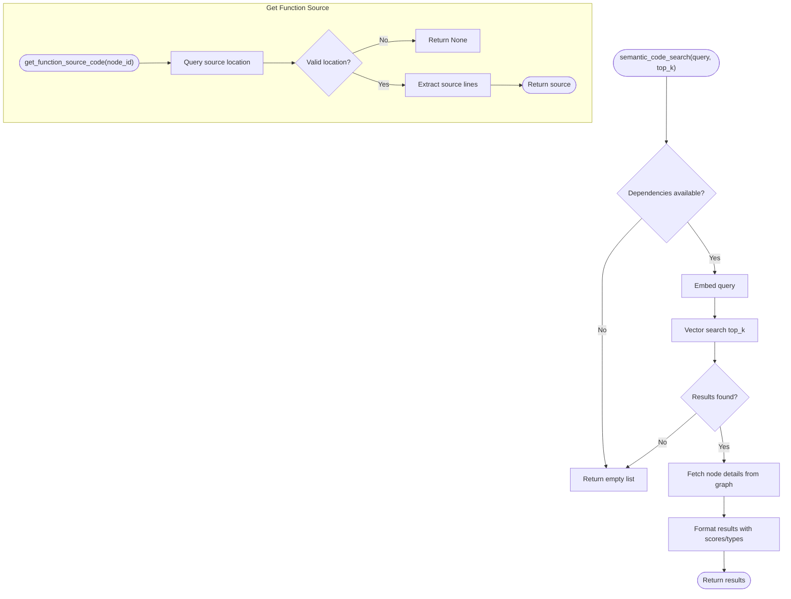

**Diagram sources**
- [tools/semantic_search.py](file://codebase_rag/tools/semantic_search.py#L18-L77)
- [tools/semantic_search.py](file://codebase_rag/tools/semantic_search.py#L80-L118)
- [types_defs.py](file://codebase_rag/types_defs.py#L193-L198)
- [tool_errors.py](file://codebase_rag/tool_errors.py#L48-L50)
- [logs.py](file://codebase_rag/logs.py#L267-L275)

**Section sources**
- [tools/semantic_search.py](file://codebase_rag/tools/semantic_search.py#L18-L156)
- [types_defs.py](file://codebase_rag/types_defs.py#L193-L198)
- [tool_errors.py](file://codebase_rag/tool_errors.py#L48-L50)
- [logs.py](file://codebase_rag/logs.py#L267-L275)

### Codebase Query Tool
Purpose: Natural language to Cypher translation and execution against the code graph.

Key behaviors:
- Generates Cypher from natural language
- Executes query and renders results in a table
- Returns structured results with summary

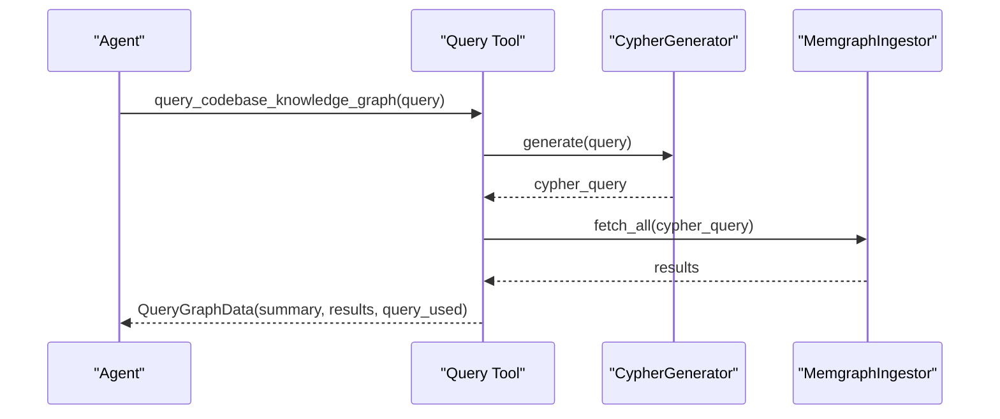

**Diagram sources**
- [tools/codebase_query.py](file://codebase_rag/tools/codebase_query.py#L24-L94)
- [schemas.py](file://codebase_rag/schemas.py#L8-L34)
- [logs.py](file://codebase_rag/logs.py#L214-L215)

**Section sources**
- [tools/codebase_query.py](file://codebase_rag/tools/codebase_query.py#L24-L94)
- [schemas.py](file://codebase_rag/schemas.py#L8-L34)
- [logs.py](file://codebase_rag/logs.py#L214-L215)

### Code Retrieval Tool
Purpose: Retrieve a code snippet by fully qualified name from the graph and file system.

Key behaviors:
- Queries graph for qualified name
- Reads file lines and extracts snippet
- Returns structured result with metadata

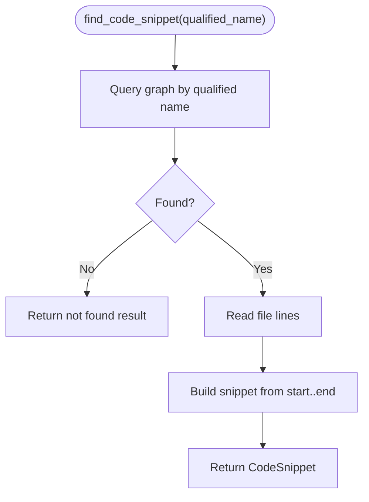

**Diagram sources**
- [tools/code_retrieval.py](file://codebase_rag/tools/code_retrieval.py#L23-L82)
- [schemas.py](file://codebase_rag/schemas.py#L37-L46)
- [tool_errors.py](file://codebase_rag/tool_errors.py#L48-L50)

**Section sources**
- [tools/code_retrieval.py](file://codebase_rag/tools/code_retrieval.py#L17-L94)
- [schemas.py](file://codebase_rag/schemas.py#L37-L46)
- [tool_errors.py](file://codebase_rag/tool_errors.py#L48-L50)

### MCP Server and Tool Execution
Purpose: Expose tools via MCP, handle discovery and invocation.

Key behaviors:
- Initializes logging and services
- Lists tools and validates unknown tool calls
- Executes tools with proper error wrapping

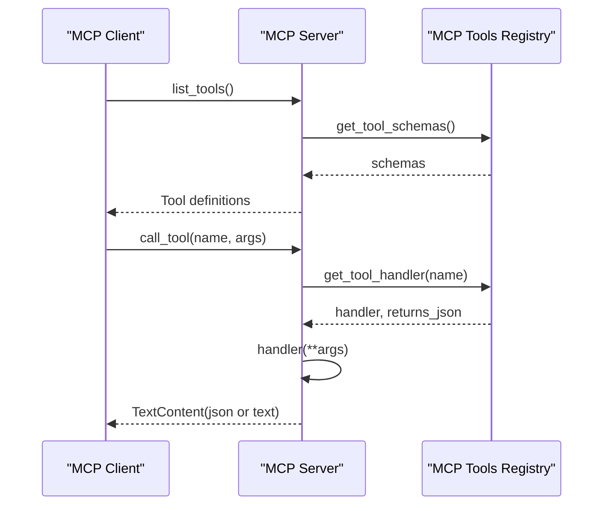

**Diagram sources**
- [mcp/server.py](file://codebase_rag/mcp/server.py#L96-L134)
- [mcp/tools.py](file://codebase_rag/mcp/tools.py#L433-L446)

**Section sources**
- [mcp/server.py](file://codebase_rag/mcp/server.py#L58-L135)
- [mcp/tools.py](file://codebase_rag/mcp/tools.py#L433-L446)

## Dependency Analysis
- Registry depends on:
  - Tool implementations for handlers
  - Types and schemas for input validation
  - Logging and constants for messaging
- Tools depend on:
  - Validation decorators for path safety
  - Pydantic schemas for output modeling
  - Error constants for consistent messaging
- MCP server depends on:
  - Registry for tool discovery and execution
  - Logging for operational visibility

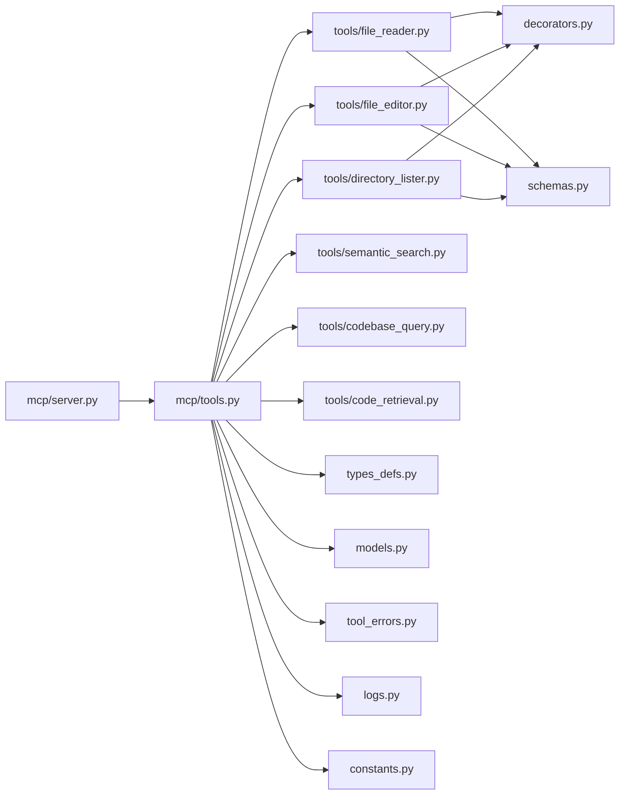

**Diagram sources**
- [mcp/server.py](file://codebase_rag/mcp/server.py#L58-L135)
- [mcp/tools.py](file://codebase_rag/mcp/tools.py#L40-L446)
- [tools/file_reader.py](file://codebase_rag/tools/file_reader.py#L16-L66)
- [tools/file_editor.py](file://codebase_rag/tools/file_editor.py#L22-L295)
- [tools/directory_lister.py](file://codebase_rag/tools/directory_lister.py#L15-L57)
- [tools/semantic_search.py](file://codebase_rag/tools/semantic_search.py#L18-L156)
- [tools/codebase_query.py](file://codebase_rag/tools/codebase_query.py#L24-L94)
- [tools/code_retrieval.py](file://codebase_rag/tools/code_retrieval.py#L17-L94)
- [decorators.py](file://codebase_rag/decorators.py#L55-L87)
- [schemas.py](file://codebase_rag/schemas.py#L8-L82)
- [types_defs.py](file://codebase_rag/types_defs.py#L343-L421)
- [models.py](file://codebase_rag/models.py#L88-L95)
- [tool_errors.py](file://codebase_rag/tool_errors.py#L1-L72)
- [logs.py](file://codebase_rag/logs.py#L569-L612)
- [constants.py](file://codebase_rag/constants.py#L188-L190)

**Section sources**
- [mcp/server.py](file://codebase_rag/mcp/server.py#L58-L135)
- [mcp/tools.py](file://codebase_rag/mcp/tools.py#L40-L446)

## Performance Considerations
- Semantic search and embedding generation can be expensive; ensure dependencies are available and results are cached where appropriate.
- File operations should avoid unnecessary reads/writes; use surgical replacements to minimize I/O.
- Logging adds overhead; tune log levels for production environments.
- Batch graph operations are handled by the ingestor; ensure adequate batch sizes and connection pooling.

[No sources needed since this section provides general guidance]

## Troubleshooting Guide
Common issues and resolutions:
- File outside project root: Path validation rejects out-of-root access; ensure paths are relative to project root.
- Binary file read: Use document analysis tools for binary content; FileReader rejects binary files.
- Ambiguous function name: Provide qualified name or line number to disambiguate.
- Surgical replacement fails: Ensure exact target code; multiple occurrences are replaced only once.
- Unknown tool: Verify tool name and ensure registry includes the tool.
- Semantic search unavailable: Install semantic dependencies or disable semantic features.

**Section sources**
- [decorators.py](file://codebase_rag/decorators.py#L55-L87)
- [tool_errors.py](file://codebase_rag/tool_errors.py#L6-L13)
- [logs.py](file://codebase_rag/logs.py#L233-L261)
- [mcp/server.py](file://codebase_rag/mcp/server.py#L112-L133)
- [mcp/tools.py](file://codebase_rag/mcp/tools.py#L433-L446)

## Conclusion
The Graph-Code tool system provides a secure, MCP-compatible interface for AI agents to interact with codebases. The registry centralizes tool definitions and safety, while individual tools encapsulate domain-specific logic. Strong typing, validation, and logging ensure predictable behavior and easy troubleshooting.

[No sources needed since this section summarizes without analyzing specific files]

## Appendices

### Tool Schema Reference
- Query Graph: Natural language to Cypher query; returns structured results.
- Read File: Reads text files; supports pagination; returns content or error.
- Replace Code: Surgically replaces code blocks; requires exact match; returns success/failure.
- List Directory: Lists directory contents; enforces project root boundary.
- Semantic Search: Finds functions by purpose; returns ranked matches.
- Get Code Snippet: Retrieves source by qualified name; returns snippet and metadata.

**Section sources**
- [tools/tool_descriptions.py](file://codebase_rag/tools/tool_descriptions.py#L8-L160)
- [mcp/tools.py](file://codebase_rag/mcp/tools.py#L70-L249)

### Parameter Validation and Error Handling
- Path validation: Ensures all file operations stay within project root.
- Error wrappers: Standardized error messages for consistent client handling.
- Logging: Rich logs for all tool operations aiding debugging and monitoring.

**Section sources**
- [decorators.py](file://codebase_rag/decorators.py#L55-L87)
- [tool_errors.py](file://codebase_rag/tool_errors.py#L1-L72)
- [logs.py](file://codebase_rag/logs.py#L200-L320)

### Security and Sandboxing
- Path validation decorators enforce project-root boundaries.
- Binary file detection prevents unsafe content reads.
- Permission errors raised for out-of-root access attempts.
- MCP server validates tool names and wraps errors for safe transport.

**Section sources**
- [decorators.py](file://codebase_rag/decorators.py#L55-L87)
- [tool_errors.py](file://codebase_rag/tool_errors.py#L6-L13)
- [mcp/server.py](file://codebase_rag/mcp/server.py#L112-L133)

### Practical Usage Examples
- Agent workflow patterns:
  - Explore codebase: Use list directory and read file to navigate.
  - Analyze code: Use semantic search to find relevant functions; get code snippet for source.
  - Modify code: Use replace code with exact target and replacement blocks.
  - Query graph: Ask natural language questions; review tabular results.

**Section sources**
- [tools/tool_descriptions.py](file://codebase_rag/tools/tool_descriptions.py#L8-L160)
- [tools/semantic_search.py](file://codebase_rag/tools/semantic_search.py#L121-L156)
- [tools/code_retrieval.py](file://codebase_rag/tools/code_retrieval.py#L85-L94)
- [tools/file_editor.py](file://codebase_rag/tools/file_editor.py#L279-L295)

### Developing Custom Tools
Steps:
- Define tool behavior and inputs/outputs
- Add a handler to the registry with a typed schema
- Implement validation and error handling
- Register the tool in the registry and expose via MCP

Guidance:
- Reuse validation decorators for path safety
- Return Pydantic models for structured results
- Log operations for observability
- Keep tool responsibilities focused and small

**Section sources**
- [mcp/tools.py](file://codebase_rag/mcp/tools.py#L433-L446)
- [types_defs.py](file://codebase_rag/types_defs.py#L355-L365)
- [schemas.py](file://codebase_rag/schemas.py#L8-L82)
- [decorators.py](file://codebase_rag/decorators.py#L55-L87)
- [logs.py](file://codebase_rag/logs.py#L569-L612)